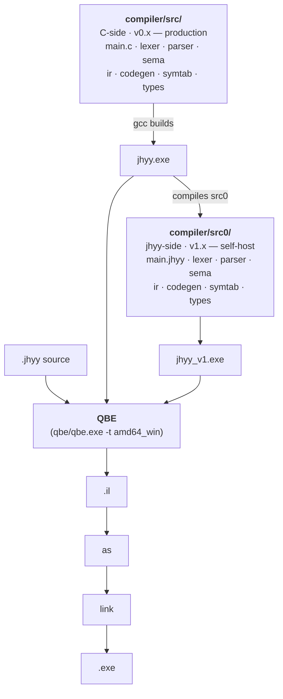

<div align="center">


# JHYY

### 机会翼游 — A self-hosted, statically typed, compiled systems programming language

**Statically typed. Expression-oriented. Compiled to native via QBE.**

[](docs/logs/v1/changelog-v1.8.0.md)
[](docs/logs/v1/changelog-v1.8.0.md)
[](https://c9x.me/compile/)
[](#build)
[](LICENSE)
[](README.zh-CN.md)

[Quick Start](#quick-start) · [Language](#language) · [CLI](#cli) · [Architecture](#architecture) · [Roadmap](#roadmap) · [Docs](#docs)

</div>

---

## v1.8.3 — v1.x final, installer self-hosting closure + UCPD.sys bypass

`jhyy_v1 → jhyy_v2 → jhyy_v3 → jhyy_v4 → jhyy_v5` compile themselves and emit **byte-equal QBE intermediate representation**:

```
jhyy_v1.exe.exe → src0/main.jhyy → jhyy_v2.il
jhyy_v2.exe     → src0/main.jhyy → jhyy_v3.il   ← byte-equal to v2.il
jhyy_v3.exe     → src0/main.jhyy → jhyy_v4.il   ← byte-equal to v2.il
jhyy_v4.exe     → src0/main.jhyy → jhyy_v5.il   ← byte-equal to v2.il
                                                 sha 03a1cdd4… (v1.8.0 ship)
```

All five raw `.il` files share an identical sha256 (1.378 MB, no fix-up post-processing). The fixed point is an attractor, not a transient. **Stage 2 N=4 byte-equal closure reached at v1.0.0 (commit `eabee0d`, 2026-08-10), stable through v1.8.3 (commit `8fcbe4d`, 2026-08-29). v1.x is now finalized.**

| Metric | Value |
|--------|-------|
| `regress.py` (C-side `jhyy.exe`) | **102/102 PASS, 0 failed, 4 skipped** (106 total) |
| `regress_v1.py` (self-hosted `jhyy_v1.exe.exe`) | **102/102 PASS, 0 failed, 4 skipped** (parity hold) |
| Stage 1 byte-equal (`jhyy_0` vs `jhyy_v1`) | **7/7 PASS** |
| Stage 2 N=4 byte-equal (`v1→v2→v3→v4→v5`) | **stable** |
| `jhyy_v2` compiling `_repro_t0.jhyy` | `EXIT=100` ✓ |
| `jhyy_v2` compiling `fib(10)` | `EXIT=55` ✓ |
| `installer/jhyy-installer-1.8.3.exe` | shipped (~30MB, includes .NET 8 Desktop Runtime) |
| `installer/jhyy-compiler-1.8.3.msi` | shipped (~995KB, includes `jhyy-setuc.exe`) |
| `vscode-ext/jhyy-lang-1.8.3.vsix` | shipped (~13KB) |

**v1.x umbrella changelog** — [`docs/logs/v1/changelog-v1.8.0.md`](docs/logs/v1/changelog-v1.8.0.md) covers v1.8.0 main + v1.8.1 / v1.8.2 / v1.8.2 patch update / v1.8.3 / v1.8.3.1 / v1.8.3.2 patches (all `fix(v1.8.0)` commits, no new features). Historical v1.0.0 → v1.7.3 changelogs each live under `docs/logs/v1/changelog-vX.Y.Z.md`.

**W-NNN workaround status (v1.8.3 ship)**:
- ✅ W-059 defer codegen silent crash — RESOLVED 2026-08-28
- ❌ W-060 enum variant payload ABI — INVALID 2026-08-28 (bash `$?` 8-bit truncation artifact, regress.py W-028 mod-256 fix handles)
- ❌ W-061 nested struct field offset — INVALID 2026-08-28 (same reason)
- ✅ W-062 VSCode UserChoice + MSYS2 OpenWithProgids shadow — RESOLVED 2026-08-29 (v1.8.3.1 闭环, SYSTEM-context CustomAction + 3-attempt fallback)
- ✅ W-063 UCPD.sys kernel filter — RESOLVED 2026-08-29 (v1.8.3 真修, `jhyy-setuc.exe` .NET 8 SYSTEM-context writer)
- 🟡 W-057 UTF-8 3/4-byte codepoint — DEFERRED-to-v2.x
- 🟡 W-058 vendored QBE 缺 `remd`/`rems` — DEFERRED-to-v2.x
- ⚠️ W-021 WiX Bal.wixext DLL naming — permanent workaround (WiX upstream won't fix)

Full index: [`docs/internal/workarounds.md`](docs/internal/workarounds.md).

**v0.x frozen**: `docs/logs/v0/changelog-v0.9.0.md` (3231 lines) — Stage 1 byte-equal 7 测试集 wip, frozen at v1.0.0 baseline (2026-08-29). v0.x C compiler (`compiler/src/*.c`) enters maintenance-only mode; new features go through `compiler/src0/*.jhyy`. Per `docs/plans/roadmap/v1.x-phase-4-m5-boot-from-scratch.md`, M5 boot-from-scratch cleanup (delete `src/*.c` + `qbe/` + `runtime.c`) is deferred until v2.x end + v3.x end.

> [!NOTE]
> **v1.8.3 is v1.x final.** The C-side compiler (`compiler/src/*.c`) remains the production path during v1.x; `compiler/src0/*.jhyy` (the jhyy-side translated source) already produces byte-equal output. v2.0 will switch the production path to `jhyy_v1.exe.exe` and start the QBE rewrite + multi-target / OS prep (see [`docs/plans/v2/v2.0.0-os-prep.md`](docs/plans/v2/v2.0.0-os-prep.md)).

---

## What is JHYY

JHYY is a self-designed, statically typed, expression-oriented, compiled systems programming language. The backend is [QBE](https://c9x.me/compile/), producing native x86-64 Windows binaries.

**Design goals**:
- **Self-hosting** — the compiler written in itself, achieving byte-equal closure (✓ v1.0.0)
- **OS development** — aligned with the [JiHuiYiYou-OS](https://github.com/JiHuiYiYou/JiHuiYiYou-OS) project, providing OS-required extensions like inline asm / volatile / naked / `no_std` / `&mut` + lifetime (v3.x roadmap)
- **Native performance** — QBE backend, no runtime / no GC, directly produces PE/COFF binaries

## A tour of the syntax

```rust
// Functions / variables / control flow / struct / match / enum / FFI
type Point = struct { x: i32, y: i32 }

fn dist_sq(a: Point, b: Point) -> i32 {
    let dx = a.x - b.x;
    let dy = b.y - a.y;
    dx * dx + dy * dy
}

fn classify(n: i32) -> *u8 {
    match n {
        0        => "zero",
        1..10    => "single digit",
        10 | 20  => "round number",
        _        => "other",
    }
}

extern fn printf(fmt: *u8, val: i32) -> i32;

fn main_jhyy() -> i32 {
    let p = Point { x: 3, y: 4 };
    let q = Point { x: 0, y: 0 };
    printf("d² = %d\n", dist_sq(p, q));
    printf("%s\n", classify(42));
    0
}
```

---

## Quick Start

### Hello world

```rust
// hello.jhyy
fn main_jhyy() -> i32 {
    42
}
```

```bash
./compiler/build/bin/jhyy.exe compile hello.jhyy -o hello
./hello.exe
echo $?    # => 42
```

### Run the regression suite

```bash
python compiler/build/bin/regress.py
# => 102/102 passed, 0 failed, 4 skipped (of 106 total)
```

### Run with VSCode

The repo ships `.vscode/tasks.json` — open any `.jhyy` file and press **`Ctrl+Shift+B`** to compile + run it. Other tasks: `Ctrl+Shift+P` → **Tasks: Run Task** → `JHYY: Run` / `JHYY: Compile` / `JHYY: Build IR`. `.vscode/settings.json` adds `compiler/build/bin` and `C:/msys64/ucrt64/bin` to the integrated terminal PATH so you can also type `jhyy run hello.jhyy` directly. `F5` launches the compiled `.exe` under MSYS2's gdb (cppdbg).

> [!IMPORTANT]
> **MSYS2 PATH requirement** — `jhyy run` shells out to `gcc` for linking, which in turn spawns `cc1.exe` / `as.exe` / `ld.exe` from `C:\msys64\ucrt64\bin`. PowerShell / cmd users outside VSCode need MSYS2 on their system PATH (or they get a silent `gcc link failed`). `.vscode/settings.json` handles this automatically for the integrated terminal; for external shells, add `C:\msys64\ucrt64\bin` to your user PATH manually.

### Verify self-hosting closure

```bash
# Stage 2 N=3 byte-equal — jhyy compiles jhyy
# Method 1: regress through self-hosted compiler
python compiler/build/bin/regress_v1.py
# Method 2: one-shot closure check via MCP (recommended)
# ask Claude Code: "verify self-host closure" → jhyy_selfhost_check
# See docs/logs/v1/changelog-v1.0.0.md for full procedure
```

---

## Language

| Category | Supported |
|----------|-----------|
| **Types** | `i8/i16/i32/i64`, `u8/u16/u32/u64`, `f32/f64`, `bool`, `*T`, `[T; N]`, `[*]T` (slice), `struct`, `enum` |
| **Casts** | `as` — integer/float conversion, widening/narrowing, `*T ↔ i64/u64` |
| **Control flow** | `if`/`else` (expression-valued), `while`, `for i in start..end`, `break`, `continue`, `match` (literal/range/enum/wildcard, with exhaustiveness check) |
| **Top-level const** | `const NAME: [T; N] = [...]` — compile-time emit to `.data` section |
| **Logic** | `&&` / `\|\|` short-circuit, `!` / `~` unary |
| **Functions** | first-class, recursion, compound assignment (`+=` `-=` `*=` `/=` `%=`), block-expression closures |
| **Modules** | `import` + transitive imports, multi-file CLI, `mod::fn()` namespaces |
| **FFI** | `extern fn` calling C (printf, file I/O, multi-arg) |
| **Memory** | runtime Arena allocator (`arena_alloc` via FFI) |

Full specification: [`docs/abis/jhyy-lang-spec-v1.3.0.md`](docs/abis/jhyy-lang-spec-v1.3.0.md) (locked; v1.3.0 = v1.1.0 + 7 v1.3.x features); known limitations in Appendix B + Appendix E.

---

## CLI

```text
jhyy compile <file.jhyy> [-o name]   compile to .exe (default amd64_win)
jhyy run     <file.jhyy>             compile and run
jhyy build   <file.jhyy> [-o name]   emit QBE IL only (.il file)
jhyy check   <file.jhyy>             syntax / semantic check only, no codegen
jhyy                                 print help
```

> [!TIP]
> For multi-file compilation, list every `.jhyy` source on the command line: `jhyy compile main.jhyy lib.jhyy -o app`

---

## Architecture

The JHYY compiler exists in two **fully equivalent** implementations that emit byte-equal QBE IL:



| Implementation | Role | Status |
|----------------|------|--------|
| `compiler/src/*.c` | C-side compiler (v0.x era) | production path, maintained |
| `compiler/src0/*.jhyy` | jhyy-side translated source (v1.x era) | self-host path, byte-equal to C-side |
| `compiler/runtime/*.c` | C runtime (Arena + main entry) | linked at compile time |

Both paths emit **byte-equal QBE intermediate representation** — Stage 1 (`jhyy_0` vs `jhyy_v1`) 7/7 byte-equal, Stage 2 (`jhyy_v1 → v2 → v3 → v4`) N=3 closure reached.

---

## Project layout

```
JiHuiYiYou-compiler/
├── compiler/
│   ├── src/                    C-side compiler source (10 .c / 9 .h files)
│   ├── src0/                   jhyy-side translated source (13 main modules + 11 _driver tests) — self-host path
│   ├── runtime/                C runtime (Arena + main entry)
│   ├── tests/
│   │   ├── examples/           integration tests (53 .jhyy) — regress.py auto-runs
│   │   └── unit/               C unit tests
│   └── build/
│       └── bin/
│           ├── jhyy.exe        C-side compiler binary
│           ├── jhyy_v1.exe     self-hosted compiler (jhyy compiled src0/)
│           └── regress.py      regression script
├── qbe/                        vendored QBE backend (c9x.me/compile)
├── mcp-jhyy/                   Claude Code MCP server (11 tools + 4 resources)
├── vscode-ext/                 VS Code language extension (syntax highlighting)
├── scripts/
│   └── dev/                    dev/ install-uninstall helpers, bench, test orchestrators (relative paths, portable)
├── docs/
│   ├── abis/                   language spec + ABI whitepaper (locked)
│   ├── plans/                  roadmap + sprint plans
│   ├── internal/               architecture / build / status / tests / workarounds
│   ├── CHANGELOG.md            changelog index (umbrella per `feedback_changelog_umbrella`)
│   └── logs/                   changelogs + sprint logs (per-version umbrella)
├── tools/
│   └── check_dangling.py       scan .md files for broken local links + hidden zero-width chars
├── Makefile                    one-line build (make)
├── .editorconfig               cross-editor indent/EOL/charset config
├── README.md                   English (this file)
└── README.zh-CN.md              简体中文
```

---

## Verification status

| Check | Command | Expected |
|-------|---------|----------|
| C-side regression | `python compiler/build/bin/regress.py` | **102/102 PASS + 4 SKIP** (106 total) |
| Self-host regression | `python compiler/build/bin/regress_v1.py` | **102/102 PASS + 4 SKIP** (parity hold) |
| Stage 1 byte-equal (`jhyy_0` vs `jhyy_v1`) | `python compiler/tests/stage1-expanded.sh` | 7/7 PASS |
| Stage 2 N=4 byte-equal (`v1→v2→v3→v4→v5`) | MCP `jhyy_selfhost_check` | `all_byte_equal=true`, stable il_sha256 |
| MCP smoke (7 test files, X `def test_*` funcs) | `pytest mcp-jhyy/tests/` | all pass |
| One-line build | `make` | 0 warnings (-Wall -Wextra) |

---

## Roadmap

The project uses a **single version axis**, no phase-N numbering:

| Axis | Scope | Goal | Status |
|------|-------|------|--------|
| **v0.x** | C-side compiler itself | reach self-host threshold | **🟢 done (frozen at v1.0.0 baseline)** |
| **v1.x** | jhyy self-hosting | byte-equal `.il` closure | **🟢 v1.8.3 shipped (v1.x final)** |
| **v2.x** | full QBE rewrite + multi-target / OS prep | amd64_sysv / freestanding | **next** — design input = [`docs/plans/v2/v2.0.0-os-prep.md`](docs/plans/v2/v2.0.0-os-prep.md) |
| **v3.x** | language extensions | OS-required: asm / volatile / naked / `no_std` / `&mut` + lifetime | **next (parallel with v2.x)** |

**Axis relationships**:
- `v0.x → v1.x → v2.x / v3.x`: **strict order** (each is a hard prerequisite of the next)
- `v2.x || v3.x`: **parallel axes** (each progresses independently; both must finish before OS M1 starts)

> [!IMPORTANT]
> **Alignment with the [JiHuiYiYou-OS](https://github.com/JiHuiYiYou/JiHuiYiYou-OS) project**: 12 cross-boundary questions + 6 decisions are closed and reflected in the OS prep plan at [docs/plans/v2/v2.0.0-os-prep.md](docs/plans/v2/v2.0.0-os-prep.md). The v2.0 sprint design input is the same plan.

---

## Tooling & Integration

### Claude Code MCP server

`mcp-jhyy/` ships **11 MCP tools** wired into the Claude Code workflow (Sprint 1 of mcp-jhyy, 2026-08-11, added 4 production-ready tools — `jhyy_regress` / `jhyy_il_diff` / `jhyy_selfhost_check` / `jhyy_workarounds` — and rebased the original 7 (`jhyy_run` / `jhyy_check` / `jhyy_compile` / `jhyy_get_il` / `jhyy_lang_ref` / `jhyy_abi_info` / `jhyy_format`) onto a thin regress.py shim):

| Tool | Purpose |
|------|---------|
| `jhyy_regress` | run C-side / jhyy-side regression, return PASS/FAIL list |
| `jhyy_il_diff` | byte-equal check on two `.il` files + contextual diff |
| `jhyy_selfhost_check` | one-shot v1→v2→v3→v4 byte-equal verification |
| `jhyy_workarounds` | query W-NNN workaround status / details |
| `jhyy_run` / `jhyy_check` / `jhyy_compile` / `jhyy_get_il` | compile / run / inspect `.jhyy` |
| `jhyy_lang_ref` / `jhyy_abi_info` / `jhyy_format` | language / ABI / format queries |

Details in [`mcp-jhyy/README.md`](mcp-jhyy/README.md).

### VS Code extension

`vscode-ext/` ships syntax highlighting (TextMate grammar + file icon) + native `Run JHYY File` (`Ctrl+F5`) + `Compile JHYY File (no run)` commands. Latest shipped = `jhyy-lang-1.8.3.vsix`. Install + build instructions in [`vscode-ext/README.md`](vscode-ext/README.md).

---

## Docs

### Specification & ABI (locked)

| Doc | Description |
|-----|-------------|
| [`docs/abis/jhyy-lang-spec-v1.3.0.md`](docs/abis/jhyy-lang-spec-v1.3.0.md) | language spec v1.3.0 (v1.1.0 + 7 v1.3.x features; limitations in Appendix B + E) |
| [`docs/abis/jhyy-abi-v1.0.0.md`](docs/abis/jhyy-abi-v1.0.0.md) | ABI whitepaper v1.0.0 (struct pass-by-value / FFI / namespaces / slices) |

### Internal

| Doc | Description |
|-----|-------------|
| [`docs/internal/architecture.md`](docs/internal/architecture.md) | pipeline / modules / QBE IL cheat sheet |
| [`docs/internal/build.md`](docs/internal/build.md) | build / run / QBE backend pitfalls (Windows) |
| [`docs/internal/workarounds.md`](docs/internal/workarounds.md) | W-NNN workaround status index |
| [`docs/internal/tests.md`](docs/internal/tests.md) | integration test catalog + how to run |

### Roadmap & plans

| Doc | Description |
|-----|-------------|
| [`docs/plans/roadmap/v0.x-c-compiler-roadmap.md`](docs/plans/roadmap/v0.x-c-compiler-roadmap.md) | C compiler evolution |
| [`docs/plans/roadmap/v1.0-self-hosting.md`](docs/plans/roadmap/v1.0-self-hosting.md) | self-hosting overview |
| [`docs/plans/roadmap/v2.x-qbe-rewrite.md`](docs/plans/roadmap/v2.x-qbe-rewrite.md) | QBE rewrite direction |
| [`docs/plans/roadmap/v3.x-language-expansion.md`](docs/plans/roadmap/v3.x-language-expansion.md) | language extension direction |
| [`docs/plans/v2/v2.0.0-os-prep.md`](docs/plans/v2/v2.0.0-os-prep.md) | compiler-side authority on OS startup chain |

### Changelog

Latest: [`docs/logs/v1/changelog-v1.8.0.md`](docs/logs/v1/changelog-v1.8.0.md) — **v1.x umbrella (covers v1.8.0 main + v1.8.1 / v1.8.2 / v1.8.2 patch update / v1.8.3 / v1.8.3.1 / v1.8.3.2 patches)**

Historical index: [`docs/logs/`](docs/logs/) — v1.0.0 → v1.7.3 each have their own umbrella;v0.0.1 → v0.9.0 for C-side compiler (v0.9 frozen at v1.0.0 baseline).

---

## Contributors

- **Human author**: JHYY
- **AI collaborator**: MiniMax-M3 (working through the [Claude Code](https://claude.ai/code) CLI workflow on design, coding, debugging, documentation)

Since v0.6 every sprint's implementation + documentation has been co-authored by JHYY + MiniMax-M3.
