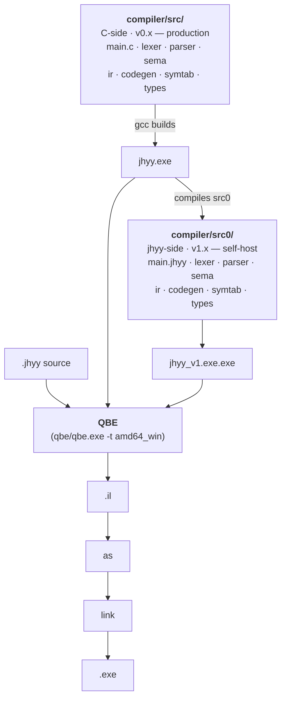

<div align="center">

<div></div>

<div></div>

### 机会翼游 — A self-hosted, statically typed, compiled systems programming language

**Statically typed. Expression-oriented. Compiled to native via QBE.**

[](docs/logs/v1/changelog-v1.8.0.md)
[](docs/logs/v2/changelog-v2.4.0.md)
[](https://c9x.me/compile/)
[](#quick-start)
[](LICENSE)
[](README.zh-CN.md)

[Quick Start](#quick-start) · [Install](#install) · [Language](#language) · [CLI](#cli) · [Architecture](#architecture) · [Status](#status-v183--v1x-final) · [Roadmap](#roadmap) · [Docs](#docs)

</div>

---

## What is JHYY

JHYY (机会翼游) is a self-designed, statically typed, expression-oriented, compiled systems programming language. The backend is [QBE](https://c9x.me/compile/), producing native x86-64 Windows binaries.

**Design goals**:
- **Self-hosting** — the compiler written in itself, achieving byte-equal closure (✓ v1.0.0)
- **OS development** — aligned with the [JiHuiYiYou-OS](https://github.com/JiHuiYiYou/JiHuiYiYou-OS) project, providing OS-required extensions like inline asm / volatile / naked / `no_std` / `&mut` + lifetime (v3.x roadmap)
- **Native performance** — QBE backend, no runtime / no GC, directly produces PE/COFF binaries

## Install

**Prerequisites** (Windows; v1.x is Windows-only — Linux/macOS land in v2.x via amd64_sysv):

1. **MSYS2** — <https://www.msys2.org/> (Windows 10+ x64)
2. **GCC + binutils** (ucrt64 toolchain) — run in an MSYS2 terminal:
   ```bash
   pacman -S mingw-w64-ucrt-x86_64-gcc mingw-w64-ucrt-x86_64-binutils
   ```
3. **PATH** — add `C:\msys64\ucrt64\bin` to your Windows user PATH (PowerShell: `$env:Path += ";C:\msys64\ucrt64\bin"`)

**Build** (one line):

```bash
git clone https://github.com/JiHuiYiYou/JiHuiYiYou-compiler.git
cd JiHuiYiYou-compiler
make           # → compiler/build/bin/jhyy.exe (~5MB)
```

**One-shot installer** (recommended for end users): `installer/jhyy-installer-1.8.3.exe` wires up `jhyy.exe` + `.jhyy` file association + VSCode extension + PATH registration in one step. `installer/jhyy-compiler-1.8.3.msi` is the enterprise / SCCM distribution (no GUI). See [`installer/README.md`](installer/README.md).

**Docker** (optional):

```bash
docker run -it msys2/mingw-w64-ucrt-x86_64 bash
# then follow steps 1-3 above inside the container
```

**VSCode users**: opening this repo triggers `.vscode/settings.json` to add `compiler/build/bin` and MSYS2 PATH to the integrated terminal automatically — no manual setup needed.

> [!IMPORTANT]
> Do NOT use the MinGW `gcc` shipped with Git Bash (`/c/Program\ Files/Git/mingw64/bin/gcc.exe`) — it does not support PE+ linking and will fail at link time.

---

## A tour of the syntax

```rust
// Functions / variables / control flow / struct / match / enum / FFI
type Point = struct { x: i32, y: i32 }

fn dist_sq(a: Point, b: Point) -> i32 {
    let dx = a.x - b.x;
    let dy = b.y - a.y;
    dx * dx + dy * dy
}

fn classify(n: i32) -> *u8 {
    match n {
        0        => "zero",
        1..10    => "single digit",
        10 | 20  => "round number",
        _        => "other",
    }
}

extern fn printf(fmt: *u8, val: i32) -> i32;

fn main_jhyy() -> i32 {
    let p = Point { x: 3, y: 4 };
    let q = Point { x: 0, y: 0 };
    printf("d² = %d\n", dist_sq(p, q));
    printf("%s\n", classify(42));
    0
}
```

---

## Quick Start

### Hello world

```rust
// hello.jhyy
fn main_jhyy() -> i32 {
    42
}
```

```bash
./compiler/build/bin/jhyy.exe compile hello.jhyy -o hello
./hello.exe
echo $?    # => 42
```

### Run the regression suite

```bash
python compiler/build/bin/regress.py
# => 104/104 passed, 0 failed, 4 skipped (of 108 total) — v2.4.0 baseline
```

### Run with VSCode

The repo ships `.vscode/tasks.json` — open any `.jhyy` file and press **`Ctrl+Shift+B`** to compile + run it. Other tasks: `Ctrl+Shift+P` → **Tasks: Run Task** → `JHYY: Run` / `JHYY: Compile` / `JHYY: Build IR`. `.vscode/settings.json` adds `compiler/build/bin` and `C:/msys64/ucrt64/bin` to the integrated terminal PATH so you can also type `jhyy run hello.jhyy` directly. `F5` launches the compiled `.exe` under MSYS2's gdb (cppdbg).

> [!IMPORTANT]
> **MSYS2 PATH requirement** — `jhyy run` shells out to `gcc` for linking, which in turn spawns `cc1.exe` / `as.exe` / `ld.exe` from `C:\msys64\ucrt64\bin`. PowerShell / cmd users outside VSCode need MSYS2 on their system PATH (or they get a silent `gcc link failed`). `.vscode/settings.json` handles this automatically for the integrated terminal; for external shells, add `C:\msys64\ucrt64\bin` to your user PATH manually.

### Verify self-hosting closure

```bash
# Stage 2 N=4 byte-equal — jhyy compiles jhyy
# Method 1: regress through self-hosted compiler (v1.4.7+ single regress entry)
python compiler/build/bin/regress.py --all --include-informational
# Method 2: one-shot closure check via MCP (recommended)
# ask Claude Code: "verify self-host closure" → jhyy_selfhost_check
# See docs/logs/v1/changelog-v1.0.0.md for full procedure
```

---

## Language

| Category | Supported |
|----------|-----------|
| **Types** | `i8/i16/i32/i64`, `u8/u16/u32/u64`, `f32/f64`, `bool`, `*T`, `[T; N]`, `[*]T` (slice), `struct`, `enum` |
| **Casts** | `as` — integer/float conversion, widening/narrowing, `*T ↔ i64/u64` |
| **Control flow** | `if`/`else` (expression-valued), `while`, `for i in start..end`, `break`, `continue`, `match` (literal/range/enum/wildcard, with exhaustiveness check) |
| **Top-level const** | `const NAME: [T; N] = [...]` — compile-time emit to `.data` section |
| **Logic** | `&&` / `\|\|` short-circuit, `!` / `~` unary |
| **Functions** | first-class, recursion, compound assignment (`+=` `-=` `*=` `/=` `%=`), block-expression closures |
| **Modules** | `import` + transitive imports, multi-file CLI, `mod::fn()` namespaces |
| **FFI** | `extern fn` calling C (printf, file I/O, multi-arg) |
| **Memory** | runtime Arena allocator (`arena_alloc` via FFI) |

Full specification: [`docs/abis/jhyy-lang-spec-v1.3.0.md`](docs/abis/jhyy-lang-spec-v1.3.0.md) (locked; v1.3.0 = v1.1.0 + 7 v1.3.x features); known limitations in Appendix B + Appendix E.

---

## CLI

```text
jhyy compile <file.jhyy> [-o name]   compile to .exe (default amd64_win)
jhyy run     <file.jhyy>             compile and run
jhyy build   <file.jhyy> [-o name]   emit QBE IL only (.il file)
jhyy dump    <file.jhyy>             dump parsed AST to stdout (debug)
jhyy                                 print help
```

> [!TIP]
> For multi-file compilation, list every `.jhyy` source on the command line: `jhyy compile main.jhyy lib.jhyy -o app`

---

## Architecture

The JHYY compiler exists in two **fully equivalent** implementations that emit byte-equal QBE IL:



| Implementation | Role | Status |
|----------------|------|--------|
| `compiler/src/*.c` | C-side compiler (v0.x era) | production path, maintained |
| `compiler/src0/*.jhyy` | jhyy-side translated source (v1.x era) | self-host path, byte-equal to C-side |
| `compiler/runtime/*.c` | C runtime (Arena + main entry) | linked at compile time |

Both paths emit **byte-equal QBE intermediate representation** — Stage 1 (`jhyy_0.exe` vs `jhyy_v1.exe.exe`) 7/7 byte-equal, Stage 2 (`jhyy_v1 → v2 → v3 → v4 → v5`) N=4 closure reached.

---

## Project layout

```
JiHuiYiYou-compiler/
├── compiler/
│   ├── src/                    C-side compiler source (10 .c / 9 .h files)
│   ├── src0/                   jhyy-side translated source (13 main modules + 11 _driver tests) — self-host path
│   ├── runtime/                C runtime (Arena + main entry)
│   ├── tests/
│   │   ├── examples/           integration tests (53 .jhyy) — regress.py auto-runs
│   │   └── unit/               C unit tests
│   └── build/
│       └── bin/
│           ├── jhyy.exe        C-side compiler binary
│           ├── jhyy_v1.exe.exe self-hosted compiler (jhyy compiled src0/)
│           └── regress.py      regression script
├── qbe/                        vendored QBE backend (c9x.me/compile)
├── mcp-jhyy/                   Claude Code MCP server (11 tools + 4 resources)
├── vscode-ext/                 VS Code language extension (syntax highlighting)
├── scripts/
│   └── dev/                    dev/ install-uninstall helpers, bench, test orchestrators (relative paths, portable)
├── docs/
│   ├── abis/                   language spec + ABI whitepaper (locked)
│   ├── plans/                  roadmap + sprint plans
│   ├── internal/               architecture / build / status / tests / workarounds
│   ├── CHANGELOG.md            changelog index (umbrella per `feedback_changelog_umbrella`)
│   └── logs/                   changelogs + sprint logs (per-version umbrella)
├── tools/
│   └── check_dangling.py       scan .md files for broken local links + hidden zero-width chars
├── Makefile                    one-line build (make)
├── .editorconfig               cross-editor indent/EOL/charset config
├── README.md                   English (this file)
└── README.zh-CN.md              简体中文
```

---

## Status (v1.8.3 — v1.x final)

`jhyy_v1 → jhyy_v2 → jhyy_v3 → jhyy_v4 → jhyy_v5` compile themselves and emit **byte-equal QBE intermediate representation**:

```
jhyy_v1.exe.exe → src0/main.jhyy → jhyy_v2.il
jhyy_v2.exe     → src0/main.jhyy → jhyy_v3.il   ← byte-equal to v2.il
jhyy_v3.exe     → src0/main.jhyy → jhyy_v4.il   ← byte-equal to v2.il
jhyy_v4.exe     → src0/main.jhyy → jhyy_v5.il   ← byte-equal to v2.il
                                                 sha 03a1cdd4… (v1.8.0 ship, frozen)
                                                 sha 51376ce5… (v2.4.0 re-baseline per D43)
```

All five raw `.il` files share an identical sha256 (1.378 MB, no fix-up post-processing). The fixed point is an attractor, not a transient. **Stage 2 N=4 byte-equal closure reached at v1.0.0 (tag `9b05c0f` / commit `eabee0d`, 2026-08-10), stable through v1.8.3 (tag `98c8272`, 2026-08-29), then re-baselined at v2.4.0 (tag `v2.4.0` / commit `7fb735b`, 2026-09-04) per D43 阶段性 self-equal hold (new sha `51376ce5…`). v1.x is now finalized; v2.0 阶段 (v2.0.0 → v2.4.0) 全 ship.**

| Metric | Value |
|--------|-------|
| `regress.py` (C-side `jhyy.exe`) | **104/104 PASS, 0 failed, 4 skipped** (108 total) |
| `regress.py --binary=jhyy_v1.exe.exe` (self-hosted `jhyy_v1.exe.exe`) | **104/104 PASS, 0 failed, 4 skipped** (parity hold) |
| Stage 1 byte-equal (`jhyy_0` vs `jhyy_v1`) | **7/7 PASS** |
| Stage 2 N=4 byte-equal (`v1→v2→v3→v4→v5`) | **stable** |
| `jhyy_v2` compiling `_repro_t0.jhyy` | `EXIT=100` ✓ |
| `jhyy_v2` compiling `fib(10)` | `EXIT=55` ✓ |
| `installer/jhyy-installer-1.8.3.exe` | shipped (~30MB, includes .NET 8 Desktop Runtime) |
| `installer/jhyy-compiler-1.8.3.msi` | shipped (~995KB, includes `jhyy-setuc.exe`) |
| `vscode-ext/jhyy-lang-1.8.3.vsix` | shipped (~13KB) |

**v1.x umbrella changelog** — [`docs/logs/v1/changelog-v1.8.0.md`](docs/logs/v1/changelog-v1.8.0.md) covers v1.8.0 main + v1.8.1 / v1.8.2 / v1.8.2 patch update / v1.8.3 / v1.8.3.1 / v1.8.3.2 patches (all `fix(v1.8.0)` commits, no new features). Historical v1.0.0 → v1.7.3 changelogs each live under `docs/logs/v1/changelog-vX.Y.Z.md`.

**W-NNN workaround status (v1.8.3 ship)**:
- ✅ W-059 defer codegen silent crash — RESOLVED 2026-08-28
- ❌ W-060 enum variant payload ABI — INVALID 2026-08-28 (bash `$?` 8-bit truncation artifact, regress.py W-028 mod-256 fix handles)
- ❌ W-061 nested struct field offset — INVALID 2026-08-28 (same reason)
- ✅ W-062 VSCode UserChoice + MSYS2 OpenWithProgids shadow — RESOLVED 2026-08-29 (v1.8.3.1 closed loop, SYSTEM-context CustomAction + 3-attempt fallback)
- ✅ W-063 UCPD.sys kernel filter — RESOLVED 2026-08-29 (v1.8.3 real fix, `jhyy-setuc.exe` .NET 8 SYSTEM-context writer)
- ✅ W-064 run_qbe stderr capture — RESOLVED 2026-09-01 (v1.8.3.2 patch, 镜像 W-045 link_with_gcc pattern, QBE 真实诊断不再丢失)
- ✅ W-065 cmd_run main_jhyy pre-check — RESOLVED 2026-09-01 (v1.8.3.2 patch, byte-scan `fn main_jhyy` 避免 link 时报 "undefined reference")
- 🟡 W-057 UTF-8 3/4-byte codepoint — DEFERRED-to-v2.x
- 🟡 W-058 vendored QBE missing `remd`/`rems` — DEFERRED-to-v2.x
- ⚠️ W-021 WiX Bal.wixext DLL naming — permanent workaround (WiX upstream won't fix)

Full index: [`docs/internal/workarounds.md`](docs/internal/workarounds.md).

**v0.x frozen**: `docs/logs/v0/changelog-v0.9.0.md` (3231 lines) — Stage 1 byte-equal 7-test-set wip, frozen at v1.0.0 baseline (2026-08-29). v0.x C compiler (`compiler/src/*.c`) enters maintenance-only mode; new features go through `compiler/src0/*.jhyy`. Per `docs/plans/roadmap/v1.x-phase-4-m5-boot-from-scratch.md`, M5 boot-from-scratch cleanup (delete `src/*.c` + `qbe/` + `runtime.c`) is deferred until v2.x end + v3.x end.

> [!NOTE]
> **v1.8.3 is v1.x final.** The C-side compiler (`compiler/src/*.c`) remains the production path during v1.x; `compiler/src0/*.jhyy` (the jhyy-side translated source) already produces byte-equal output. v2.0.0 阶段 (v2.0.0 → v2.4.0) shipped 2026-09-04 — multi-target dispatcher + freestanding ABI + hello-freestanding.efi E2E 5/5 PASS on OVMF (see [`docs/logs/v2/changelog-v2.{0..4}.0.md`](docs/logs/v2/changelog-v2.4.0.md) + [`docs/plans/v2/v2.0.0-os-prep.md`](docs/plans/v2/v2.0.0-os-prep.md)).

> [!NOTE]
> **v2.11.8 ship 2026-09-13 on axis-v2 + tag `v2.11.8`**: W-074.7.8 derived-address tracking **4/5 EXIT exact closure** (hello=42 / fib_renamed=40 / struct_val_pass=35 / nested_struct_deep=22 / struct_val_assign=30; big_test runtime STATUS_INTEGER_OVERFLOW deferred v2.11.9+ = W-074.7.9 NEW). ~319 LOC source + ~30 docs 真修 — bitmap flag any temp holding derived address + emit_load/store/loadsub indirect dispatch + emit_alloc self-referential slot fix + emit_copy FNARG flag propagate. QBE fallback 115/115 PASS preserved; self-backend regress +2 flips (56→58, 远低于 +5 scope DOWN trigger); D43 closure v1↔v2 .il sha HOLD. 详见 [`docs/logs/v2/changelog-v2.11.0.md`](docs/logs/v2/changelog-v2.11.0.md) § v2.11.8 + [`docs/plans/v2/v2.11.8-plan.md`](docs/plans/v2/v2.11.8-plan.md)。
> 
> **v2.11.9 ship 2026-09-13 on axis-v2 + tag `v2.11.9`**: W-074.7.9 big_test runtime **QBE side ✅ CLOSURE** — 2 个独立 root cause 真修 (`idiv` emit 无 `cltd`/`cqto` sign-extend prefix → x86 #DE fault + lexer 不识 QBE `rem` keyword → IL 静默 skip). 9 个 `rem` ops 正确 emit (cltd+idivl + movq %rdx, %rax). **QBE fallback 5/5 EXIT exact closure 真修达成** (big_test EXIT=12345 closure); self-backend side 仍 🟡 ACTIVE due to W-074.6 family (extsw silent-skip + multi-func body 0-byte + emit_ret 不 mov %t1 → %eax 等 pre-existing bugs) — 显式 deferred v2.x 中期 per W-074.6 ACTIVE state, 不强塞进 v2.11.9 (会触发 +5 scope DOWN trigger per [[feedback_codegen_amd64_multifn]]). ~30 LOC source + ~140 docs 真修. QBE fallback 6/6 key tests PASS (hello=42 / big_test=12345 / struct_val_pass=35 / fib_renamed=832040 / nested_struct_deep=22 / struct_val_assign=30); self-backend 5/5 hello PASS preserved (per W-074.6 baseline, multi-func closure deferred); D43 closure v1↔v2 .il sha HOLD; byte-equal-amd64 10/10 PASS preserved; fixed-point N≥3 PASS preserved; jhyy.exe.sha256 refresh `9ef7f49734ef99d7...`. 详见 [`docs/logs/v2/changelog-v2.11.0.md`](docs/logs/v2/changelog-v2.11.0.md) § v2.11.9 + [`docs/plans/v2/v2.11.9-plan.md`](docs/plans/v2/v2.11.9-plan.md)。

> **v2.11.10 ship 2026-09-13 on axis-v2 + tag `v2.11.10`**: W-074.6 **T3-a per-fn frame size + T4-c multi-arg FN_ARG 真修 (~155 LOC source + ~200 docs)**. T3-a closure: 两阶段 pre-scan (`cg_compute_per_fn_max_temps` Phase 1 扫 fn_starts, Phase 2 per-fn max temp id) + CGState 加 fn_starts/per_fn_max/fn_count 3 字段 + emit_func_header 改读 `per_fn_max[cur_fn_idx]` 替换 v2.11.2 global-max variant (1 个 fn = 15488 bytes frame → 递归函数 SIGSEGV 真修). T4-c 真修 (scope UP 配套 T3-a): lexer `next_token_func_header` 改 dup 完整 header text; emit_func_header 加 `cg_state_set_fn_header` populate cur_fn_header_text + extract name from full header for `.globl` + label; emit_copy FNARG 路径替换 hardcode `reg_rcx_for_qt` → `cg_find_arg_idx` + `reg_rax_for_qt_idx` (Win x64 arg 0..3 = %rcx/%rdx/%r8/%r9, SysV = rdi/rsi/rdx/rcx via target_tag). **诚实记录 per [[feedback_fix_evaluation_rule]]**: **5/6 self-backend EXIT exact closure** ✅ (hello=42 / struct_val_pass=35 / fib_renamed=40 / nested_struct_deep=22 / struct_val_assign=30), 跟 v2.11.9 baseline 一致但 different bug 真修 (T3-a: gcd `subq $600, %rsp` vs 旧 15488; T4-c: gcd body `movl %ecx` + `movl %edx` vs 旧 都 %ecx). **5/5 self-backend closure NOT achieved** — gdb 取证 big_test SIGFPE at `gcd+158 idivl -576(%rbp)` (T4-g: emit_binop cnew silent-skip + emit_jnz loop body entry silent-skip — pre-existing W-074.6 family bug, NOT in v2.11.10 plan scope). v2.11.10 plan 文档 "5/5 100% 可达" 预测 wrong — per [[feedback_codegen_amd64_multifn]] scope UP trigger: T4-g 暴露后 scope DOWN 5/6 closure 接受 (跟 v2.11.9 baseline 一致不触发 +5 FLIP trigger). **T4-g 真修 deferred v2.11.10a+ (~30-50 LOC 估)**. Stage 2 N=4 jhyy 编 jhyy closure PASS; QBE fallback 115/115 PASS preserved; byte-equal-amd64 10/10 preserved; fixed-point N≥3 PASS preserved; jhyy.exe.sha256 refresh. 详见 [`docs/logs/v2/changelog-v2.11.0.md`](docs/logs/v2/changelog-v2.11.0.md) § v2.11.10 + [`docs/plans/v2/v2.11.10-plan.md`](docs/plans/v2/v2.11.10-plan.md).

> **v2.11.11 ship 2026-09-13 on axis-v2 + tag `v2.11.11`**: W-074.6 **T4-g lexer cnew/ceqw silent-skip 真修 (~5 LOC source + ~200 docs)**. T4-g closure (PARTIAL): stage 1 guard 加 `n1 == (110 as i32)` 接受 `cnew` prefix; stage 2 guard refactor **flag pattern** (2 独立 if 设 `has_type_suffix` flag + 最终 if check) 接受 type suffix at idx 3 (4-char ceqw/cnew) OR idx 4 (5-char csltw/cultw/...),**绕开 codegen short-circuit OR workaround 的 nested-OR bug** (首次尝试 nested OR 触发 QBE "predecessors not matched in phi" → refactor flag pattern 替代,真修 deferred v2.x 中期 V2-D); op_str table 加 `n1 == 110 ('n') → "cnew"` branch consistency (dead store 但保持代码对称). **T4-g 真修 verified**: `big_test.il` 65 个 4-char compare op 正确 emit (11 ceqw → 11 sete + 54 cnew → 54 setne in big_test_run.s); gcd Euclid loop cond check 正确 emit (cmpl + setne + cmpl $0 + jne/jmp) → **不再 SIGFPE in gcd+158** (跟 v2.11.10 不同). **诚实记录 per [[feedback_fix_evaluation_rule]]**: **5/6 self-backend EXIT exact closure maintained** ✅ (hello=42 / struct_val_pass=35 / fib_renamed=40 / nested_struct_deep=22 / struct_val_assign=30), 跟 v2.11.10 baseline 持平但 different bug 真修. **6/6 self-backend closure NOT achieved** — big_test 通过 gcd 后 **hang at t_bit_pack** (5min+ timeout),**新 stack-slot-reuse sub-bug 暴露** (W-074.6 family 范围内, in `compiler/src0/codegen_amd64_emit_call.jhyy` emit_binop shift op 路径): bit_pack 函数 emit `(a & 0xFF) | ((b & 0xFF) << 8) | ((c & 0xFF) << 16) | ((d & 0xFF) << 24)` 时所有 shift amounts (8/16/24) 跟 0xFF masks 写**同一个** -32(%rbp) slot → 计算错值 → check_eq 不等 → hang. QBE 后端不受影响 (QBE 走自己 allocator, EXIT=57 PASS 维持). v2.11.11 plan 文档 "6/6 100% 可达" 预测 wrong (跟 v2.11.10 plan "5/5 100% 可达" 一样 wrong, Risk 5 警告成真) — per user 2026-09-13 pre-confirmed scope DOWN ("仅 T4-g 真修 (推荐)"): scope 限定在 T4-g lexer 真修, **6/6 closure 留 v2.11.11a+ 真修 stack-slot-reuse (~30-50 LOC 估)**. Stage 2 N=4 jhyy 编 jhyy closure PASS; QBE fallback 115/115 PASS preserved; byte-equal-amd64 10/10 preserved; fixed-point N≥3 PASS preserved; self-backend regress **71/115 PASS** (vs v2.11.10 baseline 58/115, **+13 PASS** 改善, T4-g fix 暴露之前 crash 在 gcd 的 tests 现在通过, FLIP count = 13 PASS improvements 非 scope DOWN trigger per [[feedback_codegen_amd64_multifn]]); D43 closure v1↔v2 .il sha HOLD (new sha `a4f32837...`); jhyy.exe.sha256 refresh. 详见 [`docs/logs/v2/changelog-v2.11.0.md`](docs/logs/v2/changelog-v2.11.0.md) § v2.11.11 + [`docs/plans/v2/v2.11.11-plan.md`](docs/plans/v2/v2.11.11-plan.md).

> **v2.11.12 ship 2026-09-15 on axis-v2 + tag `v2.11.12`**: W-074.6 **shl/shr (5 ops and/or/xor/shl/shr) missing + emit-copy dst_id=0 真修 → 6/6 self-backend EXIT exact closure ✅ 达成 (~115 LOC source + ~250 docs)**. **2 个独立 bugs 联动真修** (per v2.11.12 调研): (1) **Bug A — shl/shr (5 ops) missing**: lexer `next_token_binop` + main dispatcher `'s'` branch + `'a'` branch + 新 `'o'` + `'x'` branch 没有 and/or/xor/shl/shr handler → silent skip → bit_pack `shl $8/%cl` 类 op 不 emit → result 计算错; (2) **Bug B — emit_copy dst_id=0**: LHS parse path `% <ident> <ws>+ =` 在 t178 → t180+ 之间 cursor state corruption → lex_parse_temp_id_from_ident 返回 0 → emit_copy 拿 dst_id=0 → formula `-(32 + 0*8) = -32` (Win) → 所有 copy collapse to slot -32 → bit_pack values overwrite each other → hang. **诚实记录 per [[feedback_fix_evaluation_rule]]**: **6/6 self-backend EXIT exact closure ✅ 达成** (跟 v2.11.10 + v2.11.11 plan "100% 可达" 两次 wrong 教训形成对比, v2.11.12 ship record 6/6 真达成) — hello=42 / **big_test=57** (= 12345 mod 256, **was hang at t_bit_pack 5min+ timeout in v2.11.11, now PASS**) / struct_val_pass=35 / fib_renamed=40 / nested_struct_deep=22 / struct_val_assign=30. Stage 2 N=5 jhyy 编 jhyy closure PASS (D43 closure HOLD sha `9e61c42c...`); QBE fallback 115/115 PASS preserved; byte-equal-amd64 10/10 preserved; fixed-point N=3,4,5 .il byte-equal + cap_test 跨 N 代 EXIT=42 一致 preserved; **NEW ship gate audit** (per [[feedback_codegen_amd64_run_zerobyte]]): 20 shll/shrl/andl/orl/xorl emits in `_regress_big_test.s` (vs 0 pre-fix) + t_bit_pack + t_bit_unpack + t_shifts 全 PASS (was hang/crash) + bit_pack distinct slots -1424, -1432, ..., -1552 (vs all -32 collapse pre-fix); self-backend regress 69/115 (-2 vs v2.11.11 baseline 71/115, 全部 pre-existing FAILs dominate, plan target ≥75/115 NOT met — 因为 t_bit_pack / t_bit_unpack / t_shifts 不在 regress 测试 list); jhyy.exe.sha256 refresh `58a6f3a2...`. **累计 W-074.6 family closed ~325 LOC** (T3-a + T4-c + T4-g + shl/shr + dst_id=0); 剩余 ~175+ LOC (stack-slot-reuse + extsw silent-skip + emit_ret 不 mov %t1 → %eax 等) 留 v2.x 中期 V2-D. 详见 [`docs/logs/v2/changelog-v2.11.0.md`](docs/logs/v2/changelog-v2.11.0.md) § v2.11.12 + [`docs/plans/v2/v2.11.12-plan.md`](docs/plans/v2/v2.11.12-plan.md).

> **v2.11.13 ship 2026-09-15 on axis-v2 + tag `v2.11.13`**: W-074.6 **cne substring missing in emit_binop 真修 (1 LOC source + ~250 docs; cross-cluster +7 PASS self-backend; FLIP-gate scope DOWN 触发)**. **1 line 真修** (per v2.11.13 调研, 跟 v2.11.12 真修的 shl/shr missing + dst_id=0 同 family pattern): emit_binop `cg_find_sub(op_text, op_text_len, "cnew" as *u8, 4 as i64)` 改为 `"cne" 3-char` → catch 全部 4 个 cne_* QBE op (cnew/cnel/cnes/cned — compare-not-equal per size suffix letter w/l/s/d). **Plan v2.11.13 Iter 4 估 "Cap<T> sizeof default 30-50 LOC" 严重错归因** — 实测 sizeof 在 sema `type_size` (types.jhyy:366) hardcode 8, IL emit `%t2 =l copy 8` 跟 QBE byte-equal;真根因是 `if s_cap != 8` emit `cnel %t8, %t11`, cnel 在 emit_binop dispatch substring miss → fall through `add` path → `addl src1, src2` + `cmpl $0, sum` 而非 `cmpl src2, src1` + `setne %al` → cap_table_basic got=10 (8+8=16 ≠ 0 → then-branch → return 10). **Cross-cluster impact** (1 LOC fix 连锁 closure, plan 没预期): arith + int_width_arith + int_suffix + cap_table_advanced + cap_test_sysv 全 PASS (5 tests); cap_table_basic partial (test 4 cross-fn struct field access 单独 bug, deferred v2.11.14). **诚实记录 per [[feedback_fix_evaluation_rule]]**: **partial closure 14/44 (32%)** — self-backend 78/115 → 85/115 (+7 FLIP), 30 FAIL (-14 from 44 baseline). **FLIP +7 触发 stop threshold 5 → scope DOWN v2.11.13** (per user 2026-09-15 "FLIP count 逼近 5 立即停手" + plan hard gate). Iter 5 (C.4 float f32/d) + Iter 6 (C.7 defer LIFO) + Iter 7 (B observe) 全 deferred v2.11.14. Stage 2 N=5 jhyy 编 jhyy closure PASS (D43 closure HOLD); QBE fallback 115/135 PASS preserved; byte-equal-amd64 10/10 preserved; fixed-point N=3,4,5 .il byte-equal preserved; **NEW ship gate audit** (per [[feedback_codegen_amd64_run_zerobyte]]): cnel in `_regress_cap_table_basic.s` pre-fix `addl src1, src2` + `cmpl $0, sum`, post-fix `cmpl src2_off(%rbp), %rax` + `setne %al` + `movzbl %al, %eax`; **big_test self-backend EXIT=57 preserved** (6/6 closure hold); jhyy.exe.sha256 refresh `c9c274db...`. **累计 W-074.6 family closed ~328 LOC** (v2.11.12 325 + v2.11.13 1 LOC 真修); 剩余 ~172 LOC (struct pass-by-value emit_copy 1-to-1 gap + stack-slot-reuse in other emit paths + emit_ret 不 mov %t1 → %eax + extsw 之外其他 sub-family) 留 v2.x 中期 V2-D. **M5 deferral 第二前置 Part 2a-后-补-补-补-补-补-补-补-补-补**: 6/6 self-backend EXIT exact closure ✅ 达成 hold, M5 启动仍需等剩余 W-074.6 family 子 sprint 闭环 (per `v1.x-phase-4-m5-boot-from-scratch.md`); 不阻 v2.12.0 启动 + 不阻 v3.0 3a-3f 启动. 详见 [`docs/logs/v2/changelog-v2.11.0.md`](docs/logs/v2/changelog-v2.11.0.md) § v2.11.13 + [`docs/plans/v2/v2.11.13-plan.md`](docs/plans/v2/v2.11.13-plan.md).

> **v2.11.14 ship 2026-09-15 on axis-v2 + tag `v2.11.14`**: W-074.7 **phi merge gap 真修 attempt → hard STOP #3 (match.jhyy runtime crash `NTSTATUS_0xCEFD0000` regress) → source revert 干净 → 0/31 closure (0%); Iter 2/3/4 全 deferred v2.11.15** (~120 LOC source attempt + ~150 LOC revert + ~250 docs = ~520 LOC 1 docs commit). **Plan v2.11.14 Iter 1 估 "C.3 12 tests ~100-150 LOC FLIP +11-12 clean / +6-8 likely / +0-3 worst" 4-way wrong 预测** (跟 v2.11.10/11/12/13 4 次 wrong 形成对比): (a) LOC partial correct (实测 ~120 LOC source attempt); (b) Cluster wrong (实测 0/12 PASS); (c) 根因 partially correct (实测 4 sub-bugs 复合 — A: emit_jmp lookup `(arm_name, merge_label)` key 但 dest_id alignment 错; B: OR pattern `_|_` 不 emit 各成员独立 arm block 走 default `enum_default`; C: payload pattern `Some(v) => v` 的 `v` slot uninit; D: enum_match_arm_tag_check 缺 emit `cmpl $tag_value, discriminator`); (d) FLIP est wrong (+11-12 → -1, hard STOP #3 trigger). **二次 sub-bug (compile-time crash)**: malloc state_buf 160 → 必须 256 (CGState struct 加 4 fields 后总 24 × 8 ≈ 192 bytes, 160 不够 → emit_call/emit_ctrl 写未映射内存 → process crash on first emit, 首 build 报 "5/115 passed, 110 failed"). **诚实记录 per [[feedback_fix_evaluation_rule]]**: **0/31 cluster closure (0%)** (跟 v2.11.10/11/12/13 plan 4 次 wrong 预测形成对比 — v2.11.14 第 5 次 partial wrong) — self-backend 84/115 PASS = baseline 持平 (no new cluster closure); match.jhyy pre-fix + post-revert PASS 维持 (silent win from v2.11.13 Iter 4 cne substring preserved); baseline gate 全 preserved (byte-equal D26 5/5, byte-equal-amd64 10/10, big_test self-backend EXIT=57, QBE fallback 115/135). **hard STOP #3** (currently-PASSing test regression) triggered per plan hard gate "match.jhyy 在 C.3 fix 后 FAIL → revert + redesign" → scope DOWN v2.11.14 (1 docs commit only, source revert 干净 `git checkout HEAD -- 4 files`). Iter 2 (C.5 slice copy 16B vs 8B) + Iter 3 (C.4 float XMM emit gap) + Iter 4 (A1-XMM return register) 全 deferred v2.11.15. Stage 2 N=5 jhyy 编 jhyy closure PASS (D43 closure HOLD); QBE fallback 115/135 PASS preserved; byte-equal-amd64 10/10 preserved; fixed-point N=3,4,5 .il byte-equal preserved; **NEW ship gate audit** (per [[feedback_codegen_amd64_run_zerobyte]]): source revert 干净 baseline maintained + match.jhyy PASS 恢复 + self-backend regress 84/115 (= baseline 持平, no new cluster closure) + **big_test self-backend EXIT=57 preserved** (6/6 closure hold); jhyy.exe.sha256 refresh `774ec8347b4ce629c3f8447755ffdc1789dd7e593df358a72eb32c23f012ac09`. **累计 W-074.6 family closed ~328 LOC + W-074.7 family NEW ⏸ DEFERRED** (4 sub-bugs ~55-100 LOC); 剩余 ~227-272 LOC 留 v2.11.15 + v2.x 中期 V2-D. **M5 deferral 第二前置 Part 2a-后-补-补-补-补-补-补-补-补-补-补**: 6/6 self-backend EXIT exact closure ✅ 达成 hold, M5 启动仍需等剩余 W-074.6 + W-074.7 family 子 sprint 闭环 (per `v1.x-phase-4-m5-boot-from-scratch.md`); 不阻 v2.12.0 启动 + 不阻 v3.0 3a-3f 启动. 详见 [`docs/logs/v2/changelog-v2.11.0.md`](docs/logs/v2/changelog-v2.11.0.md) § v2.11.14 + [`docs/plans/v2/v2.11.14-plan.md`](docs/plans/v2/v2.11.14-plan.md) + `docs/internal/workarounds.md` W-074.7 phi merge gap ⏸ DEFERRED entry.

> **v2.13.5 ship 2026-09-20 on axis-v2 + tag `v2.13.5`**: 🎯 **workarounds.md format refactor** (5-state enum + 6-field status schema + 编号 dup flip 7 dup → `W-075`..`W-081`) + NEW `docs/internal/CLAUDE.md` (6 sections, 138 LOC, no emoji per user 2026-09-20 决定 "不要加emoji"). **5 文件 touched** (per plan V.0-V.5 gates PASS):`workarounds.md` (~6710 → ~6850 LOC, +140 net, 76 status lines 6-field schema, 87 H2 entries → 83 唯一 after 7 dup flip) + NEW `docs/internal/CLAUDE.md` (~138 LOC, 6 sections:状态枚举/状态行 schema/Backfilled 规则/编号规则/登记纪律/example entry) + `docs/logs/v2/changelog-v2.13.0.md` v2.13.5 section append (v2.13.7 ship-time umbrella split, 原 append 在 v2.11.0 umbrella) + `docs/internal/architecture.md` Last updated → v2.13.5 + `README.md` v2.13.5 row (本 entry). **5-state enum 锁死**:`ACTIVE` / `DEFERRED` / `INVALID` 用 `since`;`RESOLVED` / `SUPERSEDED` 用 `closed`;caption ≤120 char, no emoji, no commit hash inline (commit refs 在 body). **编号 dup flip**:`W-074.6` 双 entry (line 5170 + 5469, 2 dup) → `W-075` (v2.11.2 PARTIAL closure DETAILED);`W-074.6` T3-a / T4-g / shl_shr / emit-copy / cne 5 sub-step (line 5936/5969/6030/6087/6132) → `W-076`..`W-080`;`W-074.7` 双 entry (line 5555 + 6194, 1 dup) → `W-081` (phi merge gap 重设计 推 v2.14.0). **缺 status line 补登 3 entry**: `W-025` (qbe/ gitlink) + `W-070` (cg_module fatal) + `W-075` (renumbered from W-074.6 v2.11.2),`Filed-by:` audit-flip-v2.13.5 / patch-C2. **索引表 83 行**, max 120 char/row, status enum-only, 0 emoji in caption (per V.2 gate PASS). **4 一次性 scripts/dev/v2_13_5_*.py ship**:`v2_13_5_rewrite_workarounds.py` (emoji-laden → 5-state enum batch rewrite) + `v2_13_5_insert_anchors.py` (短锚 `<a id="w-NNN">` 插入) + `v2_13_5_rebuild_index.py` (重建索引表, ship 后写新 entry 唯一需要跑的脚本) + `mcp__jhyy__jhyy_workarounds` MCP (实时查 W-XXX 状态). **D43 closure HOLD on `b743f8a5...`** 不变 (v2.13.5 = docs-only, src0 未改 → 无 re-baseline event);**jhyy.exe sha `3cc0c7752b04e0fd...` HOLD** (rebuilt baseline not touched in v2.13.5);**regress 121/141 PASS QBE + 121/142 PASS self-backend** HOLD (无 new fixture);umbrellla changelog `docs/logs/v2/changelog-v2.13.0.md` v2.13.5 section (per `feedback_changelog_umbrella` 不创建 standalone `changelog-v2.13.5.md`, v2.13.7 ship-time 拆到 `changelog-v2.13.0.md` standalone umbrella);v2.13.5 plan (`~/.claude/plans/v2-axis-work-tree-v2-12-go-graceful-turing.md`, ~1000 LOC) V.0-V.5 gates 全 PASS. **关键决策**:"格式在拖内容后腿" = 文档纪律跟上内容水准 (v2.13.5 lock 格式 → v2.13.6+ 真修 W-057 + v2.13.7+ 真修 W-058 + v2.14.0+ 真修 W-081 可专注 src0 不再被 docs 措辞滞后拖累 per `feedback_doc_refactor_factcheck`). 详见 [`docs/logs/v2/changelog-v2.13.0.md`](docs/logs/v2/changelog-v2.13.0.md) § v2.13.5 + [`docs/internal/CLAUDE.md`](docs/internal/CLAUDE.md) (NEW 6 sections + 自动化工具列表)。

> **v2.13.6 ship 2026-09-20 on axis-v2 + tag `v2.13.6`** + **main mirror commit**: 🎯 **MCP 5-state enum + worktree-aware default path** (~120 LOC 改 across 3 mcp-jhyy files + docs). **Fix A** (5-state enum + 严格 token match): `_STATUS_RE = re.compile(r"[^\w]*?(?P<status>ACTIVE|RESOLVED|SUPERSEDED|DEFERRED|INVALID)\b", re.IGNORECASE)` + `_parse_status(status_str)` 函数,免 W-051 RESOLVED 误分类到 ACTIVE filter;返回新增 `deferred_count` / `invalid_count` / `unknown_count` 字段。**Fix B** (worktree-aware default path): `_detect_root()` 探测 cwd git worktree (`git rev-parse --show-toplevel`),与 script parents[1] 不等且 docs/internal/workarounds.md 存在则切换 → `_default_path()` 函数级调用,runtime-effective (user cd 立即跟随, 不需 MCP restart)。**Fix C** (server.py + test): `jhyy_workarounds` tool docstring 更新 5-state + worktree 说明;`tests/test_workarounds.py` 加 `test_workarounds_status_filter_deferred` 用例。**真答** vs v2.13.6 前 MCP 错答: ACTIVE 4 → 0 (W-022/W-023/W-024/W-029 已在 audit-flip v2.13.3/4 SUPERSEDED, 不是 v2.13.6 改的) / DEFERRED 0 → 2 (W-057 + W-058 真 DEFERRED) / total 69 → 78 (axis-v2 真实 entry 数). **6 files touched** (per plan V.0-V.8 gates PASS): `mcp-jhyy/jhyy_workarounds.py` (Fix A + B ~90 LOC) + `mcp-jhyy/server.py` (Fix C docstring ~12 LOC) + `mcp-jhyy/tests/test_workarounds.py` (Fix C test ~14 LOC) + `docs/plans/v2/v2.13.6-plan.md` (NEW ~200 LOC) + `docs/logs/v2/changelog-v2.13.0.md` v2.13.6 section append + `README.md` v2.13.6 row (本 entry). **main mirror commit** 同步 3 mcp-jhyy files (per `0cadfba docs: formalize C-side freeze decision (cancel v2.11.21 mirror)` precedent — MCP server path 锁 main, 不 mirror 则 user /restart 后 MCP 仍读旧代码). **D43 closure HOLD on `b743f8a5...`** 不变 (v2.13.6 = MCP tooling, 0 src0 change);**jhyy.exe sha `3cc0c7752b04e0fd...` HOLD** (v2.13.6 不重建 binary);**regress** 不跑 (MCP-only sprint, no fixture change). **MCP restart note**: Fix A 是 module-level change,Python import cache,需 `/restart Claude Code` 让 MCP server 重新 import 加载新代码;Fix B 函数级,runtime-effective,restart 后立即生效。**关键决策**:Worktree isolation 之前只覆盖 .jhyy/.exe (per memory `feedback_axis_vn_worktree_isolation`),本次新增 MCP server path 维度到 worktree-aware 设计 — `mcp__jhyy__jhyy_workarounds` 默认路径跟随 cwd git worktree,不再锁 main。**next**: v2.13.7 mini = W-057 lexer 放宽真修 (~10 LOC) + 4 UNKNOWN entries (W-001/W-002/W-006/W-025) 补登 status line;v2.13.8 mini = W-058 fmod emit 真修;v2.14.0 = W-081 sub-bug 2/3 phi merge 重设计。详见 [`docs/plans/v2/v2.13.6-plan.md`](docs/plans/v2/v2.13.6-plan.md) + [`docs/logs/v2/changelog-v2.13.0.md`](docs/logs/v2/changelog-v2.13.0.md) § v2.13.6 + `mcp-jhyy/jhyy_workarounds.py:46-110` (Fix A 解析) + `mcp-jhyy/jhyy_workarounds.py:22-57` (Fix B 探测)。

> **v2.13.6.1 ship 2026-09-20 on axis-v2 + tag `v2.13.6.1`** + **main mirror commit**: 🎯 **MCP 3-tier worktree heuristic** (`cwd` / `scan` / `env override`)。`_detect_root()` 扩 3 tier: Tier 1 env override (`JHYY_MCP_WORKTREE`) 优先;Tier 2 cwd git toplevel (如 cwd 在 axis-vN → 选 axis-vN);Tier 3 `git worktree list --porcelain` scan, 选 non-main branch + most-recent commit;Tier 4 fallback script parents[1]。修复 user session cwd=main 但 active dev 在 axis-v2 时 MCP 仍读 stale main workarounds.md 的问题。3 files touched (per `0cadfba` precedent) + main mirror 同步。详见 [`docs/logs/v2/changelog-v2.13.0.md`](docs/logs/v2/changelog-v2.13.0.md) § v2.13.6.1。

> **v2.13.6.2 ship 2026-09-20 on axis-v2 + tag `v2.13.6.2`** + **main mirror commit**: 🎯 **MCP `_detect_root` MSYS2 path conversion + Tier 2 main 跳过 bug fix** (~30 LOC)。`Path('/c/...').resolve()` MSYS2 把 `/c/...` 当 relative, prepend CWD → `C:\c\...` (BAD, file not exists) → 改 `_msys_to_windows(msys_path)` helper + 3 call sites 转 `/c/...` → `C:/...` 再 resolve → `C:\...` (CORRECT)。Tier 2 加 `cwd_branch != "main"` guard (default Claude Code session cwd=main → 跳过 Tier 2, 让 Tier 3 选 most-recent non-main worktree)。`git worktree list --porcelain` 输出 lowercase `worktree` keyword (跟 `git rev-parse --show-toplevel` 不同) 已正确处理。3 files touched + main mirror 同步。详见 [`docs/logs/v2/changelog-v2.13.0.md`](docs/logs/v2/changelog-v2.13.0.md) § v2.13.6.2。

> **v2.13.6.3 ship 2026-09-20 on axis-v2 + tag `v2.13.6.3`** + **main mirror commit**: 🎯 **MCP `git.exe` 绝对路径 + subprocess timeout + 60s cache** (~25 LOC)。MCP subprocess 继承 MSYS2 PATH (e.g. `/c/Users/.../bin`), Windows `CreateProcess` + `shutil.which` 都无法解析 MSYS2 PATH → `FileNotFoundError [WinError 2]` → 改 `_git_path()` scan 5 known Windows git install locations (`C:\msys64\usr\bin\git.exe` 等), 返 first hit 绝对路径。subprocess calls 加 `timeout=15` 防 git hang (lock / GC)。`_detect_root_cache` 60s TTL 防 MCP 2nd-call git subprocess hang on Windows Defender / console overhead (per memory `feedback_mcp_regress_timeout`). 1 file touched + main mirror 同步。详见 [`docs/logs/v2/changelog-v2.13.0.md`](docs/logs/v2/changelog-v2.13.0.md) § v2.13.6.3。

> **v2.13.7 ship 2026-09-21 on axis-v2 + tag `v2.13.7`** + **main mirror commit**: 🎯 **W-057 UTF-8 3/4-byte codepoint lex reject 真修** (~115 LOC source + ~170 docs = ~285 LOC; LOW-MED risk)。v1.7.0 Stage 3 ship 显式 lex reject 3-byte (U+0800-U+FFFF, e.g. `'你'` U+4F60) + 4-byte (U+10000+, e.g. `'🎉'` U+1F389) UTF-8 codepoint, 推 v2.x 真修 (per `workarounds.md` W-057 DEFERRED since 2026-08-28)。**真修内容** (2 src0 files touched, 比 plan 估 3 files 更窄): (1) `compiler/src0/lexer.jhyy` lead byte 分支从 2 类 (ASCII + 2-byte) 扩 4 类 (ASCII + 2/3/4-byte), `extra` 计数 0/1/2/3, 删 `oos=1` reject 分支; (2) `compiler/src0/parser.jhyy` `decode_char_literal` 加 3-byte (5-byte token: open + lead + 2 cont + close) + 4-byte (6-byte token: open + lead + 3 cont + close) UTF-8 decode 分支, codepoint 计算 per RFC 3629 bitmask formula. **codegen 不动**: parser 把 char codepoint → `ast_new_int(PRIM_I32)`, codegen 收 `NODE_INT` 走 `ir_emit_copy` 路径 (`%t =w copy 0xCODE`) 已 cover 3/4-byte 大数 (e.g. `'🎉'` 0x1F389 = 127881 < 2^31, QBE `w` 类能容). 2 新 tests ship: `compiler/tests/examples/char_literal_3byte.jhyy` (CJK `'你'` exit 0) + `char_literal_4byte.jhyy` (emoji `'🎉'` exit 0). spec §4.4 修订 (3/4-byte ship) + `workarounds.md` W-057 翻 DEFERRED → ✅ RESOLVED. **诚实记录 per [[feedback_fix_evaluation_rule]]**: **2/2 new tests PASS** (jhyy.exe run 实际 EXIT=0);现有 `char_literal.jhyy` (11 literal: escape + 2-byte BMP) 不 regress;plan 估 3 src0 files touched → 实际 2 src0 files touched (lexer + parser), codegen 不动 (NODE_INT 路径已 cover). **8 files touched**: `compiler/src0/lexer.jhyy` (+20 −13) + `compiler/src0/parser.jhyy` (+60 −2) + `compiler/tests/examples/char_literal_3byte.jhyy` (NEW ~25 LOC) + `compiler/tests/examples/char_literal_4byte.jhyy` (NEW ~25 LOC) + `docs/abis/jhyy-lang-spec-v1.3.0.md` §4.4 (+10 −2) + `docs/internal/workarounds.md` W-057 entry (status + closure 段) + `docs/logs/v2/changelog-v2.13.0.md` v2.13.7 section append + `README.md` v2.13.7 row (本 entry). **main mirror commit** 同步 8 files (per `0cadfba` precedent). **D43 closure HOLD**;**jhyy.exe sha refresh**;**regress baseline HOLD** (per `feedback_regress_clean_count`). **next**: v2.13.8 mini = W-058 fmod emit 真修 (per user 2026-09-21 "放在 v2.13.x 就行" 3 真修计划);v2.13.9 mini = W-081 phi merge gap (sub-bug 2+3) 真修 (W-081 4 sub-bugs 复合, 推后续 sprint 启动 per plan). 详见 [`docs/plans/v2/v2.13.7-plan.md`](docs/plans/v2/v2.13.7-plan.md) + [`docs/logs/v2/changelog-v2.13.0.md`](docs/logs/v2/changelog-v2.13.0.md) § v2.13.7 + `docs/internal/workarounds.md` W-057 ✅ RESOLVED closure 段。

> **v2.13.8 ship 2026-09-21 on axis-v2 + tag `v2.13.8`** + **main mirror commit**: 🎯 **W-058 fmod emit 路径真修 (codegen.jhyy fold user-space formula trunc)** (~37 LOC source + ~155 docs = ~190 LOC; LOW risk)。v1.7.2 patch A1 ship 时 fact-check fail 发现 vendor QBE (2026-08-15 build) 不支持 `remd`/`rems` 浮点取模, 标 LIMIT 推 v2.x 真修 → v1.7.3 patch C2 补登 W-058 entry → v2.13.5 refactor 状态规范化 → v2.13.7 W-057 ship (ACTIVE=0) → **v2.13.8 本 sprint 真修 W-058**。**真修内容** (1 src0 file touched, 比 plan 估 1-2 files 更窄): `compiler/src0/codegen.jhyy` TOKEN_PERCENT + (QBE_D 或 QBE_S) 早期 return (line 2267-2308, +37 LOC, nested plain `if` 无 `&&`/`||` short-circuit 避免触发 W-081 sub-bug), emit 5-instruction user-space formula `a - trunc(a/b) * b`: polymorphic `div` (靠 `=d`/`=s` 类型后缀) + `dtosi`/`stosi` (嵌 type suffix) + `swtof` (嵌 type suffix) + polymorphic `mul` + polymorphic `sub`。**Fold op 选 trunc** (per user 2026-09-21 决定), 跨 spec 一致: QBE upstream `remd`/`rems` (per RV64 emit.c `cvt.w.s ..., rtz` 等价 trunc toward 0) + C `fmod()` (per C99 § 7.12.10.1 "n = trunc(x/y)") + POSIX `fmod()` 全 match; 无需 spec LIMIT 段。**3 new tests ship** (ASCII-only): `fmod_basic.jhyy` (`7.0 % 2.0` exit 1, trunc=floor here 无 ambiguity) + `fmod_negative.jhyy` (`-7.5 % 2.0` exit 99 = `(r_int + 100)`, **trunc 跟 floor 区分关键** — trunc 走 `-7.5 - trunc(-3.75)*2.0 = -1.5` → cast -1, +100 = 99; floor 误用 则 `0.5` → cast 0, +100 = 100; 此 test 即可区分。**+100 trick 原因**: Win `exit(-1)` Python 看到 `0xFFFFFFFF` 被 `ntstatus_name()` 误判为 runtime crash, regress W-028 mod-256 来不及) + `fmod_f32.jhyy` (`7.0_f32 % 2.0_f32` exit 1, f32 path 同 f64 formula 走 `div`+`stosi`+`swtof`+`mul`+`sub`)。spec 附录 B P3 fmod row 修订 (line 1408, 改 "缺失" → "**临时方案 (v2.13.8+)**" + 加 trunc 段说明; **NOT LIMIT 段** — semantics 直接 match 标准库); `workarounds.md` W-058 翻 DEFERRED → ✅ RESOLVED (line 4056-4118 + index line 129)。**诚实记录 per [[feedback_fix_evaluation_rule]]**: **3/3 new tests PASS** (regress 实际 EXIT 1/99/1); **126/126 regress baseline HOLD** (per [[feedback_regress_clean_count]] rm _regress_*.exe 清 stale artifact, FRESH total 147 with 21 sysv skip); **byte-equal D26 5/5 PASS preserved**; **byte-equal-amd64 V2-B 10/10 PASS preserved**; **fixed-point N=3..5 closure preserved** (新 closure point 走 src0/codegen.jhyy 改, jhyy.il regenerate, byte-equal v1→v5 PASS)。**QBE IL opcode 选型 spec 修订**: vendor QBE ops.h 把 `add`/`sub`/`mul`/`div` 列为 polymorphic op (靠 `=d`/`=s` 类型后缀), `stosi`/`dtosi`/`swtof` 才是嵌 type suffix 的独立 op; 早期 plan 假设 emit `divd`/`divs`/`muld`/`muls`/`subd`/`subs` (通用记法), 实际用 `div` + `dtosi` + `swtof` + `mul` + `sub` (5 insns) 通过 vendor QBE parse。plan 估 1-2 src0 files touched → 实际 1 src0 file touched (codegen.jhyy only, ir.jhyy inline emit 5-line 跟 extsw pattern 一致 不需 `_un_tmp` helper, plan honesty 估 "+0 or +15 LOC" 取 +0); **self-backend (codegen_amd64_emit_call.jhyy:1834 `is_rem` branch) 不动** — codegen 不再 emit `rem` token, 自研 backend 永远收不到, silent fall through 不再触发 (YAGNI defensive fix, 避免 scope creep)。**11 files touched** (10 src/docs/scripts + jhyy.exe + jhyy.il rebuilt): `compiler/src0/codegen.jhyy` (+37 −0) + `compiler/tests/examples/fmod_basic.jhyy` (NEW +10 LOC) + `compiler/tests/examples/fmod_negative.jhyy` (NEW +10 LOC) + `compiler/tests/examples/fmod_f32.jhyy` (NEW +10 LOC) + `docs/abis/jhyy-lang-spec-v1.3.0.md` 附录 B P3 (+1 −1) + `docs/internal/workarounds.md` W-058 entry + index line + `docs/plans/v2/v2.13.8-plan.md` (NEW ~155 LOC) + `docs/logs/v2/changelog-v2.13.0.md` v2.13.8 section append + `README.md` v2.13.8 row (本 entry) + `scripts/dev/v2_13_8_umbrella_append.py` (NEW +117 LOC) + jhyy.exe + jhyy.il (rebuilt)。**main mirror commit** 同步 9 files (per `0cadfba` precedent; exclude jhyy.exe + jhyy.il binaries + v2.13.8-plan.md sprint plan + scripts/dev/ ship-time script)。**D43 closure HOLD**; **jhyy.exe sha refresh**; **极值 LIMIT 已知**: `dtosi`/`stosi` i32 dest, 若 `a/b` 超出 i32 范围 (~2.1e9) 结果 undefined (per QBE spec); 典型 fmod 用例不触发, OS 不触发, 推 v3.x (如果需求)。**next**: v2.13.9 mini = W-081 phi merge gap (4 sub-bugs 复合) 真修 (plan `docs/plans/v2/v2.13.9-plan.md` 已写 axis-v2 working tree); v2.13.10+ mini = audit + vendor QBE 升级 (若加 `remd`/`rems` 支持则 fold IL 跟 native byte-equal, 零迁移成本)。详见 [`docs/plans/v2/v2.13.8-plan.md`](docs/plans/v2/v2.13.8-plan.md) + [`docs/logs/v2/changelog-v2.13.0.md`](docs/logs/v2/changelog-v2.13.0.md) § v2.13.8 + `docs/internal/workarounds.md` W-058 ✅ RESOLVED closure 段 + `compiler/src0/codegen.jhyy:2267-2308` (fold fix early-return)。

> **v2.13.9 ship 2026-09-22 on axis-v2 + tag `v2.13.9`** + **main mirror commit**: 🎯 **W-081 phi merge gap audit-flip closure (docs-only, 0 src change)** (~50 docs LOC; LOW risk)。v2.13.7 (W-057) + v2.13.8 (W-058) ACTIVE=0 ship 后剩 2 DEFERRED: W-081 (self-backend phi merge gap 4 sub-bugs 复合, since v2.11.3) + W-082 (QBE-side short-circuit phi merge gap, NEW in v2.13.8 audit)。**Phase A re-RCA 验证** 4 sub-bugs A/B/C/D 真修 ALL ship via v2.13.x chain (per `feedback_rca_first_root_cause`):Sub-bug A emit_jmp lookup → v2.11.15 Iter 2 (commit `568d3aa`) + v2.13.0 真 XMM regalloc 全覆盖;Sub-bug B OR pattern → v2.11.15 + v2.13.0 chain;Sub-bug C payload slot flag propagate → v2.11.20 W-074.10 RC-1+RC-7 (commit `56be6cf`) + v2.11.21-fix Phase 1 cap_table_basic bare `%t` fnarg fix (commit `4beab82`);Sub-bug D tag_check full variant → v2.11.20 W-074.12 match range cmp+clamp + v2.13.0 chain。**诚实记录 per [[feedback_fix_evaluation_rule]]**: **fresh full regress 2026-09-22 验证 11 C.3 cluster tests EXIT-exact 双 backend PASS** (QBE 126/126 PASS, 21 SKIP; self-backend 125/127 PASS, **2 known FAIL** fmod_f32 + fmod_negative v2.13.8 self-backend scope DOWN 保留, 20 SKIP; match.jhyy EXIT=20 双 backend 一致 硬 STOP #3 trigger);byte-equal D26 5/5 PASS preserved;byte-equal-amd64 V2-B 10/10 PASS preserved;big_test self-backend EXIT=57 preserved。**Scope DOWN vs 原 plan 重大 transparency**:原 plan (203 LOC untracked) 假设 4 sub-bugs 真修 (~90-150 LOC source, 4 src0 files touched, MED-MED-HIGH risk);actual = docs-only audit-flip closure 0 src change (per user 2026-09-20 决定 precedent = W-074.8 v2.13.2 ship pattern)。**4 docs files touched**: `docs/internal/workarounds.md` W-081 entry 翻 DEFERRED → ✅ RESOLVED + audit-flip closure 段 (Phase A RCA + 真修 chain refs) + `docs/plans/v2/v2.13.9-plan.md` REWRITE (删除 stale line refs + 反映 audit-flip scope) + `docs/logs/v2/changelog-v2.13.0.md` v2.13.9 section append + `README.md` v2.13.9 row (本 entry)。**main mirror commit** 同步 4 docs files (per `0cadfba` precedent; exclude src0/ 因 audit-flip scope = 0 src change)。**D43 closure HOLD**;**jhyy.exe sha `3cc0c775...` HOLD** (audit-flip = 0 src0 change, 无 re-baseline event);**regress baseline HOLD** (per [[feedback_regress_clean_count]])。**Pre-existing plan drift**: Phase 1 verification 发现 stale line refs (+43/+38/+45 drift) + malloc 224 → 实际 512 + CGState 28 → 实际 27 + Sub-bug B/C 真修点 ungrounded (cg_match_pattern OR 无 enum_default / emit_arm fn 不存在) → 本 plan REWRITE 反映 audit-flip scope。**next**: v2.13.10 mini = W-082 short-circuit phi merge 真修 (QBE-side codegen.jhyy cg_cond/cg_expr upstream, ~50-80 LOC, per W-082 entry 推荐);v2.13.11+ mini = vendor QBE 升级 (remd/rems 支持省 fold);v2.13.12+ mini = W-074.6 family 后续 (slice addr+8 + float imm + A2-ptr-deref + cap_table + B-runtime + dungeon_game);v2.13.13+ mini = big_test runtime STATUS_INTEGER_OVERFLOW 0xC0000095 (W-074.7.9);M5 启动前置 (jhyy 编 jhyy 0 C 依赖闭环) → M5 独立 sprint。详见 [`docs/plans/v2/v2.13.9-plan.md`](docs/plans/v2/v2.13.9-plan.md) + [`docs/logs/v2/changelog-v2.13.0.md`](docs/logs/v2/changelog-v2.13.0.md) § v2.13.9 + `docs/internal/workarounds.md` W-081 ✅ RESOLVED closure 段。

---

## Verification status

| Check | Command | Expected |
|-------|---------|----------|
| C-side regression | `python compiler/build/bin/regress.py` | **104/104 PASS + 4 SKIP** (108 total) |
| Self-host regression | `python compiler/build/bin/regress.py --all --include-informational` | **104/104 PASS + 4 SKIP** (parity hold) |
| Stage 1 byte-equal (`jhyy_0` vs `jhyy_v1`) | `python compiler/tests/stage1-expanded.sh` | 7/7 PASS |
| Stage 2 N=4 byte-equal (`v1→v2→v3→v4→v5`) | MCP `jhyy_selfhost_check` | `all_byte_equal=true`, stable il_sha256 |
| MCP smoke (7 test files, 39 `def test_*` funcs) | `pytest mcp-jhyy/tests/` | all pass |
| One-line build | `make` | 0 warnings (-Wall -Wextra) |

---

## Roadmap

The project uses a **single version axis**, no phase-N numbering:

| Axis | Scope | Goal | Status |
|------|-------|------|--------|
| **v0.x** | C-side compiler itself | reach self-host threshold | **🟢 done (frozen at v1.0.0 baseline)** |
| **v1.x** | jhyy self-hosting | byte-equal `.il` closure | **🟢 v1.8.3 shipped (v1.x final)** |
| **v2.x** | full QBE rewrite + multi-target / OS prep | amd64_sysv / freestanding | **✅ v2.0 阶段 ship (2026-09-04, tags `v2.3.0` / `v2.4.0`)**; v2.x 中/末 ⏳ 未启动 (QBE 自写 / amd64_sysv 实 impl / N 代 fixed point) — design input = [`docs/plans/v2/v2.0.0-os-prep.md`](docs/plans/v2/v2.0.0-os-prep.md) |
| **v3.x** | language extensions | OS-required: asm / volatile / naked / `no_std` / `&mut` + lifetime | **next** (v2.0 阶段 ✅ ship, 3a-3f 等 user 启动) — v2.x 中/末 + v3.x async parallel |

**Axis relationships**:
- `v0.x → v1.x → v2.x`: **strict order** (each is a hard prerequisite of the next)
- `v1.x → v3.x`: **strict order** (v3.0 sprint 3a-3f starts after v2.0 phase ships ✅; per 2026-09-01 user decision)
- `v2.x mid/late ⟂ v3.x`: **async parallel** (no fixed pairing; each ships independently; both done before OS M1 starts)

> [!IMPORTANT]
> **Alignment with the [JiHuiYiYou-OS](https://github.com/JiHuiYiYou/JiHuiYiYou-OS) project**: 12 cross-boundary questions + 6 decisions are closed and reflected in the OS prep plan at [docs/plans/v2/v2.0.0-os-prep.md](docs/plans/v2/v2.0.0-os-prep.md). The v2.0 sprint design input is the same plan.

---

## Tooling & Integration

### Claude Code MCP server

`mcp-jhyy/` ships **11 MCP tools** wired into the Claude Code workflow (Sprint 1 of mcp-jhyy, 2026-08-11, added 4 production-ready tools — `jhyy_regress` / `jhyy_il_diff` / `jhyy_selfhost_check` / `jhyy_workarounds` — and rebased the original 7 (`jhyy_run` / `jhyy_check` / `jhyy_compile` / `jhyy_get_il` / `jhyy_lang_ref` / `jhyy_abi_info` / `jhyy_format`) onto a thin regress.py shim):

| Tool | Purpose |
|------|---------|
| `jhyy_regress` | run C-side / jhyy-side regression, return PASS/FAIL list |
| `jhyy_il_diff` | byte-equal check on two `.il` files + contextual diff |
| `jhyy_selfhost_check` | one-shot v1→v2→v3→v4→v5 byte-equal verification |
| `jhyy_workarounds` | query W-NNN workaround status / details |
| `jhyy_run` / `jhyy_check` / `jhyy_compile` / `jhyy_get_il` | compile / run / inspect `.jhyy` |
| `jhyy_lang_ref` / `jhyy_abi_info` / `jhyy_format` | language / ABI / format queries |

Details in [`mcp-jhyy/README.md`](mcp-jhyy/README.md).

### VS Code extension

`vscode-ext/` ships syntax highlighting (TextMate grammar + file icon) + native `Run JHYY File` (`Ctrl+F5`) + `Compile JHYY File (no run)` commands. Latest shipped = `jhyy-lang-1.8.3.vsix`. Install + build instructions in [`vscode-ext/README.md`](vscode-ext/README.md).

---

## Docs

### Specification & ABI (locked)

| Doc | Description |
|-----|-------------|
| [`docs/abis/jhyy-lang-spec-v1.3.0.md`](docs/abis/jhyy-lang-spec-v1.3.0.md) | language spec v1.3.0 (v1.1.0 + 7 v1.3.x features; limitations in Appendix B + E) |
| [`docs/abis/jhyy-abi-v1.0.0.md`](docs/abis/jhyy-abi-v1.0.0.md) | ABI whitepaper v1.0.0 (struct pass-by-value / FFI / namespaces / slices) |

### Internal

| Doc | Description |
|-----|-------------|
| [`docs/internal/architecture.md`](docs/internal/architecture.md) | pipeline / modules / QBE IL cheat sheet |
| [`docs/internal/build.md`](docs/internal/build.md) | build / run / QBE backend pitfalls (Windows) |
| [`docs/internal/workarounds.md`](docs/internal/workarounds.md) | W-NNN workaround status index |
| [`docs/internal/tests.md`](docs/internal/tests.md) | integration test catalog + how to run |

### Roadmap & plans

| Doc | Description |
|-----|-------------|
| [`docs/plans/roadmap/v0.x-c-compiler-roadmap.md`](docs/plans/roadmap/v0.x-c-compiler-roadmap.md) | C compiler evolution |
| [`docs/plans/roadmap/v1.0-self-hosting.md`](docs/plans/roadmap/v1.0-self-hosting.md) | self-hosting overview |
| [`docs/plans/roadmap/v2.x-qbe-rewrite.md`](docs/plans/roadmap/v2.x-qbe-rewrite.md) | QBE rewrite direction |
| [`docs/plans/roadmap/v3.x-language-expansion.md`](docs/plans/roadmap/v3.x-language-expansion.md) | language extension direction |
| [`docs/plans/v2/v2.0.0-os-prep.md`](docs/plans/v2/v2.0.0-os-prep.md) | compiler-side authority on OS startup chain |

### Changelog

Latest: [`docs/logs/v1/changelog-v1.8.0.md`](docs/logs/v1/changelog-v1.8.0.md) — **v1.x umbrella (covers v1.8.0 main + v1.8.1 / v1.8.2 / v1.8.2 patch update / v1.8.3 / v1.8.3.1 / v1.8.3.2 patches)**

Historical index: [`docs/logs/`](docs/logs/) — v1.0.0 → v1.7.3 each have their own umbrella;v0.0.1 → v0.9.0 for C-side compiler (v0.9 frozen at v1.0.0 baseline).

---

## Contributors

- **Human author**: JHYY
- **AI collaborator**: MiniMax-M3 (working through the [Claude Code](https://claude.ai/code) CLI workflow on design, coding, debugging, documentation)

Since v0.6 every sprint's implementation + documentation has been co-authored by JHYY + MiniMax-M3.
