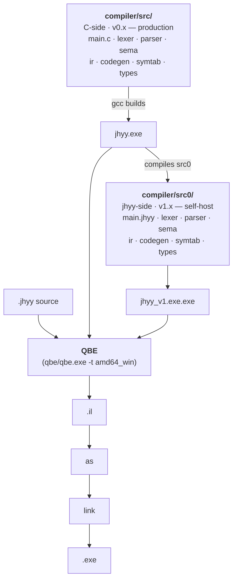

<div align="center">

<div></div>

<div></div>

### 机会翼游 — A self-hosted, statically typed, compiled systems programming language

**Statically typed. Expression-oriented. Compiled to native via QBE.**

[](docs/logs/v1/changelog-v1.8.0.md)
[](docs/logs/v2/changelog-v2.4.0.md)
[](https://c9x.me/compile/)
[](#quick-start)
[](LICENSE)
[](README.zh-CN.md)

[Quick Start](#quick-start) · [Install](#install) · [Language](#language) · [CLI](#cli) · [Architecture](#architecture) · [Status](#status-v183--v1x-final) · [Roadmap](#roadmap) · [Docs](#docs)

</div>

---

## What is JHYY

JHYY (机会翼游) is a self-designed, statically typed, expression-oriented, compiled systems programming language. The backend is [QBE](https://c9x.me/compile/), producing native x86-64 Windows binaries.

**Design goals**:
- **Self-hosting** — the compiler written in itself, achieving byte-equal closure (✓ v1.0.0)
- **OS development** — aligned with the [JiHuiYiYou-OS](https://github.com/JiHuiYiYou/JiHuiYiYou-OS) project, providing OS-required extensions like inline asm / volatile / naked / `no_std` / `&mut` + lifetime (v3.x roadmap)
- **Native performance** — QBE backend, no runtime / no GC, directly produces PE/COFF binaries

## Install

**Prerequisites** (Windows; v1.x is Windows-only — Linux/macOS land in v2.x via amd64_sysv):

1. **MSYS2** — <https://www.msys2.org/> (Windows 10+ x64)
2. **GCC + binutils** (ucrt64 toolchain) — run in an MSYS2 terminal:
   ```bash
   pacman -S mingw-w64-ucrt-x86_64-gcc mingw-w64-ucrt-x86_64-binutils
   ```
3. **PATH** — add `C:\msys64\ucrt64\bin` to your Windows user PATH (PowerShell: `$env:Path += ";C:\msys64\ucrt64\bin"`)

**Build** (one line):

```bash
git clone https://github.com/JiHuiYiYou/JiHuiYiYou-compiler.git
cd JiHuiYiYou-compiler
make           # → compiler/build/bin/jhyy.exe (~5MB)
```

**One-shot installer** (recommended for end users): `installer/jhyy-installer-1.8.3.exe` wires up `jhyy.exe` + `.jhyy` file association + VSCode extension + PATH registration in one step. `installer/jhyy-compiler-1.8.3.msi` is the enterprise / SCCM distribution (no GUI). See [`installer/README.md`](installer/README.md).

**Docker** (optional):

```bash
docker run -it msys2/mingw-w64-ucrt-x86_64 bash
# then follow steps 1-3 above inside the container
```

**VSCode users**: opening this repo triggers `.vscode/settings.json` to add `compiler/build/bin` and MSYS2 PATH to the integrated terminal automatically — no manual setup needed.

> [!IMPORTANT]
> Do NOT use the MinGW `gcc` shipped with Git Bash (`/c/Program\ Files/Git/mingw64/bin/gcc.exe`) — it does not support PE+ linking and will fail at link time.

---

## A tour of the syntax

```rust
// Functions / variables / control flow / struct / match / enum / FFI
type Point = struct { x: i32, y: i32 }

fn dist_sq(a: Point, b: Point) -> i32 {
    let dx = a.x - b.x;
    let dy = b.y - a.y;
    dx * dx + dy * dy
}

fn classify(n: i32) -> *u8 {
    match n {
        0        => "zero",
        1..10    => "single digit",
        10 | 20  => "round number",
        _        => "other",
    }
}

extern fn printf(fmt: *u8, val: i32) -> i32;

fn main_jhyy() -> i32 {
    let p = Point { x: 3, y: 4 };
    let q = Point { x: 0, y: 0 };
    printf("d² = %d\n", dist_sq(p, q));
    printf("%s\n", classify(42));
    0
}
```

---

## Quick Start

### Hello world

```rust
// hello.jhyy
fn main_jhyy() -> i32 {
    42
}
```

```bash
./compiler/build/bin/jhyy.exe compile hello.jhyy -o hello
./hello.exe
echo $?    # => 42
```

### Run the regression suite

```bash
python compiler/build/bin/regress.py
# => 104/104 passed, 0 failed, 4 skipped (of 108 total) — v2.4.0 baseline
```

### Run with VSCode

The repo ships `.vscode/tasks.json` — open any `.jhyy` file and press **`Ctrl+Shift+B`** to compile + run it. Other tasks: `Ctrl+Shift+P` → **Tasks: Run Task** → `JHYY: Run` / `JHYY: Compile` / `JHYY: Build IR`. `.vscode/settings.json` adds `compiler/build/bin` and `C:/msys64/ucrt64/bin` to the integrated terminal PATH so you can also type `jhyy run hello.jhyy` directly. `F5` launches the compiled `.exe` under MSYS2's gdb (cppdbg).

> [!IMPORTANT]
> **MSYS2 PATH requirement** — `jhyy run` shells out to `gcc` for linking, which in turn spawns `cc1.exe` / `as.exe` / `ld.exe` from `C:\msys64\ucrt64\bin`. PowerShell / cmd users outside VSCode need MSYS2 on their system PATH (or they get a silent `gcc link failed`). `.vscode/settings.json` handles this automatically for the integrated terminal; for external shells, add `C:\msys64\ucrt64\bin` to your user PATH manually.

### Verify self-hosting closure

```bash
# Stage 2 N=4 byte-equal — jhyy compiles jhyy
# Method 1: regress through self-hosted compiler (v1.4.7+ single regress entry)
python compiler/build/bin/regress.py --all --include-informational
# Method 2: one-shot closure check via MCP (recommended)
# ask Claude Code: "verify self-host closure" → jhyy_selfhost_check
# See docs/logs/v1/changelog-v1.0.0.md for full procedure
```

---

## Language

| Category | Supported |
|----------|-----------|
| **Types** | `i8/i16/i32/i64`, `u8/u16/u32/u64`, `f32/f64`, `bool`, `*T`, `[T; N]`, `[*]T` (slice), `struct`, `enum` |
| **Casts** | `as` — integer/float conversion, widening/narrowing, `*T ↔ i64/u64` |
| **Control flow** | `if`/`else` (expression-valued), `while`, `for i in start..end`, `break`, `continue`, `match` (literal/range/enum/wildcard, with exhaustiveness check) |
| **Top-level const** | `const NAME: [T; N] = [...]` — compile-time emit to `.data` section |
| **Logic** | `&&` / `\|\|` short-circuit, `!` / `~` unary |
| **Functions** | first-class, recursion, compound assignment (`+=` `-=` `*=` `/=` `%=`), block-expression closures |
| **Modules** | `import` + transitive imports, multi-file CLI, `mod::fn()` namespaces |
| **FFI** | `extern fn` calling C (printf, file I/O, multi-arg) |
| **Memory** | runtime Arena allocator (`arena_alloc` via FFI) |

Full specification: [`docs/abis/jhyy-lang-spec-v1.3.0.md`](docs/abis/jhyy-lang-spec-v1.3.0.md) (locked; v1.3.0 = v1.1.0 + 7 v1.3.x features); known limitations in Appendix B + Appendix E.

---

## CLI

```text
jhyy compile <file.jhyy> [-o name]   compile to .exe (default amd64_win)
jhyy run     <file.jhyy>             compile and run
jhyy build   <file.jhyy> [-o name]   emit QBE IL only (.il file)
jhyy dump    <file.jhyy>             dump parsed AST to stdout (debug)
jhyy                                 print help
```

> [!TIP]
> For multi-file compilation, list every `.jhyy` source on the command line: `jhyy compile main.jhyy lib.jhyy -o app`

---

## Architecture

The JHYY compiler exists in two **fully equivalent** implementations that emit byte-equal QBE IL:



| Implementation | Role | Status |
|----------------|------|--------|
| `compiler/src/*.c` | C-side compiler (v0.x era) | production path, maintained |
| `compiler/src0/*.jhyy` | jhyy-side translated source (v1.x era) | self-host path, byte-equal to C-side |
| `compiler/runtime/*.c` | C runtime (Arena + main entry) | linked at compile time |

Both paths emit **byte-equal QBE intermediate representation** — Stage 1 (`jhyy_0.exe` vs `jhyy_v1.exe.exe`) 7/7 byte-equal, Stage 2 (`jhyy_v1 → v2 → v3 → v4 → v5`) N=4 closure reached.

---

## Project layout

```
JiHuiYiYou-compiler/
├── compiler/
│   ├── src/                    C-side compiler source (10 .c / 9 .h files)
│   ├── src0/                   jhyy-side translated source (13 main modules + 11 _driver tests) — self-host path
│   ├── runtime/                C runtime (Arena + main entry)
│   ├── tests/
│   │   ├── examples/           integration tests (53 .jhyy) — regress.py auto-runs
│   │   └── unit/               C unit tests
│   └── build/
│       └── bin/
│           ├── jhyy.exe        C-side compiler binary
│           ├── jhyy_v1.exe.exe self-hosted compiler (jhyy compiled src0/)
│           └── regress.py      regression script
├── qbe/                        vendored QBE backend (c9x.me/compile)
├── mcp-jhyy/                   Claude Code MCP server (11 tools + 4 resources)
├── vscode-ext/                 VS Code language extension (syntax highlighting)
├── scripts/
│   └── dev/                    dev/ install-uninstall helpers, bench, test orchestrators (relative paths, portable)
├── docs/
│   ├── abis/                   language spec + ABI whitepaper (locked)
│   ├── plans/                  roadmap + sprint plans
│   ├── internal/               architecture / build / status / tests / workarounds
│   ├── CHANGELOG.md            changelog index (umbrella per `feedback_changelog_umbrella`)
│   └── logs/                   changelogs + sprint logs (per-version umbrella)
├── tools/
│   └── check_dangling.py       scan .md files for broken local links + hidden zero-width chars
├── Makefile                    one-line build (make)
├── .editorconfig               cross-editor indent/EOL/charset config
├── README.md                   English (this file)
└── README.zh-CN.md              简体中文
```

---

## Status (v1.8.3 — v1.x final)

`jhyy_v1 → jhyy_v2 → jhyy_v3 → jhyy_v4 → jhyy_v5` compile themselves and emit **byte-equal QBE intermediate representation**:

```
jhyy_v1.exe.exe → src0/main.jhyy → jhyy_v2.il
jhyy_v2.exe     → src0/main.jhyy → jhyy_v3.il   ← byte-equal to v2.il
jhyy_v3.exe     → src0/main.jhyy → jhyy_v4.il   ← byte-equal to v2.il
jhyy_v4.exe     → src0/main.jhyy → jhyy_v5.il   ← byte-equal to v2.il
                                                 sha 03a1cdd4… (v1.8.0 ship, frozen)
                                                 sha 51376ce5… (v2.4.0 re-baseline per D43)
```

All five raw `.il` files share an identical sha256 (1.378 MB, no fix-up post-processing). The fixed point is an attractor, not a transient. **Stage 2 N=4 byte-equal closure reached at v1.0.0 (tag `9b05c0f` / commit `eabee0d`, 2026-08-10), stable through v1.8.3 (tag `98c8272`, 2026-08-29), then re-baselined at v2.4.0 (tag `v2.4.0` / commit `7fb735b`, 2026-09-04) per D43 阶段性 self-equal hold (new sha `51376ce5…`). v1.x is now finalized; v2.0 阶段 (v2.0.0 → v2.4.0) 全 ship.**

| Metric | Value |
|--------|-------|
| `regress.py` (C-side `jhyy.exe`) | **104/104 PASS, 0 failed, 4 skipped** (108 total) |
| `regress.py --binary=jhyy_v1.exe.exe` (self-hosted `jhyy_v1.exe.exe`) | **104/104 PASS, 0 failed, 4 skipped** (parity hold) |
| Stage 1 byte-equal (`jhyy_0` vs `jhyy_v1`) | **7/7 PASS** |
| Stage 2 N=4 byte-equal (`v1→v2→v3→v4→v5`) | **stable** |
| `jhyy_v2` compiling `_repro_t0.jhyy` | `EXIT=100` ✓ |
| `jhyy_v2` compiling `fib(10)` | `EXIT=55` ✓ |
| `installer/jhyy-installer-1.8.3.exe` | shipped (~30MB, includes .NET 8 Desktop Runtime) |
| `installer/jhyy-compiler-1.8.3.msi` | shipped (~995KB, includes `jhyy-setuc.exe`) |
| `vscode-ext/jhyy-lang-1.8.3.vsix` | shipped (~13KB) |

**v1.x umbrella changelog** — [`docs/logs/v1/changelog-v1.8.0.md`](docs/logs/v1/changelog-v1.8.0.md) covers v1.8.0 main + v1.8.1 / v1.8.2 / v1.8.2 patch update / v1.8.3 / v1.8.3.1 / v1.8.3.2 patches (all `fix(v1.8.0)` commits, no new features). Historical v1.0.0 → v1.7.3 changelogs each live under `docs/logs/v1/changelog-vX.Y.Z.md`.

**W-NNN workaround status (v1.8.3 ship)**:
- ✅ W-059 defer codegen silent crash — RESOLVED 2026-08-28
- ❌ W-060 enum variant payload ABI — INVALID 2026-08-28 (bash `$?` 8-bit truncation artifact, regress.py W-028 mod-256 fix handles)
- ❌ W-061 nested struct field offset — INVALID 2026-08-28 (same reason)
- ✅ W-062 VSCode UserChoice + MSYS2 OpenWithProgids shadow — RESOLVED 2026-08-29 (v1.8.3.1 closed loop, SYSTEM-context CustomAction + 3-attempt fallback)
- ✅ W-063 UCPD.sys kernel filter — RESOLVED 2026-08-29 (v1.8.3 real fix, `jhyy-setuc.exe` .NET 8 SYSTEM-context writer)
- ✅ W-064 run_qbe stderr capture — RESOLVED 2026-09-01 (v1.8.3.2 patch, 镜像 W-045 link_with_gcc pattern, QBE 真实诊断不再丢失)
- ✅ W-065 cmd_run main_jhyy pre-check — RESOLVED 2026-09-01 (v1.8.3.2 patch, byte-scan `fn main_jhyy` 避免 link 时报 "undefined reference")
- 🟡 W-057 UTF-8 3/4-byte codepoint — DEFERRED-to-v2.x
- 🟡 W-058 vendored QBE missing `remd`/`rems` — DEFERRED-to-v2.x
- ⚠️ W-021 WiX Bal.wixext DLL naming — permanent workaround (WiX upstream won't fix)

Full index: [`docs/internal/workarounds.md`](docs/internal/workarounds.md).

**v0.x frozen**: `docs/logs/v0/changelog-v0.9.0.md` (3231 lines) — Stage 1 byte-equal 7-test-set wip, frozen at v1.0.0 baseline (2026-08-29). v0.x C compiler (`compiler/src/*.c`) enters maintenance-only mode; new features go through `compiler/src0/*.jhyy`. Per `docs/plans/roadmap/v1.x-phase-4-m5-boot-from-scratch.md`, M5 boot-from-scratch cleanup (delete `src/*.c` + `qbe/` + `runtime.c`) is deferred until v2.x end + v3.x end.

> [!NOTE]
> **v1.8.3 is v1.x final.** The C-side compiler (`compiler/src/*.c`) remains the production path during v1.x; `compiler/src0/*.jhyy` (the jhyy-side translated source) already produces byte-equal output. v2.0.0 阶段 (v2.0.0 → v2.4.0) shipped 2026-09-04 — multi-target dispatcher + freestanding ABI + hello-freestanding.efi E2E 5/5 PASS on OVMF (see [`docs/logs/v2/changelog-v2.{0..4}.0.md`](docs/logs/v2/changelog-v2.4.0.md) + [`docs/plans/v2/v2.0.0-os-prep.md`](docs/plans/v2/v2.0.0-os-prep.md)).

> [!NOTE]
> **v2.11.8 ship 2026-09-13 on axis-v2 + tag `v2.11.8`**: W-074.7.8 derived-address tracking **4/5 EXIT exact closure** (hello=42 / fib_renamed=40 / struct_val_pass=35 / nested_struct_deep=22 / struct_val_assign=30; big_test runtime STATUS_INTEGER_OVERFLOW deferred v2.11.9+ = W-074.7.9 NEW). ~319 LOC source + ~30 docs 真修 — bitmap flag any temp holding derived address + emit_load/store/loadsub indirect dispatch + emit_alloc self-referential slot fix + emit_copy FNARG flag propagate. QBE fallback 115/115 PASS preserved; self-backend regress +2 flips (56→58, 远低于 +5 scope DOWN trigger); D43 closure v1↔v2 .il sha HOLD. 详见 [`docs/logs/v2/changelog-v2.11.0.md`](docs/logs/v2/changelog-v2.11.0.md) § v2.11.8 + [`docs/plans/v2/v2.11.8-plan.md`](docs/plans/v2/v2.11.8-plan.md)。
> 
> **v2.11.9 ship 2026-09-13 on axis-v2 + tag `v2.11.9`**: W-074.7.9 big_test runtime **QBE side ✅ CLOSURE** — 2 个独立 root cause 真修 (`idiv` emit 无 `cltd`/`cqto` sign-extend prefix → x86 #DE fault + lexer 不识 QBE `rem` keyword → IL 静默 skip). 9 个 `rem` ops 正确 emit (cltd+idivl + movq %rdx, %rax). **QBE fallback 5/5 EXIT exact closure 真修达成** (big_test EXIT=12345 closure); self-backend side 仍 🟡 ACTIVE due to W-074.6 family (extsw silent-skip + multi-func body 0-byte + emit_ret 不 mov %t1 → %eax 等 pre-existing bugs) — 显式 deferred v2.x 中期 per W-074.6 ACTIVE state, 不强塞进 v2.11.9 (会触发 +5 scope DOWN trigger per [[feedback_codegen_amd64_multifn]]). ~30 LOC source + ~140 docs 真修. QBE fallback 6/6 key tests PASS (hello=42 / big_test=12345 / struct_val_pass=35 / fib_renamed=832040 / nested_struct_deep=22 / struct_val_assign=30); self-backend 5/5 hello PASS preserved (per W-074.6 baseline, multi-func closure deferred); D43 closure v1↔v2 .il sha HOLD; byte-equal-amd64 10/10 PASS preserved; fixed-point N≥3 PASS preserved; jhyy.exe.sha256 refresh `9ef7f49734ef99d7...`. 详见 [`docs/logs/v2/changelog-v2.11.0.md`](docs/logs/v2/changelog-v2.11.0.md) § v2.11.9 + [`docs/plans/v2/v2.11.9-plan.md`](docs/plans/v2/v2.11.9-plan.md)。

> **v2.11.10 ship 2026-09-13 on axis-v2 + tag `v2.11.10`**: W-074.6 **T3-a per-fn frame size + T4-c multi-arg FN_ARG 真修 (~155 LOC source + ~200 docs)**. T3-a closure: 两阶段 pre-scan (`cg_compute_per_fn_max_temps` Phase 1 扫 fn_starts, Phase 2 per-fn max temp id) + CGState 加 fn_starts/per_fn_max/fn_count 3 字段 + emit_func_header 改读 `per_fn_max[cur_fn_idx]` 替换 v2.11.2 global-max variant (1 个 fn = 15488 bytes frame → 递归函数 SIGSEGV 真修). T4-c 真修 (scope UP 配套 T3-a): lexer `next_token_func_header` 改 dup 完整 header text; emit_func_header 加 `cg_state_set_fn_header` populate cur_fn_header_text + extract name from full header for `.globl` + label; emit_copy FNARG 路径替换 hardcode `reg_rcx_for_qt` → `cg_find_arg_idx` + `reg_rax_for_qt_idx` (Win x64 arg 0..3 = %rcx/%rdx/%r8/%r9, SysV = rdi/rsi/rdx/rcx via target_tag). **诚实记录 per [[feedback_fix_evaluation_rule]]**: **5/6 self-backend EXIT exact closure** ✅ (hello=42 / struct_val_pass=35 / fib_renamed=40 / nested_struct_deep=22 / struct_val_assign=30), 跟 v2.11.9 baseline 一致但 different bug 真修 (T3-a: gcd `subq $600, %rsp` vs 旧 15488; T4-c: gcd body `movl %ecx` + `movl %edx` vs 旧 都 %ecx). **5/5 self-backend closure NOT achieved** — gdb 取证 big_test SIGFPE at `gcd+158 idivl -576(%rbp)` (T4-g: emit_binop cnew silent-skip + emit_jnz loop body entry silent-skip — pre-existing W-074.6 family bug, NOT in v2.11.10 plan scope). v2.11.10 plan 文档 "5/5 100% 可达" 预测 wrong — per [[feedback_codegen_amd64_multifn]] scope UP trigger: T4-g 暴露后 scope DOWN 5/6 closure 接受 (跟 v2.11.9 baseline 一致不触发 +5 FLIP trigger). **T4-g 真修 deferred v2.11.10a+ (~30-50 LOC 估)**. Stage 2 N=4 jhyy 编 jhyy closure PASS; QBE fallback 115/115 PASS preserved; byte-equal-amd64 10/10 preserved; fixed-point N≥3 PASS preserved; jhyy.exe.sha256 refresh. 详见 [`docs/logs/v2/changelog-v2.11.0.md`](docs/logs/v2/changelog-v2.11.0.md) § v2.11.10 + [`docs/plans/v2/v2.11.10-plan.md`](docs/plans/v2/v2.11.10-plan.md).

---

## Verification status

| Check | Command | Expected |
|-------|---------|----------|
| C-side regression | `python compiler/build/bin/regress.py` | **104/104 PASS + 4 SKIP** (108 total) |
| Self-host regression | `python compiler/build/bin/regress.py --all --include-informational` | **104/104 PASS + 4 SKIP** (parity hold) |
| Stage 1 byte-equal (`jhyy_0` vs `jhyy_v1`) | `python compiler/tests/stage1-expanded.sh` | 7/7 PASS |
| Stage 2 N=4 byte-equal (`v1→v2→v3→v4→v5`) | MCP `jhyy_selfhost_check` | `all_byte_equal=true`, stable il_sha256 |
| MCP smoke (7 test files, 39 `def test_*` funcs) | `pytest mcp-jhyy/tests/` | all pass |
| One-line build | `make` | 0 warnings (-Wall -Wextra) |

---

## Roadmap

The project uses a **single version axis**, no phase-N numbering:

| Axis | Scope | Goal | Status |
|------|-------|------|--------|
| **v0.x** | C-side compiler itself | reach self-host threshold | **🟢 done (frozen at v1.0.0 baseline)** |
| **v1.x** | jhyy self-hosting | byte-equal `.il` closure | **🟢 v1.8.3 shipped (v1.x final)** |
| **v2.x** | full QBE rewrite + multi-target / OS prep | amd64_sysv / freestanding | **✅ v2.0 阶段 ship (2026-09-04, tags `v2.3.0` / `v2.4.0`)**; v2.x 中/末 ⏳ 未启动 (QBE 自写 / amd64_sysv 实 impl / N 代 fixed point) — design input = [`docs/plans/v2/v2.0.0-os-prep.md`](docs/plans/v2/v2.0.0-os-prep.md) |
| **v3.x** | language extensions | OS-required: asm / volatile / naked / `no_std` / `&mut` + lifetime | **next** (v2.0 阶段 ✅ ship, 3a-3f 等 user 启动) — v2.x 中/末 + v3.x async parallel |

**Axis relationships**:
- `v0.x → v1.x → v2.x`: **strict order** (each is a hard prerequisite of the next)
- `v1.x → v3.x`: **strict order** (v3.0 sprint 3a-3f starts after v2.0 phase ships ✅; per 2026-09-01 user decision)
- `v2.x mid/late ⟂ v3.x`: **async parallel** (no fixed pairing; each ships independently; both done before OS M1 starts)

> [!IMPORTANT]
> **Alignment with the [JiHuiYiYou-OS](https://github.com/JiHuiYiYou/JiHuiYiYou-OS) project**: 12 cross-boundary questions + 6 decisions are closed and reflected in the OS prep plan at [docs/plans/v2/v2.0.0-os-prep.md](docs/plans/v2/v2.0.0-os-prep.md). The v2.0 sprint design input is the same plan.

---

## Tooling & Integration

### Claude Code MCP server

`mcp-jhyy/` ships **11 MCP tools** wired into the Claude Code workflow (Sprint 1 of mcp-jhyy, 2026-08-11, added 4 production-ready tools — `jhyy_regress` / `jhyy_il_diff` / `jhyy_selfhost_check` / `jhyy_workarounds` — and rebased the original 7 (`jhyy_run` / `jhyy_check` / `jhyy_compile` / `jhyy_get_il` / `jhyy_lang_ref` / `jhyy_abi_info` / `jhyy_format`) onto a thin regress.py shim):

| Tool | Purpose |
|------|---------|
| `jhyy_regress` | run C-side / jhyy-side regression, return PASS/FAIL list |
| `jhyy_il_diff` | byte-equal check on two `.il` files + contextual diff |
| `jhyy_selfhost_check` | one-shot v1→v2→v3→v4→v5 byte-equal verification |
| `jhyy_workarounds` | query W-NNN workaround status / details |
| `jhyy_run` / `jhyy_check` / `jhyy_compile` / `jhyy_get_il` | compile / run / inspect `.jhyy` |
| `jhyy_lang_ref` / `jhyy_abi_info` / `jhyy_format` | language / ABI / format queries |

Details in [`mcp-jhyy/README.md`](mcp-jhyy/README.md).

### VS Code extension

`vscode-ext/` ships syntax highlighting (TextMate grammar + file icon) + native `Run JHYY File` (`Ctrl+F5`) + `Compile JHYY File (no run)` commands. Latest shipped = `jhyy-lang-1.8.3.vsix`. Install + build instructions in [`vscode-ext/README.md`](vscode-ext/README.md).

---

## Docs

### Specification & ABI (locked)

| Doc | Description |
|-----|-------------|
| [`docs/abis/jhyy-lang-spec-v1.3.0.md`](docs/abis/jhyy-lang-spec-v1.3.0.md) | language spec v1.3.0 (v1.1.0 + 7 v1.3.x features; limitations in Appendix B + E) |
| [`docs/abis/jhyy-abi-v1.0.0.md`](docs/abis/jhyy-abi-v1.0.0.md) | ABI whitepaper v1.0.0 (struct pass-by-value / FFI / namespaces / slices) |

### Internal

| Doc | Description |
|-----|-------------|
| [`docs/internal/architecture.md`](docs/internal/architecture.md) | pipeline / modules / QBE IL cheat sheet |
| [`docs/internal/build.md`](docs/internal/build.md) | build / run / QBE backend pitfalls (Windows) |
| [`docs/internal/workarounds.md`](docs/internal/workarounds.md) | W-NNN workaround status index |
| [`docs/internal/tests.md`](docs/internal/tests.md) | integration test catalog + how to run |

### Roadmap & plans

| Doc | Description |
|-----|-------------|
| [`docs/plans/roadmap/v0.x-c-compiler-roadmap.md`](docs/plans/roadmap/v0.x-c-compiler-roadmap.md) | C compiler evolution |
| [`docs/plans/roadmap/v1.0-self-hosting.md`](docs/plans/roadmap/v1.0-self-hosting.md) | self-hosting overview |
| [`docs/plans/roadmap/v2.x-qbe-rewrite.md`](docs/plans/roadmap/v2.x-qbe-rewrite.md) | QBE rewrite direction |
| [`docs/plans/roadmap/v3.x-language-expansion.md`](docs/plans/roadmap/v3.x-language-expansion.md) | language extension direction |
| [`docs/plans/v2/v2.0.0-os-prep.md`](docs/plans/v2/v2.0.0-os-prep.md) | compiler-side authority on OS startup chain |

### Changelog

Latest: [`docs/logs/v1/changelog-v1.8.0.md`](docs/logs/v1/changelog-v1.8.0.md) — **v1.x umbrella (covers v1.8.0 main + v1.8.1 / v1.8.2 / v1.8.2 patch update / v1.8.3 / v1.8.3.1 / v1.8.3.2 patches)**

Historical index: [`docs/logs/`](docs/logs/) — v1.0.0 → v1.7.3 each have their own umbrella;v0.0.1 → v0.9.0 for C-side compiler (v0.9 frozen at v1.0.0 baseline).

---

## Contributors

- **Human author**: JHYY
- **AI collaborator**: MiniMax-M3 (working through the [Claude Code](https://claude.ai/code) CLI workflow on design, coding, debugging, documentation)

Since v0.6 every sprint's implementation + documentation has been co-authored by JHYY + MiniMax-M3.
