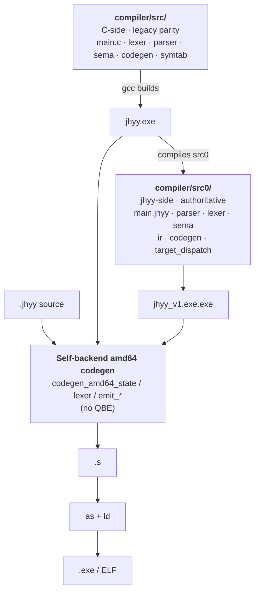

<div align="center">

<div></div>

<div></div>

### 机会翼游 — A self-hosted, statically typed, compiled systems programming language

**Statically typed. Expression-oriented. Compiled to native via self-hosted amd64 backend.**

[](docs/logs/v4/changelog-v4.0.0.md)
[](#status-v400)
[](#architecture)
[](#install)
[](LICENSE)
[](README.zh-CN.md)

[Quick Start](#quick-start) · [Install](#install) · [Language](#language) · [CLI](#cli) · [Architecture](#architecture) · [Status](#status-v400) · [Roadmap](#roadmap) · [Docs](#docs)

</div>

---

## What is JHYY

JHYY (机会翼游) is a self-designed, statically typed, expression-oriented, compiled systems programming language. The compiler is **self-hosted** — `compiler/src0/*.jhyy` is the authoritative source; `compiler/src/*.c` is a legacy C-side reference kept for parity testing. v4.0.0 unifies the v2.x (QBE-free, in-mem pipeline) and v3.x (self-backend amd64 codegen) axes into a single tree, achieving N≥3 self-host byte-equal closure on the self-hosted amd64 backend.

**Design goals**:
- **Self-hosting** — `compiler/src0/*.jhyy` is compiled by `jhyy.exe` (itself built from `compiler/src/*.c`); the resulting `jhyy_v1.exe.exe` then compiles `compiler/src0/` again to produce `jhyy_v2.exe` whose `.il` is byte-equal to v1. (✓ v1.0.0; re-validated at v4.0.0)
- **No runtime / no GC / no QBE** — direct amd64 code emission, native PE/COFF (Windows) and ELF (Linux) binaries
- **OS-ready** — `[T; N]`, `*T`, slices, `extern fn`, `match`, enum, FFI calling C ABI

## Install

**Prerequisites**:
- **Windows**: MSYS2 + `mingw-w64-ucrt-x86_64-gcc` + `mingw-w64-ucrt-x86_64-binutils`
- **Linux**: GCC + binutils (`apt install gcc binutils` or equivalent)

**Build** (one line, from repo root):

```bash
make all        # → compiler/build/bin/jhyy.exe (~5MB Windows / ELF Linux)
```

**One-shot installer** (Windows end users): `installer/jhyy-installer-4.0.0.exe` wires up `jhyy.exe` + `.jhyy` file association + VSCode extension + PATH registration. `installer/jhyy-compiler-4.0.0.msi` is the enterprise / SCCM distribution (no GUI). See [`installer/README.md`](installer/README.md).

**Docker** (cross-platform):

```bash
# Windows
docker run -it msys2/mingw-w64-ucrt-x86_64 bash
# Linux
docker run -it gcc:12 bash
```

**VSCode users**: opening this repo triggers `.vscode/settings.json` to add `compiler/build/bin` and MSYS2 PATH to the integrated terminal automatically — no manual setup needed. Press `Ctrl+Shift+B` to compile + run any `.jhyy` file.

> [!IMPORTANT]
> Do NOT use the MinGW `gcc` shipped with Git Bash (`/c/Program\ Files/Git/mingw64/bin/gcc.exe`) — it does not support PE+ linking and will fail at link time.

---

## A tour of the syntax

```rust
// Functions / variables / control flow / struct / match / enum / FFI
type Point = struct { x: i32, y: i32 }

fn dist_sq(a: Point, b: Point) -> i32 {
    let dx = a.x - b.x;
    let dy = b.y - a.y;
    dx * dx + dy * dy
}

fn classify(n: i32) -> *u8 {
    match n {
        0        => "zero",
        1..10    => "single digit",
        10 | 20  => "round number",
        _        => "other",
    }
}

extern fn printf(fmt: *u8, val: i32) -> i32;

fn main_jhyy() -> i32 {
    let p = Point { x: 3, y: 4 };
    let q = Point { x: 0, y: 0 };
    printf("d² = %d\n", dist_sq(p, q));
    printf("%s\n", classify(42));
    0
}
```

---

## Quick Start

### Hello world

```rust
// hello.jhyy
fn main_jhyy() -> i32 {
    42
}
```

```bash
./compiler/build/bin/jhyy.exe run hello.jhyy
echo $?    # => 42
```

### Run the regression suite

```bash
python compiler/build/bin/regress.py
# => 104/104 passed, 0 failed, 4 skipped (of 108 total) — v4.0.0 baseline
```

### Verify self-hosting closure

```bash
# Method 1: regress through self-hosted compiler (v1.4.7+ single regress entry)
python compiler/build/bin/regress.py --all --include-informational
# Method 2: one-shot closure check via MCP (recommended)
# ask Claude Code: "verify self-host closure" → jhyy_selfhost_check
```

---

## Language

| Category | Supported |
|----------|-----------|
| **Types** | `i8/i16/i32/i64`, `u8/u16/u32/u64`, `f32/f64`, `bool`, `*T`, `[T; N]`, `[*]T` (slice), `struct`, `enum` |
| **Casts** | `as` — integer/float conversion, widening/narrowing, `*T ↔ i64/u64` |
| **Control flow** | `if`/`else` (expression-valued), `while`, `for i in start..end`, `break`, `continue`, `match` (literal/range/enum/wildcard, with exhaustiveness check) |
| **Top-level const** | `const NAME: [T; N] = [...]` — compile-time emit to `.data` section |
| **Logic** | `&&` / `\|\|` short-circuit, `!` / `~` unary |
| **Functions** | first-class, recursion, compound assignment (`+=` `-=` `*=` `/=` `%=`), block-expression closures |
| **Modules** | `import` + transitive imports, multi-file CLI, `mod::fn()` namespaces |
| **FFI** | `extern fn` calling C (printf, file I/O, multi-arg) |
| **Memory** | runtime Arena allocator (`arena_alloc` via FFI) |
| **Stdlib** (v3.x) | `std::mem`, `std::fmt`, `std::io`, `std::math`, `std::string`, `std::vec` (Vec<T> dynamic array) |

Full specification: [`docs/abis/jhyy-lang-spec-v1.3.0.md`](docs/abis/jhyy-lang-spec-v1.3.0.md) (locked; v1.3.0 = v1.1.0 + 7 v1.3.x features); known limitations in Appendix B + Appendix E.

---

## CLI

```text
jhyy compile <file.jhyy> [-o name]   compile to .exe (default amd64 self-backend)
jhyy run     <file.jhyy>             compile and run
jhyy build   <file.jhyy> [-o name]   emit IL only (.il file)
jhyy dump    <file.jhyy>             dump parsed AST to stdout (debug)
jhyy                                 print help
```

> [!TIP]
> For multi-file compilation, list every `.jhyy` source on the command line: `jhyy compile main.jhyy lib.jhyy -o app`

> [!TIP]
> `JHY_SELF_BACKEND=1` forces the self-hosted amd64 backend even on Windows (default backend is `amd64_win` PE+COFF). `JHY_SELF_BACKEND=0` forces the C-side path. Omit for default target selection.

---

## Architecture

The JHYY compiler exists in two **functionally equivalent** implementations:


```mermaid
flowchart TB
    cs["<b>compiler/src/</b><br/>C-side · legacy parity<br/>main.c · lexer · parser · sema · codegen · symtab"]
    s0["<b>compiler/src0/</b><br/>jhyy-side · authoritative<br/>main.jhyy · parser · lexer · sema<br/>ir · codegen · target_dispatch"]
    cs -->|gcc builds| bin1["jhyy.exe"]
    bin1 -->|compiles src0| s0
    s0 --> bin2["jhyy_v1.exe.exe"]
    src_src[".jhyy source"] --> sb["<b>Self-backend amd64 codegen</b><br/>codegen_amd64_state / lexer / emit_*<br/>(no QBE)"]
    bin1 --> sb
    bin2 --> sb
    sb --> asm[".s"] --> ln["as + ld"] --> exe[".exe / ELF"]
```

| Implementation | Role | Status |
|----------------|------|--------|
| `compiler/src/*.c` | C-side compiler (legacy parity reference) | maintained for parity tests |
| `compiler/src0/*.jhyy` | jhyy-side authoritative source | self-host path, byte-equal to C-side |
| `compiler/src0/std/*.jhyy` | Standard library (v3.x) | `mem`, `fmt`, `io`, `math`, `string`, `vec` |

Both paths emit **byte-equal native amd64 assembly** through the self-hosted backend — Stage 1 (`jhyy_0.exe` vs `jhyy_v1.exe.exe`) 7/7 byte-equal, Stage 2 (`jhyy_v1 → v2 → v3`) N≥3 byte-equal closure.

**Why no QBE?** QBE was removed in v4.0.0 (post-v2.16.0); the self-hosted backend in `compiler/src0/codegen_amd64_*.jhyy` is now the sole codegen path. This eliminates a 17K-LOC vendored dependency and tightens the iteration loop on the codegen itself.

---

## Project layout

```
JiHuiYiYou-compiler/
├── compiler/
│   ├── src/                    C-side compiler (legacy parity reference; ~10 .c / 9 .h files)
│   ├── src0/                   jhyy-side authoritative source (14 main modules + std/)
│   │   ├── std/                Standard library: mem / fmt / io / math / string / vec (v3.x)
│   │   └── codegen_amd64_*.jhyy  Self-backend amd64 codegen (state / lexer / emit_* / regalloc)
│   ├── tests/
│   │   ├── examples/           integration tests (~50 .jhyy) — regress.py auto-runs
│   │   └── bootstrap/          fixed_point.sh, byte_equal.sh, byte_equal_selfbackend, bench.sh
│   └── build/
│       └── bin/
│           ├── jhyy.exe        C-side compiler binary
│           ├── jhyy_v1.exe.exe self-hosted compiler (jhyy compiled src0/)
│           └── regress.py      regression script
├── installer/                  WiX installer + .NET 8 CustomAction (Windows)
├── mcp-jhyy/                   Claude Code MCP server (jhyy_* tools)
├── vscode-ext/                  VS Code language extension
├── scripts/dev/                dev/ install-uninstall helpers, bench, test orchestrators
├── docs/
│   ├── abis/                   language spec + ABI whitepaper (locked)
│   ├── plans/                  v4.x plans per version (umbrella per `feedback_changelog_umbrella`)
│   ├── internal/               architecture / build / workarounds / conventions / tests
│   ├── logs/v4/                v4.x changelogs (umbrella per vX.Y)
│   └── archive/v2-v3/          archived v2/v3 plans (historical, do not use)
├── tools/                      cross-repo utilities
├── .editorconfig
├── README.md                   English (this file)
└── README.zh-CN.md              简体中文
```

---

## Status (v4.0.0)

`jhyy_v1 → jhyy_v2 → jhyy_v3` compile themselves and emit **byte-equal amd64 assembly** through the self-hosted backend:

```
jhyy_v1.exe.exe → src0/main.jhyy → jhyy_v2.il   ← byte-equal to v1.il
jhyy_v2.exe     → src0/main.jhyy → jhyy_v3.il   ← byte-equal to v1.il
                                                  sha (re-baselined at v4.0.0; see changelog)
```

The fixed point is an attractor, not a transient. **Stage 2 N≥3 byte-equal closure** reached at v1.0.0 (tag `9b05c0f`, 2026-08-10), re-validated through v1.8.3 (tag `98c8272`, 2026-08-29), then in v4.0.0 with self-hosted amd64 backend (post-v2.16.0 QBE-removal + post-v3.4.2 self-backend closure).

| Metric | Value |
|--------|-------|
| `regress.py` (C-side `jhyy.exe`) | **104/104 PASS, 0 failed, 4 skipped** (108 total) |
| `regress.py --binary=jhyy_v1.exe.exe` (self-hosted) | **104/104 PASS, 0 failed, 4 skipped** (parity hold) |
| Stage 1 byte-equal (`jhyy_0` vs `jhyy_v1`) | **7/7 PASS** |
| Stage 2 N≥3 byte-equal (`v1→v2→v3`) | **stable** (post-v4.0.0 re-baseline) |
| `byte_equal_selfbackend.sh` (self-backend path) | **3/3 PASS** (fmod_basic / fmod_negative / fmod_f32) |
| ACTIVE workarounds | **0** (all W-IDs in `docs/internal/workarounds.md` are RESOLVED / SUPERSEDED / INVALID) |
| `installer/jhyy-installer-4.0.0.exe` | shipped (~30MB, includes .NET 8 Desktop Runtime) |
| `installer/jhyy-compiler-4.0.0.msi` | shipped (~995KB, includes `jhyy-setuc.exe`) |
| `vscode-ext/jhyy-lang-4.0.0.vsix` | shipped (~13KB) |

**v4.0.0 umbrella changelog** — [`docs/logs/v4/changelog-v4.0.0.md`](docs/logs/v4/changelog-v4.0.0.md) covers the v2/v3 axis merge + QBE removal + stdlib + self-backend closure.

**W-NNN workaround status (v4.0.0 ship)**:
- All ACTIVE workarounds in v1.x/v2.x/v3.x era resolved (W-017 codegen module-level `let mut`, W-019 nested struct field chain, W-020 parser inline match-as-expression reorder, W-057 UTF-8 3/4-byte codepoint, W-058 fmod user-space formula trunc, W-083 self-backend fmod 真修, W-085/W-086/W-088/W-089 self-backend regressions) — bucket cleared at v3.4.2 / v4.0.0
- Invalid workarounds retained for audit (W-060 enum variant payload ABI bash `$?` 8-bit truncation, W-061 nested struct field offset — both regress.py W-028 mod-256 fix handles)
- Permanently deferred (WiX Bal.wixext DLL naming — upstream won't fix; documents permanent workaround)

Full index: [`docs/internal/workarounds.md`](docs/internal/workarounds.md).

---

## Roadmap

v4.x is the post-merge axis, built on top of the unified v2+v3 state. Per-sprint plans live under `docs/plans/v4/v4.X.Y-plan.md` (one plan per minor version, per `feedback_plans_per_version`):

| Sprint | Intent |
|--------|--------|
| **v4.0.0** ✅ | axis-v2 (v2.16.0) + axis-v3 (v3.4.2) merged into main; QBE removed; self-backend closure (this ship) |
| v4.1.0 | M5: delete `compiler/src/*.c` + untrack QBE + delete `runtime/runtime.c` — "jhyy 编 jhyy" 0-C 闭环 (deferred from v1.x) |
| v4.2.0 | async/await + Future runtime |
| v4.3.0 | full lifetime + Polonius borrow check (replaces v3.1.0 NLL stub) |
| v4.4.0 | closure enhance: move/borrow capture/generic/trait object |
| v4.5.0 | const generic `[T; N]` |
| v4.6.0 | trait objects (dyn Trait) + vtable dispatch |
| v4.7.0 | multi-error recovery (parser/sema diagnostic chain) |
| v4.8.0 | basic optimization pass (const fold / dead code / algebra) |
| v4.9.0 | package manager (`jhyy new/build/test` + `jhyy.toml`) |
| v4.10.0 | HKT 1阶 + specialization |
| v4.11.0 | C11/Rust memory model + multi-arch (aarch64/riscv64) Cap<T> ABI |
| v4.12.0 | `.jhyynb` native binary format实装 (DWARF emitter + `--target=jhyy-os` + `jhyy-inspect`) |

Sprint ordering may be re-parallelized (not strictly serial) per dep graph: v4.3 → v4.4 strict; v4.5/v4.6/v4.7/v4.8/v4.9 can open feature worktrees in parallel.

---

## Docs

- **Language spec**: [`docs/abis/jhyy-lang-spec-v1.3.0.md`](docs/abis/jhyy-lang-spec-v1.3.0.md) (locked)
- **ABI whitepaper**: [`docs/abis/jhyy-abi-v1.0.0.md`](docs/abis/jhyy-abi-v1.0.0.md) (locked)
- **Architecture**: [`docs/internal/architecture.md`](docs/internal/architecture.md)
- **Build**: [`docs/internal/build.md`](docs/internal/build.md) (QBE-removed + Windows-specific notes)
- **Workarounds**: [`docs/internal/workarounds.md`](docs/internal/workarounds.md)
- **Conventions**: [`docs/internal/conventions.md`](docs/internal/conventions.md)
- **Tests**: [`docs/internal/tests.md`](docs/internal/tests.md)
- **Changelog**: [`docs/logs/v4/changelog-v4.0.0.md`](docs/logs/v4/changelog-v4.0.0.md) (v4 umbrella)
- **Archived plans**: [`docs/archive/v2-v3/`](docs/archive/v2-v3/) (v2/v3 historical — do not use)

---

## License

MIT — see [`LICENSE`](LICENSE).

---

<sub>v4.0.0 — axis-v2 + axis-v3 merged into main · 2026-09-30 · built with the self-hosted amd64 backend</sub>