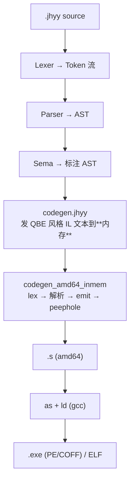

<div align="center">

<div></div>

<div></div>

### 机会翼游 — A self-hosted, statically typed, compiled systems programming language

**Statically typed. Expression-oriented. Compiled to native by a self-written amd64 backend.**

[](docs/archive/logs/v4/changelog-v4.0.0.md)
[](#status-v412)
[](#architecture)
[](#install)
[](LICENSE)
[](README.zh-CN.md)

[Quick Start](#quick-start) · [Install](#install) · [Language](#language) · [CLI](#cli) · [Architecture](#architecture) · [Status](#status-v412) · [Roadmap](#roadmap) · [Docs](#docs)

</div>

---

## What is JHYY

JHYY (机会翼游) is a self-designed, statically typed, expression-oriented, compiled systems
programming language. **The compiler is written in itself** — `compiler/src0/*.jhyy` is the
*only* implementation. `jhyy.exe` compiles `compiler/src0/main.jhyy`; the compiler that
produces compiles it again, and the closure gate **iterates until the emitted `.s` is
byte-identical** (the fixed point is reached, not assumed).

The backend is a **self-written in-memory amd64 code emitter**
(`compiler/src0/codegen_amd64_*.jhyy`) — no vendored QBE, no LLVM, no GC, no runtime.

**Design goals**:

- **Self-hosting** — the compiler compiles itself; the closure is verified by iteration to a
  fixed point (`.s` byte-identical across generations).
- **Native output** — direct amd64 code emission; PE/COFF (Windows) and ELF (Linux) binaries.
- **OS-ready** — `extern fn` FFI on the C ABI, `enum` + `match`, `#[no_std]`, `#[naked]`,
  inline `asm!`, `#[link_section]`, `volatile`, memory barriers, `defer`.

## Install

**End users (Windows x64)** — grab the installer. **MSYS2 is not required**: since v4.1.0
the MSI bundles a minimal native ucrt64 toolchain (`<INSTALLDIR>\toolchain\`).

| Artifact | Size | What it is |
|---|---|---|
| `jhyy-installer-4.1.2.exe` | ~55 MB | GUI installer — compiler + `.jhyy` file association + VS Code extension + PATH |
| `jhyy-compiler-4.1.2.msi` | ~28 MB | Same payload, no GUI — for enterprise / SCCM distribution |

**Building from source** — needs MSYS2 + `mingw-w64-ucrt-x86_64-gcc` (the compiler
*build* host requirement; end users don't need it):

```bash
make all        # → compiler/build/bin/jhyy.exe (~1.9 MB)
```

> [!IMPORTANT]
> Do NOT use the MinGW `gcc` shipped with Git Bash (`/c/Program\ Files/Git/mingw64/bin/gcc.exe`)
> — it does not support PE+ linking and fails at link time.

**Docker**:

```bash
# compiler host — full toolchain (Windows)
docker run -it msys2/mingw-w64-ucrt-x86_64 bash
# amd64_sysv target toolchain — link + run the emitted .s on Linux
# (jhyy.exe is a PE binary: it does NOT run inside this container)
docker run -it gcc:12 bash
```

**VSCode users**: opening this repo triggers `.vscode/settings.json` to add
`compiler/build/bin` and the MSYS2 ucrt64 path to the integrated terminal. Press
`Ctrl+Shift+B` to compile + run any `.jhyy` file.

---

## A tour of the syntax

```rust
// Functions / variables / control flow / struct / match / enum / FFI
type Point = struct { x: i32, y: i32 }

fn dist_sq(a: Point, b: Point) -> i32 {
    let dx = a.x - b.x;
    let dy = a.y - b.y;
    dx * dx + dy * dy
}

fn classify(n: i32) -> *u8 {
    match n {
        0        => "zero",
        1..10    => "single digit",
        10 | 20  => "round number",
        _        => "other",
    }
}

extern fn printf(fmt: *u8, val: i32) -> i32;

fn main_jhyy() -> i32 {
    let p = Point { x: 3, y: 4 };
    let q = Point { x: 0, y: 0 };
    printf("d² = %d\n", dist_sq(p, q));
    printf("%s\n", classify(42));
    0
}
```

---

## Quick Start

### Hello world

```rust
// hello.jhyy
fn main_jhyy() -> i32 {
    42
}
```

```bash
./compiler/build/bin/jhyy.exe run hello.jhyy
echo $?    # => 42
```

### Run the regression suite

```bash
python regress.py
# => 259/259 passed (全部有断言), 0 failed, 20 skipped (of 279 total)
```

### Verify the self-host closure

```bash
make            # builds jhyy.exe, then iterates the closure to a fixed point
#   ⇒ _boot_new.s vs _boot_new2.s byte-identical
```

---

## Language

| Category | Supported |
|----------|-----------|
| **Types** | `i8/i16/i32/i64`, `u8/u16/u32/u64`, `f32/f64`, `bool`, `*T`, `[T; N]`, `[*]T` (slice), `struct`, `enum`, `Cap<T>`, `PhantomData<T>` |
| **Sizes** | `sizeof(T)` / `alignof(T)` — compile-time constants |
| **Casts** | `as` — integer/float conversion, widening/narrowing, `*T ↔ i64/u64` |
| **Control flow** | `if`/`else` (expression-valued), `while`, `for i in start..end`, `break`, `continue`, `match` (literal/range/enum/wildcard, with exhaustiveness check) |
| **Cleanup** | `defer` — runs at scope exit (LIFO); not run on an implicit tail return |
| **Top-level const** | `const NAME: [T; N] = [...]` — compile-time emit to the `.data` section |
| **Logic** | `&&` / `\|\|` short-circuit, `!` / `~` unary |
| **Functions** | first-class, recursion, compound assignment (`+=` `-=` `*=` `/=` `%=`), block-expression closures (no capture — capturing is a compile error) |
| **Modules** | `import` + transitive imports, multi-file CLI, `mod::fn()` namespaces |
| **FFI** | `extern fn` calling C (printf, file I/O, multi-arg) |
| **OS / embedded** | `#[no_std]`, `#[naked]`, `#[link_section]`, `volatile`, inline `asm!`, memory barriers |
| **Stdlib** | `import mem;` / `fmt` / `io` / `math` / `string` / `vec` / `os` / `arena` — **note: no `std::` prefix** (`import std::vec;` is a compile error) |

Full specification: [`docs/abis/jhyy-lang-spec-v4.0.0.md`](docs/abis/jhyy-lang-spec-v4.0.0.md)
(locked 2026-10-24; it replaces v1.3.0 + 17 v3.x supplements, both archived to git history).
Known limitations are collected in its **Appendix B**, not scattered through the prose.

---

## CLI

```text
jhyy compile <file.jhyy> [-o output]   compile + link -> .exe
jhyy build   <file.jhyy> [-o output]   compile only -> .s (no link)
jhyy run     <file.jhyy>              compile + link + execute
jhyy dump    <file.jhyy>              ⚠️ not implemented yet (exits 1)

flags:
  --target=<triple>  select target (default amd64_win)
  --no-link          compile to .s only, skip the gcc link (for cross toolchains)
  --help             show help and exit
```

Targets: `amd64_win` (default, hosted Windows) · `amd64_win_freestanding` (UEFI) ·
`amd64_sysv` · `amd64_sysv_freestanding`.

> [!TIP]
> For multi-file compilation, list every `.jhyy` source on the command line:
> `jhyy compile main.jhyy lib.jhyy -o app`
>
> ⚠️ **There is no `jhyy --version`** — it never existed. Running it prints
> `unknown command` and exits 1. The version banner is the **first line of
> `jhyy --help`** (and of `jhyy` with no arguments).
>
> ⚠️ `jhyy build` and `jhyy compile --no-link` are *not* equivalent: `build` does not run
> `apply_link_section_directives`, so programs using `#[link_section]` produce different
> `.s` on the two paths (see `W-170`). Prefer `compile --no-link` for tooling.

---

## Architecture


```mermaid
flowchart TB
    src[".jhyy source"] --> lex["Lexer → Token 流"]
    lex --> parse["Parser → AST"]
    parse --> sema["Sema → 标注 AST"]
    sema --> il["codegen.jhyy<br/>发 QBE 风格 IL 文本到**内存**"]
    il --> sb["codegen_amd64_inmem<br/>lex → 解析 → emit → peephole"]
    sb --> asm[".s (amd64)"]
    asm --> ln["as + ld (gcc)"]
    ln --> exe[".exe (PE/COFF) / ELF"]
```

| Piece | Where | Role |
|-------|-------|------|
| `compiler/src0/*.jhyy` | 30 modules | **The** compiler — lexer, parser, sema, IR, codegen, target dispatch |
| `compiler/src0/codegen_amd64_*.jhyy` | self-written backend | IL lexer · emitter (`emit_call` / `emit_ctrl` / `emit_mem` / `emit_sse`) · peephole · register cache |
| `compiler/src0/std/*.jhyy` | 8 modules | `mem` `fmt` `io` `math` `string` `vec` `os` `arena` |
| `compiler/runtime/runtime.c` | C runtime | Arena allocator + `main` → `main_jhyy` bridge |
| `runtime/linux_elf/` | crt0.S + link.ld | Linux ELF runtime for the `amd64_sysv*` targets |

**Why no QBE?** QBE was removed in v4.0.0 (post-v2.16.0). The self-written backend is now
the sole codegen path — that removes a 17K-LOC vendored dependency and tightens the
iteration loop on codegen itself.

---

## Project layout

```
JiHuiYiYou-compiler/
├── compiler/
│   ├── src0/                   编译器源码(唯一实现,30 个模块 + std/)
│   │   ├── std/                标准库:mem / fmt / io / math / string / vec / os / arena
│   │   └── codegen_amd64_*.jhyy 自研后端:IL lexer / emit_* / peephole / 寄存器缓存
│   ├── runtime/                C 运行时(Arena + main 入口)
│   ├── tests/
│   │   ├── examples/           集成测试(274 个 .jhyy + 5 个子目录)— regress.py 自动跑
│   │   └── bootstrap/          fixed_point.sh · closure_check.sh · artifact_checks.sh · byte_equal*.sh
│   └── build/bin/              jhyy.exe · jhyy_v1.exe.exe(自举产物)
├── runtime/linux_elf/          Linux ELF 运行时(crt0.S + link.ld)
├── regress.py                  回归测试套件(仓库根)
├── docs/                       规范 / 内部文档 / 计划 / changelog
├── installer/                  WiX installer + 内置 ucrt64 工具链
├── mcp-jhyy/                   Claude Code MCP server(jhyy_* 工具)
├── vscode-ext/                 VS Code 扩展
├── scripts/dev/                开发脚本(bench / test / build / install)
└── tools/                      跨仓工具
```

---

## Status (v4.1.2)

| Metric | Value |
|--------|-------|
| `regress.py` | **259 PASS + 0 XFAIL + 0 failed + 20 SKIP** (279 total) |
| Assertion audit | 279 scanned / 259 runnable / 200 real assertions / 0 zero-signal |
| Self-host closure | `make` iterates to a fixed point — emitted `.s` byte-identical |
| `fixed_point.sh` | **17 PASS / 0 FAIL** (N=10, `.il` and `.s` byte-equal across generations) |
| `artifact_checks.sh` | **17 PASS / 0 FAIL** |
| `closure_check.sh` | PASS (v2.s == v3.s, byte-identical) |
| ACTIVE workarounds | **1** — [`W-170`](docs/workarounds.md): `jhyy build` doesn't apply `#[link_section]` |
| `jhyy-installer-4.1.2.exe` | shipped (~55 MB, includes .NET 8 Desktop Runtime + bundled ucrt64 toolchain) |
| `jhyy-compiler-4.1.2.msi` | shipped (~28 MB, includes `jhyy-setuc.exe` + bundled toolchain) |
| `jhyy-lang-4.1.2.vsix` | shipped (VS Code extension) |

**v4.x umbrella changelog** — [`docs/archive/logs/v4/changelog-v4.0.0.md`](docs/archive/logs/v4/changelog-v4.0.0.md)
is the single per-axis changelog (per the project's umbrella convention).

---

## Roadmap

v4.x is the post-merge axis. Plans live one per version slot under
[`docs/plans/v4/`](docs/plans/v4/README.md) — the authoritative index, plus
[`docs/archive/plans/v4/version-schedule.md`](docs/archive/plans/v4/version-schedule.md) for the schedule.

**Performance line** (self-written backend — the current main line):

| Sprint | Intent |
|--------|--------|
| **v4.4.0** ⭐ | **Register allocation** — stage 1 (allocator + safety net, byte-identical output) is done; stage 2 is the emit layer consuming registers |
| v4.4.1 / v4.4.2 / v4.4.3 | call-clobber + register classes / cross-block + phi parallel moves / gates + perf validation |
| v4.4.5 | peephole 4096 limit + IR optimisation framework (two downgraded versions) |
| v4.5 | M5 Part 3 — the last 0-C-closure item |

**OS line** (v4.6 → v4.15, stable identity `OS-1` … `OS-16`): stop-the-bleeding → stack
observation → feedback loop → ABI convergence → language self-consistency → effect system →
lifetime → trait + `dyn Trait` → const generics → HKT → capability typing → trusted
toolchain.

Version numbers on reserved slots are **placeholders** — each plan carries a
"check on start" checklist to be re-verified against reality when that slot is picked up.

---

## Docs

- **Language spec**: [`docs/abis/jhyy-lang-spec-v4.0.0.md`](docs/abis/jhyy-lang-spec-v4.0.0.md) (locked)
- **ABI whitepaper**: [`docs/abis/jhyy-abi-v4.0.0.md`](docs/abis/jhyy-abi-v4.0.0.md) (locked)
- **Binary format** (design doc, not implemented): [`docs/abis/jhyy-binary-format-v1.0.0.md`](docs/abis/jhyy-binary-format-v1.0.0.md)
- **Architecture**: [`docs/internal/architecture.md`](docs/internal/architecture.md)
- **Build & run**: [`docs/internal/build.md`](docs/internal/build.md)
- **Tests**: [`docs/FACTS.md`](docs/FACTS.md)
- **Workarounds ledger**: [`docs/workarounds.md`](docs/workarounds.md)
- **Conventions**: [`CONTRIBUTING.md`](CONTRIBUTING.md)
- **Changelog**: [`docs/archive/logs/v4/changelog-v4.0.0.md`](docs/archive/logs/v4/changelog-v4.0.0.md) (v4 umbrella)
- **Archived plans**: [`docs/archive/plans/v2-v3/`](docs/archive/plans/v2-v3/) (v2/v3 historical — superseded)

---

## License

MIT — see [`LICENSE`](LICENSE).

---

<sub>v4.1.2 — 2026-10-29 · 版本号自动化(`VERSION` 单一真相源) · 自研 amd64 后端</sub>
