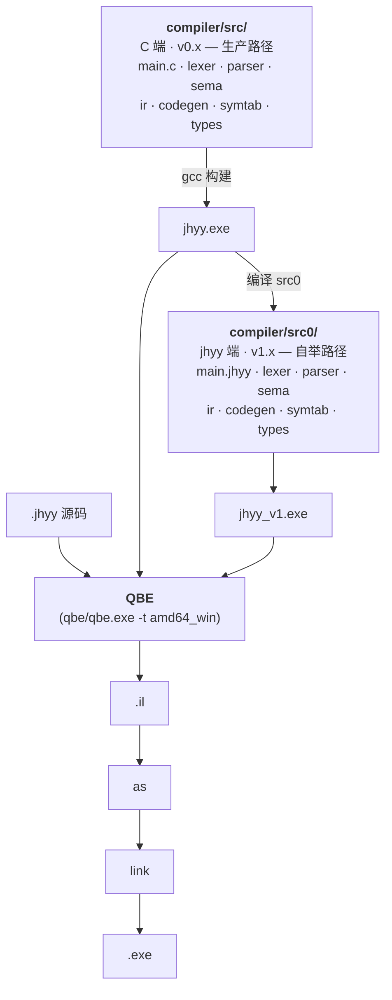

<div align="center">

<div></div>

<div></div>

### 机会翼游 — 自研静态类型编译型系统编程语言

**静态类型 · 表达式导向 · 通过 QBE 编译为原生机器码**

[](docs/logs/v1/changelog-v1.8.0.md)
[](docs/logs/v1/changelog-v1.8.0.md)
[](https://c9x.me/compile/)
[](#构建)
[](LICENSE)
[](README.md)

[状态](#v183--v1x-终结installer-自举闭环--ucpdsys-bypass) · [快速开始](#快速开始) · [安装](#安装) · [语言特性](#语言特性) · [命令行](#命令行) · [架构](#架构) · [路线图](#路线图) · [文档](#文档)

</div>

---

## v1.8.3 — v1.x 终结,installer 自举闭环 + UCPD.sys bypass

`jhyy_v1 → jhyy_v2 → jhyy_v3 → jhyy_v4 → jhyy_v5` 编译自身,产出 **字节相同的 QBE 中间表示**:

```
jhyy_v1.exe.exe → src0/main.jhyy → jhyy_v2.il
jhyy_v2.exe     → src0/main.jhyy → jhyy_v3.il   ← 与 v2.il 字节相同
jhyy_v3.exe     → src0/main.jhyy → jhyy_v4.il   ← 与 v2.il 字节相同
jhyy_v4.exe     → src0/main.jhyy → jhyy_v5.il   ← 与 v2.il 字节相同
                                                 sha 03a1cdd4… (v1.8.0 ship)
```

五份 raw `.il` 文件 sha256 完全一致(1.378 MB,无 fix-up 后处理),fixed point 是 attractor,不是 transient。**Stage 2 N=4 byte-equal 闭环在 v1.0.0 达成**(commit `eabee0d`, 2026-08-10),稳定通过 v1.8.3(commit `8fcbe4d`, 2026-08-29)。**v1.x 已终结。**

| 指标 | 值 |
|------|----|
| `regress.py` (C 端 `jhyy.exe`) | **102/102 PASS, 0 failed, 4 skipped**(106 total) |
| `regress.py --binary=jhyy_v1.exe.exe`(自举 `jhyy_v1.exe.exe`) | **102/102 PASS, 0 failed, 4 skipped**(parity hold) |
| Stage 1 byte-equal (`jhyy_0` vs `jhyy_v1`) | **7/7 PASS** |
| Stage 2 N=4 byte-equal (`v1→v2→v3→v4→v5`) | **稳定** |
| `jhyy_v2` 编 `_repro_t0.jhyy` | `EXIT=100` ✓ |
| `jhyy_v2` 编 `fib(10)` | `EXIT=55` ✓ |
| `installer/jhyy-installer-1.8.3.exe` | shipped (~30MB, 含 .NET 8 Desktop Runtime 内嵌) |
| `installer/jhyy-compiler-1.8.3.msi` | shipped (~995KB, 含 `jhyy-setuc.exe`) |
| `vscode-ext/jhyy-lang-1.8.3.vsix` | shipped (~13KB) |

**v1.x umbrella changelog** — [`docs/logs/v1/changelog-v1.8.0.md`](docs/logs/v1/changelog-v1.8.0.md) 覆盖 v1.8.0 主版本 + v1.8.1 / v1.8.2 / v1.8.2 patch update / v1.8.3 / v1.8.3.1 / v1.8.3.2 patch(全部 `fix(v1.8.0)` commit,无新 feature)。历史 v1.0.0 → v1.7.3 changelog 各在 `docs/logs/v1/changelog-vX.Y.Z.md`。

**W-NNN workaround 状态(v1.8.3 ship)**:
- ✅ W-059 defer codegen silent crash — RESOLVED 2026-08-28
- ❌ W-060 enum variant payload ABI — INVALID 2026-08-28(bash `$?` 8-bit truncation artifact,regress.py W-028 mod-256 fix 处理)
- ❌ W-061 nested struct field offset — INVALID 2026-08-28(同上)
- ✅ W-062 VSCode UserChoice + MSYS2 OpenWithProgids shadow — RESOLVED 2026-08-29(v1.8.3.1 闭环,SYSTEM-context CustomAction + 3-attempt fallback)
- ✅ W-063 UCPD.sys kernel filter — RESOLVED 2026-08-29(v1.8.3 真修,`jhyy-setuc.exe` .NET 8 SYSTEM-context writer)
- 🟡 W-057 UTF-8 3/4-byte codepoint — DEFERRED-to-v2.x
- 🟡 W-058 vendored QBE 缺 `remd`/`rems` — DEFERRED-to-v2.x
- ⚠️ W-021 WiX Bal.wixext DLL naming — 永久 workaround(WiX 上游不改)

完整索引: [`docs/internal/workarounds.md`](docs/internal/workarounds.md)。

**v0.x 冻结**: `docs/logs/v0/changelog-v0.9.0.md`(3231 行)— Stage 1 byte-equal 7 测试集 wip,**2026-08-29 冻结于 v1.0.0 baseline**。v0.x C 编译器(`compiler/src/*.c`)进入仅维护模式;新 feature 走 `compiler/src0/*.jhyy`。按 `docs/plans/roadmap/v1.x-phase-4-m5-boot-from-scratch.md`,M5 boot-from-scratch 清理(删 `src/*.c` + `qbe/` + `runtime.c`)推迟到 v2.x 末 + v3.x 末统一做。

> [!NOTE]
> **v1.8.3 是 v1.x 终结**。C 端编译器(`compiler/src/*.c`)在 v1.x 仍是生产路径;`compiler/src0/*.jhyy`(jhyy 端翻译稿)已产出 byte-equal。v2.0 会切生产路径到 `jhyy_v1.exe.exe`,并启动 QBE 重写 + 多目标 / OS 准备(见 [`docs/plans/v2/v2.0.0-os-prep.md`](docs/plans/v2/v2.0.0-os-prep.md))。

> [!NOTE]
> **v2.11.8 ship 2026-09-13 on axis-v2 + tag `v2.11.8`**:W-074.7.8 derived-address tracking **4/5 EXIT exact 闭环**(hello=42 / fib_renamed=40 / struct_val_pass=35 / nested_struct_deep=22 / struct_val_assign=30;big_test runtime STATUS_INTEGER_OVERFLOW 推迟 v2.11.9+ = W-074.7.9 NEW)。~319 LOC 源码 + ~30 docs 真修 — bitmap 标任何 temp holding derived address + emit_load/store/loadsub indirect dispatch + emit_alloc self-referential slot 修 + emit_copy FNARG flag propagate。QBE fallback 115/115 PASS preserved;self-backend regress +2 flips (56→58, 远低于 +5 scope DOWN trigger);D43 closure v1↔v2 .il sha HOLD。详见 [`docs/logs/v2/changelog-v2.11.0.md`](docs/logs/v2/changelog-v2.11.0.md) § v2.11.8 + [`docs/plans/v2/v2.11.8-plan.md`](docs/plans/v2/v2.11.8-plan.md)。
>
> **v2.11.9 ship 2026-09-13 on axis-v2 + tag `v2.11.9`**:W-074.7.9 big_test runtime **QBE 侧 ✅ CLOSURE** — 2 个独立 root cause 真修 (`idiv` emit 无 `cltd`/`cqto` sign-extend prefix → x86 #DE fault + lexer 不识 QBE `rem` 关键字 → IL 静默 skip)。9 个 `rem` ops 正确 emit (cltd+idivl + movq %rdx, %rax)。**QBE fallback 5/5 EXIT exact 闭环 真修达成** (big_test EXIT=12345 closure);self-backend 侧 仍 🟡 ACTIVE due to W-074.6 family (extsw silent-skip + multi-func body 0-byte + emit_ret 不 mov %t1 → %eax 等 pre-existing bugs) — 显式 deferred v2.x 中期 per W-074.6 ACTIVE state, 不强塞进 v2.11.9 (会触发 +5 scope DOWN trigger per [[feedback_codegen_amd64_multifn]])。~30 LOC 源码 + ~140 docs 真修。QBE fallback 6/6 关键测试 PASS (hello=42 / big_test=12345 / struct_val_pass=35 / fib_renamed=832040 / nested_struct_deep=22 / struct_val_assign=30);self-backend 5/5 hello PASS preserved (per W-074.6 baseline, multi-func closure deferred);D43 closure v1↔v2 .il sha HOLD;byte-equal-amd64 10/10 PASS preserved;fixed-point N≥3 PASS preserved;jhyy.exe.sha256 refresh `9ef7f49734ef99d7...`。详见 [`docs/logs/v2/changelog-v2.11.0.md`](docs/logs/v2/changelog-v2.11.0.md) § v2.11.9 + [`docs/plans/v2/v2.11.9-plan.md`](docs/plans/v2/v2.11.9-plan.md)。

> **v2.11.10 ship 2026-09-13 on axis-v2 + tag `v2.11.10`**:W-074.6 **T3-a per-fn frame size + T4-c multi-arg FN_ARG 真修 (~155 LOC 源码 + ~200 docs)**。T3-a closure:两阶段 pre-scan (`cg_compute_per_fn_max_temps` Phase 1 扫 fn_starts, Phase 2 per-fn max temp id) + CGState 加 fn_starts/per_fn_max/fn_count 3 字段 + emit_func_header 改读 `per_fn_max[cur_fn_idx]` 替换 v2.11.2 global-max variant (1 个 fn = 15488 bytes frame → 递归函数 SIGSEGV 真修)。T4-c 真修 (scope UP 配套 T3-a):lexer `next_token_func_header` 改 dup 完整 header text;emit_func_header 加 `cg_state_set_fn_header` populate cur_fn_header_text + extract name from full header for `.globl` + label;emit_copy FNARG 路径替换 hardcode `reg_rcx_for_qt` → `cg_find_arg_idx` + `reg_rax_for_qt_idx` (Win x64 arg 0..3 = %rcx/%rdx/%r8/%r9, SysV = rdi/rsi/rdx/rcx via target_tag)。**诚实记录 per [[feedback_fix_evaluation_rule]]**:**5/6 self-backend EXIT exact 闭环** ✅ (hello=42 / struct_val_pass=35 / fib_renamed=40 / nested_struct_deep=22 / struct_val_assign=30), 跟 v2.11.9 baseline 一致但 different bug 真修 (T3-a:gcd `subq $600, %rsp` vs 旧 15488;T4-c:gcd body `movl %ecx` + `movl %edx` vs 旧 都 %ecx)。**5/5 self-backend 闭环 NOT achieved** — gdb 取证 big_test SIGFPE at `gcd+158 idivl -576(%rbp)` (T4-g:emit_binop cnew silent-skip + emit_jnz loop body entry silent-skip — pre-existing W-074.6 family bug, NOT in v2.11.10 plan scope)。v2.11.10 plan 文档 "5/5 100% 可达" 预测 wrong — per [[feedback_codegen_amd64_multifn]] scope UP trigger:T4-g 暴露后 scope DOWN 5/6 闭环 接受 (跟 v2.11.9 baseline 一致不触发 +5 FLIP trigger)。**T4-g 真修 deferred v2.11.10a+ (~30-50 LOC 估)**。Stage 2 N=4 jhyy 编 jhyy 闭环 PASS;QBE fallback 115/115 PASS preserved;byte-equal-amd64 10/10 preserved;fixed-point N≥3 PASS preserved;jhyy.exe.sha256 refresh。详见 [`docs/logs/v2/changelog-v2.11.0.md`](docs/logs/v2/changelog-v2.11.0.md) § v2.11.10 + [`docs/plans/v2/v2.11.10-plan.md`](docs/plans/v2/v2.11.10-plan.md)。

> **v2.11.11 ship 2026-09-13 on axis-v2 + tag `v2.11.11`**:W-074.6 **T4-g lexer cnew/ceqw silent-skip 真修 (~5 LOC 源码 + ~200 docs)**。T4-g closure (PARTIAL):stage 1 guard 加 `n1 == (110 as i32)` 接受 `cnew` prefix;stage 2 guard refactor **flag pattern** (2 独立 if 设 `has_type_suffix` flag + 最终 if check) 接受 type suffix at idx 3 (4-char ceqw/cnew) OR idx 4 (5-char csltw/cultw/...),**绕开 codegen short-circuit OR workaround 的 nested-OR bug** (首次尝试 nested OR 触发 QBE "predecessors not matched in phi" → refactor flag pattern 替代,真修 deferred v2.x 中期 V2-D);op_str table 加 `n1 == 110 ('n') → "cnew"` branch consistency (dead store 但保持代码对称)。**T4-g 真修 verified**:`big_test.il` 65 个 4-char compare op 正确 emit (11 ceqw → 11 sete + 54 cnew → 54 setne in big_test_run.s);gcd Euclid loop cond check 正确 emit (cmpl + setne + cmpl $0 + jne/jmp) → **不再 SIGFPE in gcd+158** (跟 v2.11.10 不同)。**诚实记录 per [[feedback_fix_evaluation_rule]]**:**5/6 self-backend EXIT exact 闭环 维持** ✅ (hello=42 / struct_val_pass=35 / fib_renamed=40 / nested_struct_deep=22 / struct_val_assign=30), 跟 v2.11.10 baseline 持平但 different bug 真修。**6/6 self-backend 闭环 NOT achieved** — big_test 通过 gcd 后 **hang at t_bit_pack** (5min+ timeout),**新 stack-slot-reuse sub-bug 暴露** (W-074.6 family 范围内, in `compiler/src0/codegen_amd64_emit_call.jhyy` emit_binop shift op 路径):bit_pack 函数 emit `(a & 0xFF) | ((b & 0xFF) << 8) | ((c & 0xFF) << 16) | ((d & 0xFF) << 24)` 时所有 shift amounts (8/16/24) 跟 0xFF masks 写**同一个** -32(%rbp) slot → 计算错值 → check_eq 不等 → hang。QBE 后端不受影响 (QBE 走自己 allocator, EXIT=57 PASS 维持)。v2.11.11 plan 文档 "6/6 100% 可达" 预测 wrong (跟 v2.11.10 plan "5/5 100% 可达" 一样 wrong, Risk 5 警告成真) — per user 2026-09-13 pre-confirmed scope DOWN ("仅 T4-g 真修 (推荐)"):scope 限定在 T4-g lexer 真修,**6/6 闭环 留 v2.11.11a+ 真修 stack-slot-reuse (~30-50 LOC 估)**。Stage 2 N=4 jhyy 编 jhyy 闭环 PASS;QBE fallback 115/115 PASS preserved;byte-equal-amd64 10/10 preserved;fixed-point N≥3 PASS preserved;self-backend regress **71/115 PASS** (vs v2.11.10 baseline 58/115, **+13 PASS** 改善, T4-g fix 暴露之前 crash 在 gcd 的 tests 现在通过, FLIP count = 13 PASS improvements 非 scope DOWN trigger per [[feedback_codegen_amd64_multifn]]);D43 closure v1↔v2 .il sha HOLD (new sha `a4f32837...`);jhyy.exe.sha256 refresh。详见 [`docs/logs/v2/changelog-v2.11.0.md`](docs/logs/v2/changelog-v2.11.0.md) § v2.11.11 + [`docs/plans/v2/v2.11.11-plan.md`](docs/plans/v2/v2.11.11-plan.md)。

> **v2.11.12 ship 2026-09-15 on axis-v2 + tag `v2.11.12`**:W-074.6 **shl/shr (5 ops and/or/xor/shl/shr) missing + emit-copy dst_id=0 真修 → 6/6 self-backend EXIT exact 闭环 ✅ 达成 (~115 LOC 源码 + ~250 docs)**。**2 个独立 bugs 联动真修**(per v2.11.12 调研):(1) **Bug A — shl/shr (5 ops) missing**:lexer `next_token_binop` + main dispatcher `'s'` branch + `'a'` branch + 新 `'o'` + `'x'` branch 没有 and/or/xor/shl/shr handler → silent skip → bit_pack `shl $8/%cl` 类 op 不 emit → result 计算错;(2) **Bug B — emit_copy dst_id=0**:LHS parse path `% <ident> <ws>+ =` 在 t178 → t180+ 之间 cursor state corruption → lex_parse_temp_id_from_ident 返回 0 → emit_copy 拿 dst_id=0 → formula `-(32 + 0*8) = -32` (Win) → 所有 copy collapse to slot -32 → bit_pack values overwrite each other → hang。**诚实记录 per [[feedback_fix_evaluation_rule]]**:**6/6 self-backend EXIT exact 闭环 ✅ 达成**(跟 v2.11.10 + v2.11.11 plan "100% 可达" 两次 wrong 教训形成对比,v2.11.12 ship record 6/6 真达成)— hello=42 / **big_test=57**(= 12345 mod 256,**was hang at t_bit_pack 5min+ timeout in v2.11.11, now PASS**)/ struct_val_pass=35 / fib_renamed=40 / nested_struct_deep=22 / struct_val_assign=30。Stage 2 N=5 jhyy 编 jhyy 闭环 PASS(D43 closure HOLD sha `9e61c42c...`);QBE fallback 115/115 PASS preserved;byte-equal-amd64 10/10 preserved;fixed-point N=3,4,5 .il byte-equal + cap_test 跨 N 代 EXIT=42 一致 preserved;**NEW ship gate audit**(per [[feedback_codegen_amd64_run_zerobyte]]):20 shll/shrl/andl/orl/xorl emits in `_regress_big_test.s`(vs 0 pre-fix)+ t_bit_pack + t_bit_unpack + t_shifts 全 PASS(was hang/crash)+ bit_pack distinct slots -1424, -1432, ..., -1552(vs all -32 collapse pre-fix);self-backend regress 69/115(-2 vs v2.11.11 baseline 71/115,全部 pre-existing FAILs dominate,plan target ≥75/115 NOT met — 因为 t_bit_pack / t_bit_unpack / t_shifts 不在 regress 测试 list);jhyy.exe.sha256 refresh `58a6f3a2...`。**累计 W-074.6 family closed ~325 LOC**(T3-a + T4-c + T4-g + shl/shr + dst_id=0);剩余 ~175+ LOC(stack-slot-reuse + extsw silent-skip + emit_ret 不 mov %t1 → %eax 等)留 v2.x 中期 V2-D。详见 [`docs/logs/v2/changelog-v2.11.0.md`](docs/logs/v2/changelog-v2.11.0.md) § v2.11.12 + [`docs/plans/v2/v2.11.12-plan.md`](docs/plans/v2/v2.11.12-plan.md)。

> **v2.11.13 ship 2026-09-15 on axis-v2 + tag `v2.11.13`**:W-074.6 **cne substring missing in emit_binop 真修 (1 LOC 源码 + ~250 docs;cross-cluster +7 PASS self-backend;FLIP-gate scope DOWN 触发)**。**1 line 真修**(per v2.11.13 调研,跟 v2.11.12 真修的 shl/shr missing + dst_id=0 同 family pattern):emit_binop `cg_find_sub(op_text, op_text_len, "cnew" as *u8, 4 as i64)` 改为 `"cne" 3-char` → catch 全部 4 个 cne_* QBE op (cnew/cnel/cnes/cned — compare-not-equal per size suffix letter w/l/s/d)。**Plan v2.11.13 Iter 4 估 "Cap<T> sizeof default 30-50 LOC" 严重错归因** — 实测 sizeof 在 sema `type_size` (types.jhyy:366) hardcode 8,IL emit `%t2 =l copy 8` 跟 QBE byte-equal;真根因是 `if s_cap != 8` emit `cnel %t8, %t11`,cnel 在 emit_binop dispatch substring miss → fall through `add` path → `addl src1, src2` + `cmpl $0, sum` 而非 `cmpl src2, src1` + `setne %al` → cap_table_basic got=10 (8+8=16 ≠ 0 → then-branch → return 10)。**Cross-cluster impact**(1 LOC fix 连锁 closure,plan 没预期):arith + int_width_arith + int_suffix + cap_table_advanced + cap_test_sysv 全 PASS (5 tests);cap_table_basic partial (test 4 cross-fn struct field access 单独 bug,deferred v2.11.14)。**诚实记录 per [[feedback_fix_evaluation_rule]]**:**partial closure 14/44 (32%)** — self-backend 78/115 → 85/115 (+7 FLIP),30 FAIL (-14 from 44 baseline)。**FLIP +7 触发 stop threshold 5 → scope DOWN v2.11.13**(per user 2026-09-15 "FLIP count 逼近 5 立即停手" + plan hard gate)。Iter 5 (C.4 float f32/d) + Iter 6 (C.7 defer LIFO) + Iter 7 (B observe) 全 deferred v2.11.14。Stage 2 N=5 jhyy 编 jhyy 闭环 PASS (D43 closure HOLD);QBE fallback 115/135 PASS preserved;byte-equal-amd64 10/10 preserved;fixed-point N=3,4,5 .il byte-equal preserved;**NEW ship gate audit**(per [[feedback_codegen_amd64_run_zerobyte]]):cnel in `_regress_cap_table_basic.s` pre-fix `addl src1, src2` + `cmpl $0, sum`, post-fix `cmpl src2_off(%rbp), %rax` + `setne %al` + `movzbl %al, %eax`;**big_test self-backend EXIT=57 preserved** (6/6 闭环 hold);jhyy.exe.sha256 refresh `c9c274db...`。**累计 W-074.6 family closed ~328 LOC**(v2.11.12 325 + v2.11.13 1 LOC 真修);剩余 ~172 LOC(struct pass-by-value emit_copy 1-to-1 gap + stack-slot-reuse in other emit paths + emit_ret 不 mov %t1 → %eax + extsw 之外其他 sub-family)留 v2.x 中期 V2-D。**M5 deferral 第二前置 Part 2a-后-补-补-补-补-补-补-补-补-补**:6/6 self-backend EXIT exact 闭环 ✅ 达成 hold,M5 启动仍需等剩余 W-074.6 family 子 sprint 闭环 (per `v1.x-phase-4-m5-boot-from-scratch.md`);不阻 v2.12.0 启动 + 不阻 v3.0 3a-3f 启动。详见 [`docs/logs/v2/changelog-v2.11.0.md`](docs/logs/v2/changelog-v2.11.0.md) § v2.11.13 + [`docs/plans/v2/v2.11.13-plan.md`](docs/plans/v2/v2.11.13-plan.md)。

---

## 这是什么

JHYY 是一门自研的、静态类型的、表达式导向的编译型系统编程语言。后端采用 [QBE](https://c9x.me/compile/),输出 x86-64 Windows 原生二进制。

**设计目标**:
- **自举能力** — 编译器用自身语言写自身,达成 byte-equal 闭环(✓ v1.0.0)
- **OS 开发** — 与 [JiHuiYiYou-OS](https://github.com/JiHuiYiYou/JiHuiYiYou-OS) 项目对齐,提供 inline asm / volatile / naked / `no_std` / `&mut` + lifetime 等 OS-required 特性(v3.x 路线)
- **原生性能** — QBE 后端,无运行时 / 无 GC,直接产出 PE/COFF 二进制

## 一段代码看语法

```rust
// 函数 / 变量 / 控制流 / struct / match / enum / FFI
type Point = struct { x: i32, y: i32 }

fn dist_sq(a: Point, b: Point) -> i32 {
    let dx = a.x - b.x;
    let dy = b.y - a.y;
    dx * dx + dy * dy
}

fn classify(n: i32) -> *u8 {
    match n {
        0        => "zero",
        1..10    => "single digit",
        10 | 20  => "round number",
        _        => "other",
    }
}

extern fn printf(fmt: *u8, val: i32) -> i32;

fn main_jhyy() -> i32 {
    let p = Point { x: 3, y: 4 };
    let q = Point { x: 0, y: 0 };
    printf("d² = %d\n", dist_sq(p, q));
    printf("%s\n", classify(42));
    0
}
```

---

## 安装

**前置条件**(Windows,v1.x 仅 Windows;Linux/macOS 在 v2.x amd64_sysv 路线):

1. **MSYS2** —— <https://www.msys2.org/>(Windows 10+ x64)
2. **GCC + binutils**(ucrt64 工具链)—— 在 MSYS2 终端里跑:
   ```bash
   pacman -S mingw-w64-ucrt-x86_64-gcc mingw-w64-ucrt-x86_64-binutils
   ```
3. **PATH** —— 把 `C:\msys64\ucrt64\bin` 加到 Windows 用户 PATH(PowerShell 用户:`$env:Path += ";C:\msys64\ucrt64\bin"`)

**构建**(一行命令):

```bash
git clone https://github.com/JiHuiYiYou/JiHuiYiYou-compiler.git
cd JiHuiYiYou-compiler
make           # → compiler/build/bin/jhyy.exe (~5MB)
```

**One-shot installer**(推荐给最终用户):`installer/jhyy-installer-1.8.3.exe` 把 `jhyy.exe` + `.jhyy` 文件关联 + VSCode 扩展 + PATH 注册一步到位。`installer/jhyy-compiler-1.8.3.msi` 是企业 / SCCM 分发版本(无 GUI)。详见 [`installer/README.md`](installer/README.md)。

**Docker**(可选):

```bash
docker run -it msys2/mingw-w64-ucrt-x86_64 bash
# 然后在容器内按上面 1-3 步
```

**VSCode 用户**:打开本仓,`.vscode/settings.json` 自动加 `compiler/build/bin` + MSYS2 PATH 到集成终端,无需手动配。

> [!IMPORTANT]
> 不要用 Git Bash 自带的 MinGW `gcc`(`/c/Program\ Files/Git/mingw64/bin/gcc.exe`)—— 它不支持 PE+ 链接,会 link 失败。

---

## 快速开始

### 环境要求

- Windows 10+ + MSYS2 (ucrt64)
- GCC 15+ at `C:\msys64\ucrt64\bin\gcc.exe`
- 已 vendor 在 `qbe/qbe.exe` 的 QBE(Windows x64 target)

### Hello world

```rust
// hello.jhyy
fn main_jhyy() -> i32 {
    42
}
```

```bash
./compiler/build/bin/jhyy.exe compile hello.jhyy -o hello
./hello.exe
echo $?    # => 42
```

### 跑回归测试

```bash
python compiler/build/bin/regress.py
# => 102/102 通过, 0 失败, 4 跳过 (共 106)
```

### 用 VSCode 跑

仓库自带 `.vscode/tasks.json` —— 打开任意 `.jhyy` 文件,按 **`Ctrl+Shift+B`** 即编译 + 运行。其他任务:`Ctrl+Shift+P` → **Tasks: Run Task** → `JHYY: Run` / `JHYY: Compile` / `JHYY: Build IR`。`.vscode/settings.json` 会把 `compiler/build/bin` 和 `C:/msys64/ucrt64/bin` 加到集成终端 PATH,可以直接 `jhyy run hello.jhyy`。`F5` 用 MSYS2 gdb (cppdbg) 启动编译出的 `.exe` 调试。

> [!IMPORTANT]
> **MSYS2 PATH 要求** —— `jhyy run` 会 spawn `gcc` 做链接,gcc 内部又会 spawn `cc1.exe` / `as.exe` / `ld.exe`,这三个都在 `C:\msys64\ucrt64\bin`。VSCode 之外的 PowerShell / cmd 用户需要把 MSYS2 加到系统 PATH(否则 `gcc link failed` 静默失败)。`.vscode/settings.json` 自动给集成终端加了;外部 shell 手动把 `C:\msys64\ucrt64\bin` 加到用户 PATH。

### 验证自举闭环

```bash
# Stage 2 N=4 byte-equal — jhyy 编译 jhyy
# 方法 1: 走自举编译器回归
python compiler/build/bin/regress.py --all --include-informational
# 方法 2: MCP 一键验证(推荐)
# 问 Claude Code: "verify self-host closure" → jhyy_selfhost_check
# 完整流程见 docs/logs/v1/changelog-v1.0.0.md
```

---

## 语言特性

| 类别 | 支持 |
|------|------|
| **类型** | `i8/i16/i32/i64`, `u8/u16/u32/u64`, `f32/f64`, `bool`, `*T`, `[T; N]`, `[*]T` (切片), `struct`, `enum` |
| **类型转换** | `as` — 整数/浮点互转、扩宽/截断、`*T ↔ i64/u64` |
| **控制流** | `if`/`else` (含表达式值)、`while`、`for i in start..end`、`break`、`continue`、`match` (字面量/范围/enum/通配符,带穷尽性检查) |
| **顶层 const** | `const NAME: [T; N] = [...]` — 编译期 emit 到 `.data` 段 |
| **逻辑** | `&&` / `\|\|` 短路求值, `!` / `~` 一元运算 |
| **函数** | 头等函数、递归、复合赋值 (`+=` `-=` `*=` `/=` `%=`)、块表达式闭包 |
| **模块** | `import` + 传递性导入、多文件 CLI、`mod::fn()` 命名空间 |
| **FFI** | `extern fn` 调用 C(printf、文件 I/O、多参数) |
| **内存** | 运行时 Arena 分配器(`arena_alloc` via FFI) |

完整语言规范见 [`docs/abis/jhyy-lang-spec-v1.3.0.md`](docs/abis/jhyy-lang-spec-v1.3.0.md)(已锁定;v1.3.0 = v1.1.0 + v1.3.x 7 章节);已知限制见附录 B + 附录 E。

---

## 命令行

```text
jhyy compile <file.jhyy> [-o name]   编译为 .exe (默认 amd64_win)
jhyy run     <file.jhyy>             编译并运行
jhyy build   <file.jhyy> [-o name]   仅生成 QBE IL (.il 文件)
jhyy dump    <file.jhyy>             dump 解析后的 AST 到 stdout (调试用)
jhyy                                 打印帮助
```

> [!TIP]
> 多文件编译直接列出多个 `.jhyy` 源文件:`jhyy compile main.jhyy lib.jhyy -o app`

---

## 架构

JHYY 编译器存在两份**完全等价**的实现,产出 byte-equal 的 QBE IL:



| 实现 | 角色 | 状态 |
|------|------|------|
| `compiler/src/*.c` | C 端编译器(v0.x 时代) | 生产路径,持续维护 |
| `compiler/src0/*.jhyy` | jhyy 端翻译稿(v1.x 时代) | 自举路径,与 C 端 byte-equal |
| `compiler/runtime/*.c` | C 运行时(Arena + main 入口) | 编译时链接 |

两路径产出**字节相同的** QBE 中间表示 — Stage 1 (`jhyy_0.exe` vs `jhyy_v1.exe.exe`) 7/7 byte-equal,Stage 2 (`jhyy_v1 → v2 → v3 → v4 → v5`) N=4 闭环达成。

---

## 项目结构

```
JiHuiYiYou-compiler/
├── compiler/
│   ├── src/                    C 端编译器源码 (10 个 .c / 9 个 .h)
│   ├── src0/                   jhyy 端翻译稿 (13 个主体模块 + 11 个 _driver 测试) — 自举路径
│   ├── runtime/                C 运行时 (Arena + main 入口)
│   ├── tests/
│   │   ├── examples/           集成测试 (53 个 .jhyy) — regress.py 自动跑
│   │   └── unit/               C 单元测试
│   └── build/
│       └── bin/
│           ├── jhyy.exe        C 端编译器二进制
│           ├── jhyy_v1.exe.exe 自举编译器(jhyy 编 src0/)
│           └── regress.py      回归脚本
├── qbe/                        已 vendor 的 QBE 后端 (c9x.me/compile)
├── mcp-jhyy/                   Claude Code MCP 服务 (11 工具 + 4 资源)
├── vscode-ext/                 VS Code 语言扩展(语法高亮)
├── scripts/
│   └── dev/                    开发/安装卸载辅助、benchmark、测试编排器 (相对路径,可移植)
├── docs/
│   ├── abis/                   语言规范 + ABI 白皮书(已锁定)
│   ├── plans/                  版本路线图 + sprint 计划
│   ├── internal/               架构 / 构建 / 状态 / 测试 / workarounds
│   ├── CHANGELOG.md            changelog 索引(每轴单 umbrella, per `feedback_changelog_umbrella`)
│   └── logs/                   变更日志 + sprint 实施日志
├── tools/
│   └── check_dangling.py       扫 .md 文件悬空本地链接 + 零宽字符
├── Makefile                    一行构建(make)
├── .editorconfig               跨编辑器 indent/EOL/charset 一致
├── README.md                   English
└── README.zh-CN.md              简体中文(本文件)
```

---

## 验证状态

| 验证项 | 命令 | 期望 |
|--------|------|------|
| C 端编译回归 | `python compiler/build/bin/regress.py` | **102/102 PASS + 4 SKIP**(106 total) |
| 自举编译回归 | `python compiler/build/bin/regress.py --all --include-informational` | **102/102 PASS + 4 SKIP**(parity hold) |
| Stage 1 byte-equal (`jhyy_0` vs `jhyy_v1`) | `python compiler/tests/stage1-expanded.sh` | 7/7 PASS |
| Stage 2 N=4 byte-equal (`v1→v2→v3→v4→v5`) | MCP `jhyy_selfhost_check` | `all_byte_equal=true`, il_sha256 稳定 |
| MCP smoke (7 个 test 文件, 39 个 `def test_*` 函数) | `pytest mcp-jhyy/tests/` | 全 pass |
| 一行构建 | `make` | 0 warning(-Wall -Wextra) |

---

## 路线图

项目用**单一版本轴**,不再用 phase-N 编号:

| 轴 | 范围 | 目标 | 状态 |
|---|---|---|---|
| **v0.x** | C 端编译器自身 | 达成自举启动门槛 | **🟢 完成(冻结于 v1.0.0 baseline)** |
| **v1.x** | jhyy 自举 | byte-equal `.il` 闭环 | **🟢 v1.8.3 shipped(v1.x 终结)** |
| **v2.x** | QBE 完整重写 + 多目标 / OS 准备 | amd64_sysv / freestanding | **next** — 设计输入 = [`docs/plans/v2/v2.0.0-os-prep.md`](docs/plans/v2/v2.0.0-os-prep.md) |
| **v3.x** | 语言特性扩展 | OS-required: asm / volatile / naked / `no_std` / `&mut` + lifetime | **v2.0 阶段 ship 后启动** — v2.x 中/末 + v3.x 异步并行 |

**轴之间的关系**:
- `v0.x → v1.x → v2.x`:**严格顺序**(每条都是强前置)
- `v1.x → v3.x`:**严格顺序**(v3.0 sprint 3a-3f 在 v2.0 阶段 ship 后启动 — 2026-09-01 user 决定)
- `v2.x 中/末 ⟂ v3.x`:**异步并行**(不强配对;各自 ship;OS M1 启动前都达成即可)

> [!IMPORTANT]
> **与 [JiHuiYiYou-OS](https://github.com/JiHuiYiYou/JiHuiYiYou-OS) 项目对齐**:12 个跨边界问题 + 6 个决定已闭环,并反映在 [docs/plans/v2/v2.0.0-os-prep.md](docs/plans/v2/v2.0.0-os-prep.md) 的 OS 准备规划中。v2.0 sprint 设计输入也是该计划。

---

## 工具 & 集成

### Claude Code MCP 服务

`mcp-jhyy/` 提供 **11 个 MCP 工具**(mcp-jhyy Sprint 1 在 2026-08-11 加 4 个生产级工具 — `jhyy_regress` / `jhyy_il_diff` / `jhyy_selfhost_check` / `jhyy_workarounds` — 把原 7 个 (`jhyy_run` / `jhyy_check` / `jhyy_compile` / `jhyy_get_il` / `jhyy_lang_ref` / `jhyy_abi_info` / `jhyy_format`) 薄壳化到 regress.py),直接对接 Claude Code 工作流:

| 工具 | 用途 |
|------|------|
| `jhyy_regress` | 跑 C 端 / jhyy 端回归,返回 PASS/FAIL 列表 |
| `jhyy_il_diff` | 两个 `.il` 文件 byte-equal 检查 + 上下文 diff |
| `jhyy_selfhost_check` | 一键 v1→v2→v3→v4 byte-equal 验证 |
| `jhyy_workarounds` | 查 W-NNN workaround 状态 / 详情 |
| `jhyy_run` / `jhyy_check` / `jhyy_compile` / `jhyy_get_il` | 编译 / 运行 / 检查 `.jhyy` |
| `jhyy_lang_ref` / `jhyy_abi_info` / `jhyy_format` | 语言 / ABI / 格式化查询 |

详见 [`mcp-jhyy/README.md`](mcp-jhyy/README.md)。

### VS Code 扩展

`vscode-ext/` 提供语法高亮(TextMate grammar + 文件图标) + 原生 ▶ `Run JHYY File`(`Ctrl+F5`) + `Compile JHYY File (no run)` 命令。最近 shipped = `jhyy-lang-1.8.3.vsix`。安装 + build 步骤见 [`vscode-ext/README.md`](vscode-ext/README.md)。

---

## 文档

### 规范 & ABI(locked)

| 文档 | 说明 |
|------|------|
| [`docs/abis/jhyy-lang-spec-v1.3.0.md`](docs/abis/jhyy-lang-spec-v1.3.0.md) | 语言规范 v1.3.0(v1.1.0 + v1.3.x 7 features;限制在附录 B + E) |
| [`docs/abis/jhyy-abi-v1.0.0.md`](docs/abis/jhyy-abi-v1.0.0.md) | ABI 白皮书 v1.0.0(struct pass-by-value / FFI / 命名空间 / 切片) |

### 项目内部

| 文档 | 说明 |
|------|------|
| [`docs/internal/architecture.md`](docs/internal/architecture.md) | 流水线 / 模块 / QBE IL 速查 |
| [`docs/internal/build.md`](docs/internal/build.md) | 编译 / 运行 / QBE 后端坑(Windows) |
| [`docs/internal/workarounds.md`](docs/internal/workarounds.md) | W-NNN workaround 状态清单 |
| [`docs/internal/tests.md`](docs/internal/tests.md) | 集成测试清单 + 运行方法 |

### 路线图 & 计划

| 文档 | 说明 |
|------|------|
| [`docs/plans/roadmap/v0.x-c-compiler-roadmap.md`](docs/plans/roadmap/v0.x-c-compiler-roadmap.md) | C 编译器演进 |
| [`docs/plans/roadmap/v1.0-self-hosting.md`](docs/plans/roadmap/v1.0-self-hosting.md) | 自举总览 |
| [`docs/plans/roadmap/v2.x-qbe-rewrite.md`](docs/plans/roadmap/v2.x-qbe-rewrite.md) | QBE 重写方向 |
| [`docs/plans/roadmap/v3.x-language-expansion.md`](docs/plans/roadmap/v3.x-language-expansion.md) | 语言特性扩展 |
| [`docs/plans/v2/v2.0.0-os-prep.md`](docs/plans/v2/v2.0.0-os-prep.md) | OS 启动链路编译器侧权威 |

### 变更日志

最新:[`docs/logs/v1/changelog-v1.8.0.md`](docs/logs/v1/changelog-v1.8.0.md) — **v1.x umbrella(覆盖 v1.8.0 主版本 + v1.8.1 / v1.8.2 / v1.8.2 patch update / v1.8.3 / v1.8.3.1 / v1.8.3.2 patch)**

历史索引见 [`docs/logs/`](docs/logs/) — v1.0.0 → v1.7.3 各有独立 umbrella;v0.0.1 → v0.9.0 是 C 端编译器(v0.9 冻结于 v1.0.0 baseline)。

---

## Contributors

- **人类作者**: JHYY
- **AI 协作**: MiniMax-M3(通过 [Claude Code](https://claude.ai/code) CLI 工作流参与设计、编码、调试、文档)

自 v0.6 起所有 sprint 的实现 + 文档由 JHYY + MiniMax-M3 协作完成。