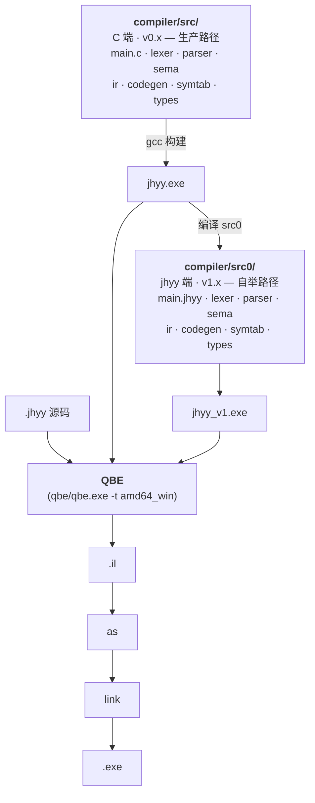

<div align="center">


# JHYY

### 机会翼游 — 自研静态类型编译型系统编程语言

**静态类型 · 表达式导向 · 通过 QBE 编译为原生机器码**

[](docs/logs/v1/changelog-v1.8.0.md)
[](docs/logs/v1/changelog-v1.8.0.md)
[](https://c9x.me/compile/)
[](#构建)
[](LICENSE)
[](README.md)

[快速开始](#快速开始) · [语言特性](#语言特性) · [命令行](#命令行) · [架构](#架构) · [路线图](#路线图) · [文档](#文档)

</div>

---

## v1.8.3 — v1.x 终结,installer 自举闭环 + UCPD.sys bypass

`jhyy_v1 → jhyy_v2 → jhyy_v3 → jhyy_v4 → jhyy_v5` 编译自身,产出 **字节相同的 QBE 中间表示**:

```
jhyy_v1.exe.exe → src0/main.jhyy → jhyy_v2.il
jhyy_v2.exe     → src0/main.jhyy → jhyy_v3.il   ← 与 v2.il 字节相同
jhyy_v3.exe     → src0/main.jhyy → jhyy_v4.il   ← 与 v2.il 字节相同
jhyy_v4.exe     → src0/main.jhyy → jhyy_v5.il   ← 与 v2.il 字节相同
                                                 sha 03a1cdd4… (v1.8.0 ship)
```

五份 raw `.il` 文件 sha256 完全一致(1.378 MB,无 fix-up 后处理),fixed point 是 attractor,不是 transient。**Stage 2 N=4 byte-equal 闭环在 v1.0.0 达成**(commit `eabee0d`, 2026-08-10),稳定通过 v1.8.3(commit `8fcbe4d`, 2026-08-29)。**v1.x 已终结。**

| 指标 | 值 |
|------|----|
| `regress.py` (C 端 `jhyy.exe`) | **102/102 PASS, 0 failed, 4 skipped**(106 total) |
| `regress_v1.py` (自举 `jhyy_v1.exe.exe`) | **102/102 PASS, 0 failed, 4 skipped**(parity hold) |
| Stage 1 byte-equal (`jhyy_0` vs `jhyy_v1`) | **7/7 PASS** |
| Stage 2 N=4 byte-equal (`v1→v2→v3→v4→v5`) | **稳定** |
| `jhyy_v2` 编 `_repro_t0.jhyy` | `EXIT=100` ✓ |
| `jhyy_v2` 编 `fib(10)` | `EXIT=55` ✓ |
| `installer/jhyy-installer-1.8.3.exe` | shipped (~30MB, 含 .NET 8 Desktop Runtime 内嵌) |
| `installer/jhyy-compiler-1.8.3.msi` | shipped (~995KB, 含 `jhyy-setuc.exe`) |
| `vscode-ext/jhyy-lang-1.8.3.vsix` | shipped (~13KB) |

**v1.x umbrella changelog** — [`docs/logs/v1/changelog-v1.8.0.md`](docs/logs/v1/changelog-v1.8.0.md) 覆盖 v1.8.0 主版本 + v1.8.1 / v1.8.2 / v1.8.2 patch update / v1.8.3 / v1.8.3.1 / v1.8.3.2 patch(全部 `fix(v1.8.0)` commit,无新 feature)。历史 v1.0.0 → v1.7.3 changelog 各在 `docs/logs/v1/changelog-vX.Y.Z.md`。

**W-NNN workaround 状态(v1.8.3 ship)**:
- ✅ W-059 defer codegen silent crash — RESOLVED 2026-08-28
- ❌ W-060 enum variant payload ABI — INVALID 2026-08-28(bash `$?` 8-bit truncation artifact,regress.py W-028 mod-256 fix 处理)
- ❌ W-061 nested struct field offset — INVALID 2026-08-28(同上)
- ✅ W-062 VSCode UserChoice + MSYS2 OpenWithProgids shadow — RESOLVED 2026-08-29(v1.8.3.1 闭环,SYSTEM-context CustomAction + 3-attempt fallback)
- ✅ W-063 UCPD.sys kernel filter — RESOLVED 2026-08-29(v1.8.3 真修,`jhyy-setuc.exe` .NET 8 SYSTEM-context writer)
- 🟡 W-057 UTF-8 3/4-byte codepoint — DEFERRED-to-v2.x
- 🟡 W-058 vendored QBE 缺 `remd`/`rems` — DEFERRED-to-v2.x
- ⚠️ W-021 WiX Bal.wixext DLL naming — 永久 workaround(WiX 上游不改)

完整索引: [`docs/internal/workarounds.md`](docs/internal/workarounds.md)。

**v0.x 冻结**: `docs/logs/v0/changelog-v0.9.0.md`(3231 行)— Stage 1 byte-equal 7 测试集 wip,**2026-08-29 冻结于 v1.0.0 baseline**。v0.x C 编译器(`compiler/src/*.c`)进入仅维护模式;新 feature 走 `compiler/src0/*.jhyy`。按 `docs/plans/roadmap/v1.x-phase-4-m5-boot-from-scratch.md`,M5 boot-from-scratch 清理(删 `src/*.c` + `qbe/` + `runtime.c`)推迟到 v2.x 末 + v3.x 末统一做。

> [!NOTE]
> **v1.8.3 是 v1.x 终结**。C 端编译器(`compiler/src/*.c`)在 v1.x 仍是生产路径;`compiler/src0/*.jhyy`(jhyy 端翻译稿)已产出 byte-equal。v2.0 会切生产路径到 `jhyy_v1.exe.exe`,并启动 QBE 重写 + 多目标 / OS 准备(见 [`docs/plans/v2/v2.0.0-os-prep.md`](docs/plans/v2/v2.0.0-os-prep.md))。

---

## 这是什么

JHYY 是一门自研的、静态类型的、表达式导向的编译型系统编程语言。后端采用 [QBE](https://c9x.me/compile/),输出 x86-64 Windows 原生二进制。

**设计目标**:
- **自举能力** — 编译器用自身语言写自身,达成 byte-equal 闭环(✓ v1.0.0)
- **OS 开发** — 与 [JiHuiYiYou-OS](https://github.com/JiHuiYiYou/JiHuiYiYou-OS) 项目对齐,提供 inline asm / volatile / naked / `no_std` / `&mut` + lifetime 等 OS-required 特性(v3.x 路线)
- **原生性能** — QBE 后端,无运行时 / 无 GC,直接产出 PE/COFF 二进制

## 一段代码看语法

```rust
// 函数 / 变量 / 控制流 / struct / match / enum / FFI
type Point = struct { x: i32, y: i32 }

fn dist_sq(a: Point, b: Point) -> i32 {
    let dx = a.x - b.x;
    let dy = b.y - a.y;
    dx * dx + dy * dy
}

fn classify(n: i32) -> *u8 {
    match n {
        0        => "zero",
        1..10    => "single digit",
        10 | 20  => "round number",
        _        => "other",
    }
}

extern fn printf(fmt: *u8, val: i32) -> i32;

fn main_jhyy() -> i32 {
    let p = Point { x: 3, y: 4 };
    let q = Point { x: 0, y: 0 };
    printf("d² = %d\n", dist_sq(p, q));
    printf("%s\n", classify(42));
    0
}
```

---

## 快速开始

### 环境要求

- Windows 10+ + MSYS2 (ucrt64)
- GCC 15+ at `C:\msys64\ucrt64\bin\gcc.exe`
- 已 vendor 在 `qbe/qbe.exe` 的 QBE(Windows x64 target)

### Hello world

```rust
// hello.jhyy
fn main_jhyy() -> i32 {
    42
}
```

```bash
./compiler/build/bin/jhyy.exe compile hello.jhyy -o hello
./hello.exe
echo $?    # => 42
```

### 跑回归测试

```bash
python compiler/build/bin/regress.py
# => 102/102 通过, 0 失败, 4 跳过 (共 106)
```

### 用 VSCode 跑

仓库自带 `.vscode/tasks.json` —— 打开任意 `.jhyy` 文件,按 **`Ctrl+Shift+B`** 即编译 + 运行。其他任务:`Ctrl+Shift+P` → **Tasks: Run Task** → `JHYY: Run` / `JHYY: Compile` / `JHYY: Build IR`。`.vscode/settings.json` 会把 `compiler/build/bin` 和 `C:/msys64/ucrt64/bin` 加到集成终端 PATH,可以直接 `jhyy run hello.jhyy`。`F5` 用 MSYS2 gdb (cppdbg) 启动编译出的 `.exe` 调试。

> [!IMPORTANT]
> **MSYS2 PATH 要求** —— `jhyy run` 会 spawn `gcc` 做链接,gcc 内部又会 spawn `cc1.exe` / `as.exe` / `ld.exe`,这三个都在 `C:\msys64\ucrt64\bin`。VSCode 之外的 PowerShell / cmd 用户需要把 MSYS2 加到系统 PATH(否则 `gcc link failed` 静默失败)。`.vscode/settings.json` 自动给集成终端加了;外部 shell 手动把 `C:\msys64\ucrt64\bin` 加到用户 PATH。

### 验证自举闭环

```bash
# Stage 2 N=4 byte-equal — jhyy 编译 jhyy
# 方法 1: 走自举编译器回归
python compiler/build/bin/regress_v1.py
# 方法 2: MCP 一键验证(推荐)
# 问 Claude Code: "verify self-host closure" → jhyy_selfhost_check
# 完整流程见 docs/logs/v1/changelog-v1.0.0.md
```

---

## 语言特性

| 类别 | 支持 |
|------|------|
| **类型** | `i8/i16/i32/i64`, `u8/u16/u32/u64`, `f32/f64`, `bool`, `*T`, `[T; N]`, `[*]T` (切片), `struct`, `enum` |
| **类型转换** | `as` — 整数/浮点互转、扩宽/截断、`*T ↔ i64/u64` |
| **控制流** | `if`/`else` (含表达式值)、`while`、`for i in start..end`、`break`、`continue`、`match` (字面量/范围/enum/通配符,带穷尽性检查) |
| **顶层 const** | `const NAME: [T; N] = [...]` — 编译期 emit 到 `.data` 段 |
| **逻辑** | `&&` / `\|\|` 短路求值, `!` / `~` 一元运算 |
| **函数** | 头等函数、递归、复合赋值 (`+=` `-=` `*=` `/=` `%=`)、块表达式闭包 |
| **模块** | `import` + 传递性导入、多文件 CLI、`mod::fn()` 命名空间 |
| **FFI** | `extern fn` 调用 C(printf、文件 I/O、多参数) |
| **内存** | 运行时 Arena 分配器(`arena_alloc` via FFI) |

完整语言规范见 [`docs/abis/jhyy-lang-spec-v1.3.0.md`](docs/abis/jhyy-lang-spec-v1.3.0.md)(已锁定;v1.3.0 = v1.1.0 + v1.3.x 7 章节);已知限制见附录 B + 附录 E。

---

## 命令行

```text
jhyy compile <file.jhyy> [-o name]   编译为 .exe (默认 amd64_win)
jhyy run     <file.jhyy>             编译并运行
jhyy build   <file.jhyy> [-o name]   仅生成 QBE IL (.il 文件)
jhyy check   <file.jhyy>             仅做语法 / 语义检查,不生成代码
jhyy                                 打印帮助
```

> [!TIP]
> 多文件编译直接列出多个 `.jhyy` 源文件:`jhyy compile main.jhyy lib.jhyy -o app`

---

## 架构

JHYY 编译器存在两份**完全等价**的实现,产出 byte-equal 的 QBE IL:



| 实现 | 角色 | 状态 |
|------|------|------|
| `compiler/src/*.c` | C 端编译器(v0.x 时代) | 生产路径,持续维护 |
| `compiler/src0/*.jhyy` | jhyy 端翻译稿(v1.x 时代) | 自举路径,与 C 端 byte-equal |
| `compiler/runtime/*.c` | C 运行时(Arena + main 入口) | 编译时链接 |

两路径产出**字节相同的** QBE 中间表示 — Stage 1 (`jhyy_0` vs `jhyy_v1`) 7/7 byte-equal,Stage 2 (`jhyy_v1 → v2 → v3 → v4`) N=3 闭环达成。

---

## 项目结构

```
JiHuiYiYou-compiler/
├── compiler/
│   ├── src/                    C 端编译器源码 (10 个 .c / 9 个 .h)
│   ├── src0/                   jhyy 端翻译稿 (13 个主体模块 + 11 个 _driver 测试) — 自举路径
│   ├── runtime/                C 运行时 (Arena + main 入口)
│   ├── tests/
│   │   ├── examples/           集成测试 (53 个 .jhyy) — regress.py 自动跑
│   │   └── unit/               C 单元测试
│   └── build/
│       └── bin/
│           ├── jhyy.exe        C 端编译器二进制
│           ├── jhyy_v1.exe     自举编译器(jhyy 编 src0/)
│           └── regress.py      回归脚本
├── qbe/                        已 vendor 的 QBE 后端 (c9x.me/compile)
├── mcp-jhyy/                   Claude Code MCP 服务 (11 工具 + 4 资源)
├── vscode-ext/                 VS Code 语言扩展(语法高亮)
├── docs/
│   ├── abis/                   语言规范 + ABI 白皮书(已锁定)
│   ├── plans/                  版本路线图 + sprint 计划
│   ├── internal/               架构 / 构建 / 状态 / 测试 / workarounds
│   └── logs/                   变更日志 + sprint 实施日志
├── Makefile                    一行构建(make)
├── README.md                   English
└── README.zh-CN.md              简体中文(本文件)
```

---

## 验证状态

| 验证项 | 命令 | 期望 |
|--------|------|------|
| C 端编译回归 | `python compiler/build/bin/regress.py` | **102/102 PASS + 4 SKIP**(106 total) |
| 自举编译回归 | `python compiler/build/bin/regress_v1.py` | **102/102 PASS + 4 SKIP**(parity hold) |
| Stage 1 byte-equal (`jhyy_0` vs `jhyy_v1`) | `python compiler/tests/stage1-expanded.sh` | 7/7 PASS |
| Stage 2 N=4 byte-equal (`v1→v2→v3→v4→v5`) | MCP `jhyy_selfhost_check` | `all_byte_equal=true`, il_sha256 稳定 |
| MCP smoke (7 个 test 文件, X 个 `def test_*` 函数) | `pytest mcp-jhyy/tests/` | 全 pass |
| 一行构建 | `make` | 0 warning(-Wall -Wextra) |

---

## 路线图

项目用**单一版本轴**,不再用 phase-N 编号:

| 轴 | 范围 | 目标 | 状态 |
|---|---|---|---|
| **v0.x** | C 端编译器自身 | 达成自举启动门槛 | **🟢 完成(冻结于 v1.0.0 baseline)** |
| **v1.x** | jhyy 自举 | byte-equal `.il` 闭环 | **🟢 v1.8.3 shipped(v1.x 终结)** |
| **v2.x** | QBE 完整重写 + 多目标 / OS 准备 | amd64_sysv / freestanding | **next** — 设计输入 = [`docs/plans/v2/v2.0.0-os-prep.md`](docs/plans/v2/v2.0.0-os-prep.md) |
| **v3.x** | 语言特性扩展 | OS-required: asm / volatile / naked / `no_std` / `&mut` + lifetime | **next(与 v2.x 并行)** |

**轴之间的关系**:
- `v0.x → v1.x → v2.x / v3.x`:**严格顺序**(每条都是强前置)
- `v2.x || v3.x`:**并行轴**(各自推进;OS M1 启动前两轴各自达成即可,不互相阻塞)

> [!IMPORTANT]
> **与 [JiHuiYiYou-OS](https://github.com/JiHuiYiYou/JiHuiYiYou-OS) 项目对齐**:12 个跨边界问题 + 6 个决定已闭环,并反映在 [docs/plans/v2/v2.0.0-os-prep.md](docs/plans/v2/v2.0.0-os-prep.md) 的 OS 准备规划中。v2.0 sprint 设计输入也是该计划。

---

## 工具 & 集成

### Claude Code MCP 服务

`mcp-jhyy/` 提供 **11 个 MCP 工具**(mcp-jhyy Sprint 1 在 2026-08-11 加 4 个生产级工具 — `jhyy_regress` / `jhyy_il_diff` / `jhyy_selfhost_check` / `jhyy_workarounds` — 把原 7 个 (`jhyy_run` / `jhyy_check` / `jhyy_compile` / `jhyy_get_il` / `jhyy_lang_ref` / `jhyy_abi_info` / `jhyy_format`) 薄壳化到 regress.py),直接对接 Claude Code 工作流:

| 工具 | 用途 |
|------|------|
| `jhyy_regress` | 跑 C 端 / jhyy 端回归,返回 PASS/FAIL 列表 |
| `jhyy_il_diff` | 两个 `.il` 文件 byte-equal 检查 + 上下文 diff |
| `jhyy_selfhost_check` | 一键 v1→v2→v3→v4 byte-equal 验证 |
| `jhyy_workarounds` | 查 W-NNN workaround 状态 / 详情 |
| `jhyy_run` / `jhyy_check` / `jhyy_compile` / `jhyy_get_il` | 编译 / 运行 / 检查 `.jhyy` |
| `jhyy_lang_ref` / `jhyy_abi_info` / `jhyy_format` | 语言 / ABI / 格式化查询 |

详见 [`mcp-jhyy/README.md`](mcp-jhyy/README.md)。

### VS Code 扩展

`vscode-ext/` 提供语法高亮(TextMate grammar + 文件图标) + 原生 ▶ `Run JHYY File`(`Ctrl+F5`) + `Compile JHYY File (no run)` 命令。最 shipped = `jhyy-lang-1.8.3.vsix`。安装 + build 步骤见 [`vscode-ext/README.md`](vscode-ext/README.md)。

---

## 文档

### 规范 & ABI(locked)

| 文档 | 说明 |
|------|------|
| [`docs/abis/jhyy-lang-spec-v1.3.0.md`](docs/abis/jhyy-lang-spec-v1.3.0.md) | 语言规范 v1.3.0(v1.1.0 + v1.3.x 7 features;限制在附录 B + E) |
| [`docs/abis/jhyy-abi-v1.0.0.md`](docs/abis/jhyy-abi-v1.0.0.md) | ABI 白皮书 v1.0.0(struct pass-by-value / FFI / 命名空间 / 切片) |

### 项目内部

| 文档 | 说明 |
|------|------|
| [`docs/internal/architecture.md`](docs/internal/architecture.md) | 流水线 / 模块 / QBE IL 速查 |
| [`docs/internal/build.md`](docs/internal/build.md) | 编译 / 运行 / QBE 后端坑(Windows) |
| [`docs/internal/workarounds.md`](docs/internal/workarounds.md) | W-NNN workaround 状态清单 |
| [`docs/internal/tests.md`](docs/internal/tests.md) | 集成测试清单 + 运行方法 |

### 路线图 & 计划

| 文档 | 说明 |
|------|------|
| [`docs/plans/roadmap/v0.x-c-compiler-roadmap.md`](docs/plans/roadmap/v0.x-c-compiler-roadmap.md) | C 编译器演进 |
| [`docs/plans/roadmap/v1.0-self-hosting.md`](docs/plans/roadmap/v1.0-self-hosting.md) | 自举总览 |
| [`docs/plans/roadmap/v2.x-qbe-rewrite.md`](docs/plans/roadmap/v2.x-qbe-rewrite.md) | QBE 重写方向 |
| [`docs/plans/roadmap/v3.x-language-expansion.md`](docs/plans/roadmap/v3.x-language-expansion.md) | 语言特性扩展 |
| [`docs/plans/v2/v2.0.0-os-prep.md`](docs/plans/v2/v2.0.0-os-prep.md) | OS 启动链路编译器侧权威 |

### 变更日志

最新:[`docs/logs/v1/changelog-v1.8.0.md`](docs/logs/v1/changelog-v1.8.0.md) — **v1.x umbrella(覆盖 v1.8.0 主版本 + v1.8.1 / v1.8.2 / v1.8.2 patch update / v1.8.3 / v1.8.3.1 / v1.8.3.2 patch)**

历史索引见 [`docs/logs/`](docs/logs/) — v1.0.0 → v1.7.3 各有独立 umbrella;v0.0.1 → v0.9.0 是 C 端编译器(v0.9 冻结于 v1.0.0 baseline)。

---

## Contributors

- **人类作者**: JHYY
- **AI 协作**: MiniMax-M3(通过 [Claude Code](https://claude.ai/code) CLI 工作流参与设计、编码、调试、文档)

自 v0.6 起所有 sprint 的实现 + 文档由 JHYY + MiniMax-M3 协作完成。